# Design and Process

## Defining Services

### 1 Describe users roles and personas

- Who
  - Who are users
  - developers
  - stakeholders
- What
  - What the system do
  - main feature
- Why
  - Why is the system needed
- When
  - When do users need
  - developer can done
- How
  - How well system will look
  - How many users
  - How much data

Roles

- Role are not people of job titles, people have multiple roles, single role have many people
- Roles should describe a user objective
- Eg: shopper, Account holder, Customer, Administrator, Manager

Persona

A end user in real world who will use the application, their story related to the application or their needs or scenario they may encounter

User stories

- Give each story a title of that describes purpose
- Short, one sentence description
- Specify user role, what they want to do, and why
- As a [role], I want to..., so that I can...
- Evaluate user stories with INVEST criteria

### 2 Write qualitative requirements with user stories

1. Define role
2. Write personas for each roles
3. Write user stories for main features of case study

### 3 Write quantitative requirements using key performance indicators (KPIs)

- Availability: whether the request has responded to
- Latency: How long does it take to response
- Throughput: How many requests can be handed
- Data storage
  - Latency: How long does it take to read and write date
  - Availability: Is the data there when we needed
  - Durability: If there is a failure, do we lose any data

Business KPIs

- Return of Investment
- Employee turnover
- Customer churn

Technical KPIs

- Page views
- User registrations
- Checkouts

The goal is outcome or result you want to achieve.

The KPI is a metric that indicates whether you are on track to achieve the goal.

Eg: As an example, a goal may be to increase turnover for an online store, and an associated KPI may be the percentage of conversions on the website.

### 4 Use SMART criteria to evaluate your service requirements

SMART

- Specific
- Measurable
- Achievable
- Relevant
- Time-bound

### 5 Determine appropriate SLOs and SLIs for you services

SLI Service Level Indicator: Availability, latency

- Measurable, time bound
  - 400ms aggregated per minute

SLO Service Level Objectives: 

- Realistic: 95% Availability rather than 99.99%

SLA Service Level Agreement, more strict SLO

- A business contract between the provider and the customer

Eg:

- SLO: mean latency ≤ 200 ms

- SLA: 99th percentile latency > 300 ms for compensation. 排序后第100个用户的延迟
- There is the case 99% requests latency are very fast less than 200ms, but 1% is extremely slow which is larger than 300ms, so after sort the P99 is larger than 300ms, trigger the compensation

## Microservices

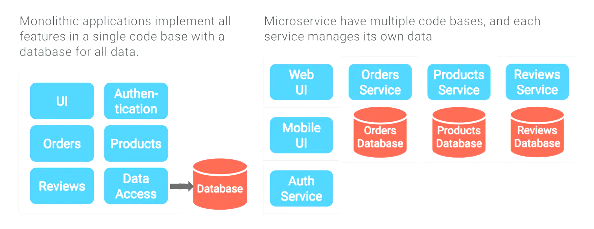

### Definitions

App Engine, Cloud Run, GKE, and Cloud Run functions could deploy microservices

**Monolith to microservices**

- Decompose applications by feature to minimize dependencies (Review services, Order service, products services)
- Organize services by architecture layer (Web, Android interfaces, Data access services)
- Isolate services that provide shared functionality (Authentication service, Reporting service)

**State services**

- manage stored data over time
- hard to scale
- hard to upgrade
- need to backup

**Stateless services**

- get data from env or other stateful services
- easy to scale by adding instances
- easy to migrate to new versions
- easy to administer

**Suggestions:**

- Avoid strong shared state in-memory on your servers (hard to scale, cause the subsequence requests have to be sent to the same server)
- Store state using backend storage services shared by the frontend server
  - Cache state data for faster access
  - Use Firestore, cloud SQL for state
  - Redis for caching

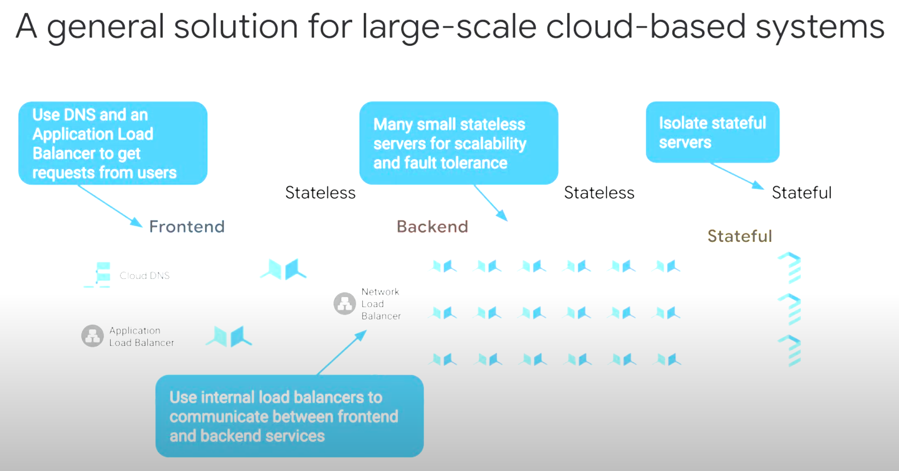

### 12 factors

1 Codebase, use git like version control to track changes

2 Dependencies, use package manager like NPM, pip

3 Config, kept out of code and in env variables

4 Backing services, treat backing services as attached services. 

- Database, cache, queues are accessed via URLs
- Should be easy to swap one for another

5 Build, release, run.

- Build create package from source code
- Deployment packages are linked to a release for rollback and audit
- Run for execution the app

6 Processes

- Apps run in one or more processes
- Data should fetch from data services, ether stateless or stateful data

7 Port binding, export services via port binding

- No separate server like Apache needed, the application itself can be host on GKE, App engine...
- Apps are self-contained

8 Concurrency

- Scale out via process, because of self-contained so easily to do so.

9 Disposability, Apps should be more reliable

- When infrastructure failed, they can gracefully shutdown and restart quickly
- Scale up and down quickly

10 Dev/prod parity, keep dev, stage, prod as similar as possible

- Docker makes this easier
- Workflows built on Artifact Registry, Cloud Storage, Terraform

11 Logs, treat logs as event streams

- Decouple the collection, processing, and analysis of logs from the core logic of apps
- Should be standard output and aggregating into a single source. So when scale up and down, no log storage to be concerned, and also good to distribute VMs or containers

12 Admin processes, run admin/management tasks as one-off processes

- Admin tasks should be repeatable processes, not one-off manual tasks (Like migrate database, script pre-hit to fill cache)
- Admin tasks shouldn't be a part of the application, cause this will slow the app

### HTTP

The underlying protocol of carrying transportation data

#### REST

The design of microservices based on REST, gRPC, etc to achieve loosely coupled independent services

- maintain backward compatibility of the contract
- Can response JSON, HTMl, XML and etc.

#### gRPC

For internal communications

#### GraphQL


### APIs

Definition, the interface of services

#### OpenAPI

The standard doc format for REST interface, including details like url, params, response format

**Swagger**, OpenAPI application, easy to debug

#### GraphQL Schema

### **Google managing APIs tools**

- Cloud Endpoints
- Apigee API platform
- API Gateway

## DevOps Auto

### CI/CD

1 Check-in code

- Git
- Cloud Source Repositories
  - Managed
  - Pub/sub messages when change
  - Audit logging
  - Connect with GitHub

2 Run unit tests


3 Build deployment package

- Create a Docker image
- Cloud Build
  - Google-hosted Docker build service
- Build triggers whenever there is change in the repo
  - On commits of a particular branch
  - On commits of a particular tag
  - Dockerfile or a Cloud Build file
- Artifact Registry
  - A universal packge manager for build artifacts and dependencies.
  - Store Docker and OCI container images

4 Deploy

- Save new Docker image in an artifact registry
- Each microservice should have its own repository
- Binary authorization allows you to enforce the deployment of only trusted containers into GKE

### Cloud Source Repositories

### Automate builds

with Cloud Build and build triggers

### Artifact Registry

### Infrastructure as code using Terraform

Infrastructure as code (IaC)

which allows for the provisioning, configuration, and deployment activities to be automated.

HashiCorp Configuration Language (HCL) allows for concise descriptions of resources using blocks, arguments, and expressions.

## Storage solutions

- Storing binary data with Cloud Storage
- Relational data with Cloud SQL or Spanner
- NoSQL or unstructured data using Firestore and Bigtable
- caching for fast data access using Memorystore
- aggregating data for queries and reports using BigQuery as a data warehouse

Choose storage:

1. Service
2. Structured or unstructured
3. SQL or NoSQL
4. Strong or Eventual Consistency
5. Amount of Data (MB, GB, TP, PB)
6. Read only or Read/Write

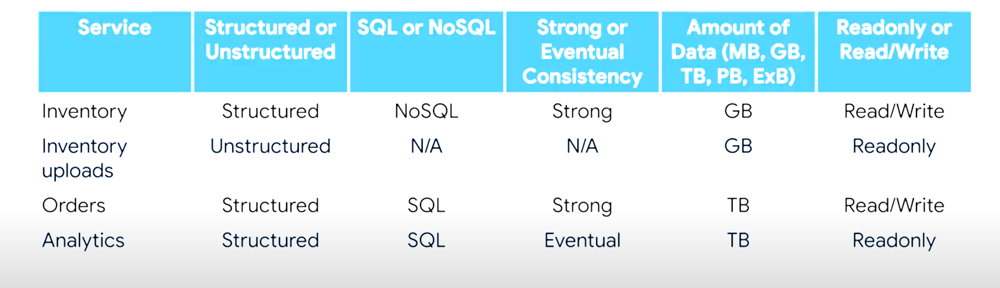


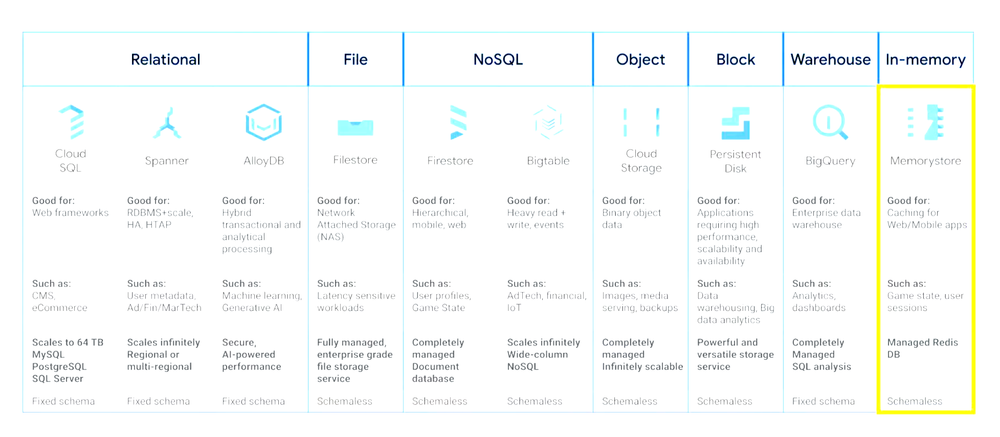

Decision chart

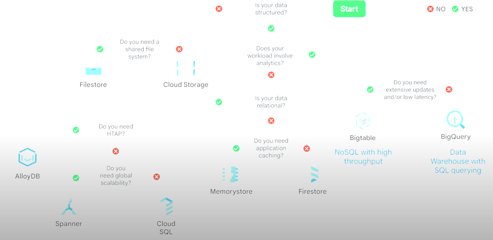

- **HTAP** 的全称是 **Hybrid Transactional/Analytical Processing**（混合事务/分析处理）

**Upload data, use Cloud Storage Transfer Service**

## Google Cloud and Hybrid Network Architecture

## Cloud networks

Regions, geographical location run the resources, it has zones in each region

points of presence PoPs, where Google's network is connected to rest of the world

Global private network, globally, resources across regions can communicate using their internal IP addressees within same VPC

Services

1. specific machine and os requirements: Compute engine
2. wheter use containers (microservice architecture): GKE or Cloud Run, depending on whether configure own kubernetes cluster
3. If no container 
    1. event-driven: Cloud Run functions
    2. no event-driven: App Engine

### Compute Engine
- Iaas
  For applications that are not containerized
  For application that is a database
  
#### Instance group for variations
- instance templates: defines boot disk image, machine type, labels, startup script...
- autoscaling, could be in multiple zones for high availability, use a global load balancer to distribute traffic, and use CDN for static content
### Load balancer

Application load balancer and network load balancer

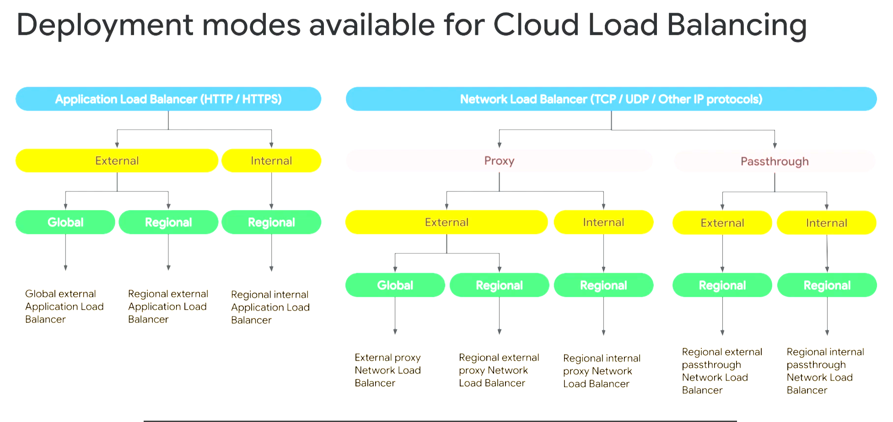

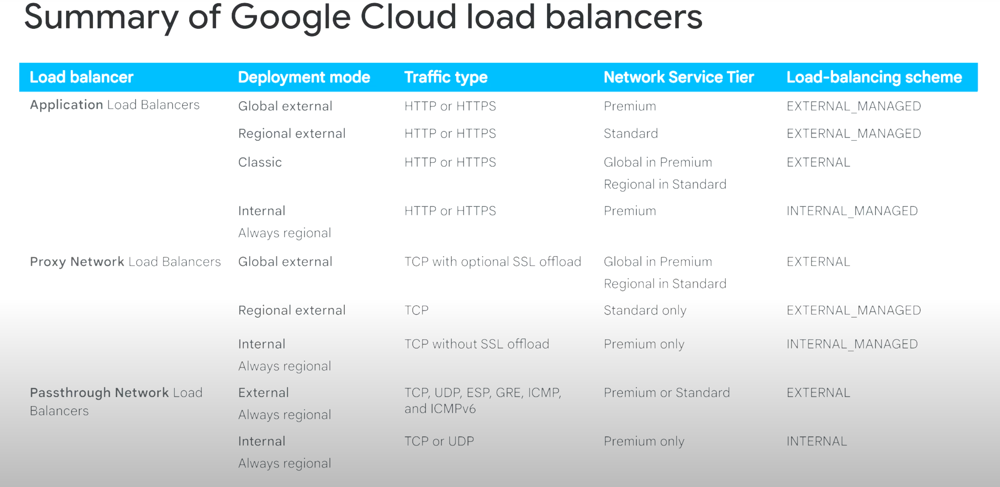

Application load balancer, use CDN to cache data

**Network Intelligence Center**

visualize your VPC’s network topology and test network connectivity

**Choose Load balancer**

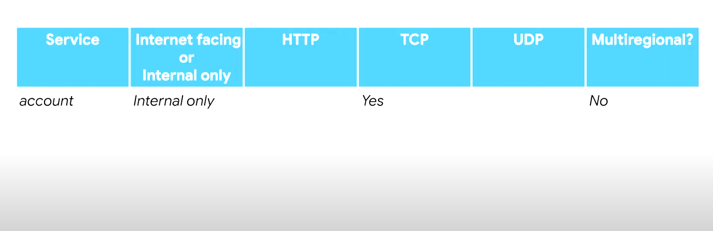

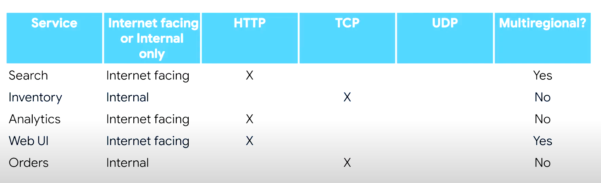

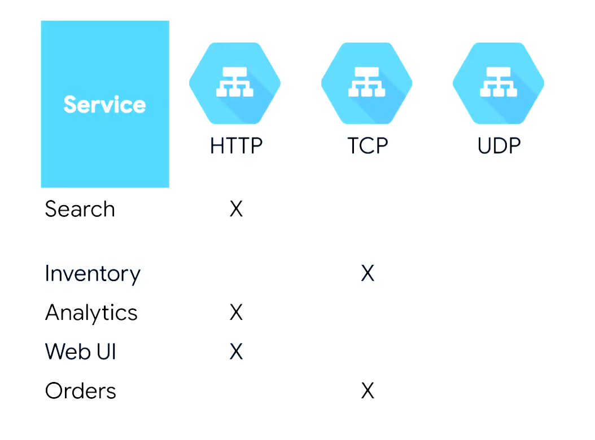

### Peering, Cloud VPN, and Cloud Interconnect

## Reliable systems

1. Single points of failure
2. Correlated failures
3. Cascading failures
4. Overload

Reliability

single points of failure:
- relicating data
- multiple virtual machine instances, two extra instance or N plus 2 for failure and upgraded
- instances deployed in different zones
- for scaling, make each units interchangeable, stateless clones

correlated failures: related items fail at the same time
A single machine / top-of-rack switch / zone or region /configuration fails, all following processes relying on it will fail as well
A group of related items that could fail together, is refered as a fault domain. Decouple it into microservices can be a solution

Cascading failures: Like a message queue overload
- health check in CE or readiness probe in GKE
- new server should start up quickly

Query of death: a request causes a failure in the service
- latency, resource, utilization and error rates should be monitored to help identify the problem
- retry in a proper way
  - use exponential backoff strategy, and add jitter to avoid thundering herd problem.
  - circuit breaker used to fail following requests after it receives certain number of failures, and resume when a test of requests succeed
  (GKE, the Istio service mesh automatically implements circuit breakers)
  

recover data
- lazy deletion, viable to the user who deleted for like 30 days, after that move it to soft deletion phase, which can be restored by admin


### Matrics for reliable systems

**availability**
the percent of time a system is running and able to process requests.

- monitoring is vital, health check
- building in fault tolerance, removing single points of failure 
- Backup systems
- db use multi-zones, and use distributed database

**durability**
- the chance of losing data because hardware or system failure
- data is preserved and available is a mixture of replication and backup
- replicated in multiple zones
- Regular restores from backup should be performed to confirm that the process works as expected

**scalability**
- the ability of a system to continue to work as user load and data grow
- Monitoring and autoscaling should be used to respond to variations in load

**Disaster recovery**

Recovery time of object: how long it can take to be back up and running.

recovery point objective: the amount of data that would be acceptable to lose

## Security

### least **privilege**
- granting a user / machine instances / processes only the minimal set of permissions required to perform a duty (IAM, service accounts)

### separation of concerns
objectives:
- prevention of conflict of interest
- detection of control failures

- Different people can be given suitable rights to different projects
- Folders are especially useful for organizing multiple projects.


### regular audits
discover attacks and potential security breaches
- All Google Cloud services write to audit logs: admin, data access, VPC flow, firewall, and system logs

### governance

Security Command Center

### securing people
- Roles 
- Groups
- organizational policies and folders
    - Organizational policies apply to all resources underneath an organization.
    - Cloud IAM policies are also inherited top to bottom
    - Folders inherit policies of the organization, projects inherit policies of the folders, and so on
- IAM, Identity-Aware Proxy, Cloud IAP
    - Cloud IAP provides managed access to applications running in App Engine standard environment, App Engine flexible environment, Compute Engine, and GKE.
    - Identity Platform provides sign up and sign-in for end user applications.
    
### service accounts
- A service account is a special kind of account used by an application, a virtual machine instance, or a GKE node pool. Making authorized API calls.
- A service account is both an identity and a resource.
    - (identity) used as an identity for your application or service to authenticate, for example, a Compute Engine VM running as a service account.
    - (resource) control who can create VMs with the service account so random VMs cannot assume the identity.
- public/private RSA key-pairs that are used to authenticate to Google
    - Cloud Key Management Service (Cloud KMS) to help securely manage your keys.

### secure network access 

using private IP's, firewalls, and Google Cloud private access

- removing external IPs to prevent access to machines from outside their network whenever possible
- external IP usage scenario:
    - Use a bastion host to provide access to private machines
    - SSH into internal machines using Identity-Aware Proxy (IAP)
    - Use Cloud NAT to provide egress to internet from private machines
    All internet traffic should terminate at load balancers, IAP, Cloud NAT, Firewall, API Gateway.

- VM instances that only have internal IP addresses can use private Google access to access Google services that have external IP addresses 
- VM should always configure a firewall rules to control access
- manage APIs, you can use Cloud Endpoints. use TLS for your service endpoints
- load balancers (level 3 and 4), HTTPS, CDN. Google Cloud armor supports layer 7 application rules (like range of IPs, cookie values filter)

### encryption
- Default: Google-Managed Encryption Keys
- Customer-Managed Encryption Keys (CMEK), You create and manage the keys using Cloud Key Management Service (KMS)
- customer supplied encryption keys, CSEK, generated by customers
- Data Loss Prevention API to protect sensitive data by finding it and redacting it
- Cloud DLP provides fast scalable classification and redaction for sensitive data elements like credit card numbers

## Application maintenance and monitoring

### version management
- ensure backward compatibility with a previous version
- indicating the version in the URI and making sure you change the version when you make a backward and compatible change
- zero downtime
    - Rolling updates: 
        - if the API is not changed
        - is backward compatible
        - if it is okay to have two versions of the same service running during the update
        - instance groups / Kubernetes / App Engine has rolling update build-in support
    - blue-green deployment, don't want multiple versions of a service to run simultaneously
        The blue deployment is running the current deployed production software while the green-deployment environment is available for deploying updated versions of the software.
        When you want to test a new software version, you deploy it to the green environment.
        Once testing is complete, the workload is shifted from the current, which would be the blue in this case, to the new, the green environment.
        This strategy mitigates the risk of a bad deployment by allowing they switchback to the previous deployment if something goes wrong.
        - Compute Engine use DNS to migrate requests
        - Kubernetes configure your service to route to new pods using labels
        - App Engine allows you to split traffic
    - Canary releases
        you make a new deployment with the current deployment still running
        Then you send a small percentage of traffic to the new deployment and monitor it.
        If using CE, create a new CE or create a new pod in GKE for Carnary releases, App Engine, you can again use the traffic splitting

Rolling Update: Gradually replaces old instances with new ones. Simple, efficient for minor fixes, minimal infrastructure overhead.

Canary Deployment: Rolls out to a small subset first to catch issues before full deployment. Best for risk mitigation when you want to validate before going all-in.

Blue/Green Deployment: Maintains two identical production environments and switches traffic between them. Provides instant rollback capability but requires double infrastructure.

### Monitoring
cost perspective, resources are being best provisioned against demand
A circle
- Forcast
- Allocate
- Approve
- Deploy
Resources:
- CE
- Disk
- egress charges
    - Egress in the same zone is free.
    - same region using an external IP address or an internal IP address is free
    - all internet egress is charged
    Recommend:
- Use CDN, cache
- Use pub/sub
- Use metrics
- Set a budge

Tools:
Monitoring, Logging, Trace, Error Reporting, and Profiler.

- pricing calculator to create an initial estimate for deploying your case study application.
- uptime checks to monitor the availability of your application 

# IaaS and PaaS

Three wave of cloud computing

1. Colocation
   Rent physical place, providers provide electricity, network, air condition and more. But  os and software are provided by companies themselives.
2. Virtual Data Center
   Split a physical machine to many virtual machine, each machine contains their os.
3. Container-based Architecture
   Docker and Kubernetes
   Do not need to virtualize a whole computer, but only virtualize the running enviroment for the application.

Virtual data center:
**Infrastructure as a service**

- Raw compute
- Storage
- Network
  Similar to physical data centers
  Computer Engine is an IaaS
  Customer pay the resources ahead of time

**Platform as a service**

- Bind code to libraries that provide access to the infrasture application needs
  App Engine is an PaaS
    - App Engine, you provide code like python, js, java, and give it to google, they config the compute, storage, network resources and run your code, return you an url.
      Customer pay the resources they acutally use

Cloud Run is another PaaS, a serverless technology, run containerized microservices
Cloud Run functions, manages event-driven codes

**SaaS**
Provide entire application stack, deliverying entire cloud-based application that customer can use
Like Gmail, Drive


# Security

- Hardware infrastructure layer
  - Hardware design and provenance: customer design data center, chips
  - Secure boot stack: BIOS, bootloader, kernel, OS
  - Permises security
- Service deployment layer
  - encryption of inter-service communication: cryptographic privacy and integrity for remote procedure call (RPC). 
    - Google services communicate with each other using RPC calls
    - Deploy hardware cryptographic accelerators, exntend the default encryption to all RPC traffic inside data centers
- User identity layer
  - Similar location, same device
  - Universal Second factor U2F
- Storage layer
  - Encryption using centrally managed key
  - Enables hardware encryption
- Internet communication layer
  - Google Front End, TSL connections: public-private key pair and CA certificates
  - Denial of Service DoS protections
- Google's Operational security layer
  - Intrusion detection: Rules gives security teams warnings of possible incidents
  - Reducing insider risk: Limits and monitors the activities of employees who access to infrastructure
  - Employee U2F use
  - Stringent software development practices：central source control and two-party review of code

# Billings and pricing

- Rate Quotas: For example, by default, the GKE service implements a quota of 3,000 calls to its API from each Google Cloud project every 100 seconds.
- Allocation quotas: For example, by default, each Google Cloud project has a quota allowing it no more than 15 Virtual Private Cloud networks.

## Resource Manager

Policies contain a set of roles and members, and policies are set on resources.
    
IAM policies are inherited top-to-bottom, billing is accumulated from the bottom up.

Each project is associated with one billing account. and resources cost are accumulated.

Specifically, projects let you enable billing, manage permissions and credentials, and enable services and APIs.

To interact with Google Cloud resources, you must provide the identifying project information for every request. So you know which project pay the cost of the resource usage.

Resource hierarchy:
    From physical organization:
        Global
        Regional
        Zonal

**quotas**
quotas or limits.
Eg:
    - you can only have fifteen VPC networks per project.
    - you can only have 24 CPUs per region.
    
As your use of Google Cloud expands over time, your quotas may increase accordingly.

- prevent runaway consumption in case of error or malicious attack.
- Quotas also prevent billing spikes or surprises.


**labels**
more granularity for resources
key-value pairs that you can attach to your resources, like VMs, disks, snapshots and images.
Used to organize resources, and they can propagate through billing.

- For example, you could create a label to define the environment of your virtual machines. Then search and list all your production resources
- help analyze costs or to run bulk operations on multiple resources.
  Examples:
- cost accounting or budgeting, eg: team:marketing and team:research.
- distinguish components, eg: component:redis, and component:frontend.
- owner or a primary contact for a resource, eg: owner:alice, and owner:bob.
- state, eg: state:inuse, and state:readyfordeletion.


**Network tags**
 user-defined strings that are applied to instances only and are mainly used for networking, such as applying firewall rules and custom static routes.

**billing**
set a budget.

create a budge:
    1. on project name
    2. set amount
    3. email or pub/sub notification
    
labeling all your resources and exporting your billing data to BigQuery to analyze your spend.
    

# Resrouce Monitoring

## Google Cloud Observability
monitoring logging, error reporting, and fault tracing
    there are free usage allotments
    

## Cloud Monitoring
**Charts**
**Dashboards**
**Alerts**
    Such as the server down at night
    We recommend alerting on symptoms, and not necessarily causes

    - The type of uptime check can be set to HTTP, HTTPS, or TCP.
        - The resource to be checked can be an App Engine application, a Compute Engine instance, a URL of a host, or an AWS instance or load balancer.

**Metrics**
A metrics scope is the root entity that holds monitoring and configuration information in Cloud Monitoring.

- Every metrics scope is hosted by a specific Google Cloud project, known as the Scoping Project.
- The metrics scope can include the scoping project itself plus up to 375 additional Google Cloud projects. These are called Monitored Projects.
  - By adding projects to a metrics scope, you can view metrics from different environments (like Production, Staging, and Dev) on a single chart without switching project contexts

a role assigned to one person on one project applies equally to all projects monitored by that metrics scope.

In order to give people different roles per project and to control visibility to data, consider placing the monitoring of those projects in separate metrics scopes.

The Ops Agent collects metrics inside the VM, not at the hypervisor level.

The Ops Agent supports most major operating systems, such as CentOS, Ubuntu, and Windows.

When you want to maintain a metric at a target value, specify a utilization target.
The autoscaler creates VMs when the metric value is above the target and deletes VMs when the metric value is below the target.

## Logging
store, search, analyze, monitor, and alert on log data and events from Google Cloud and AWS.

Logging includes storage for logs, a user interface called Logs Explorer, and an API to manage logs programmatically.

Logs are only retained for 30 days, but you can export your logs to Cloud Storage buckets, BigQuery datasets, and Pub/Sub topics.
BigQuery for analysis
Pub/Sub for real-time processing and alerting

Looker Studio transforms your raw data into the metrics and dimensions that you can use to create easy-to-understand reports and dashboards.

## Partner Integration
This helps expand the IT ops, security, and compliance capabilities available to Google Cloud customers.

Site Reliability Engineering:
Monitoring!!!

## Error Reporting

## Tracing
Cloud Trace is a distributed tracing system that collects latency data from your applications and displays it in the Google Cloud console.

track how requests propagate through your application and receive detailed, near real-time performance insights.

## Profiling
Cloud Profiler continuously analyzes the performance of CPU or memory-intensive functions executed across an application.
Profiler uses statistical techniques and extremely low-impact instrumentation that runs across all production application instances to provide a complete picture of an application’s performance without slowing it down.

## Network monitoring

Metrics

Alerting policy

Connectivity tests: Using the network intelligence center connectivity tests, Tal can self diagnose connectivity issues within Google Cloud or Google Cloud to an external

Firewall insights: Firewall insights provides reports that contain information about firewall usage and the impact of various firewall rules on your virtual Private Cloud, VPC network.

Network analyzer: automatically monitors your VPC network configurations and detects misconfigurations and suboptimal configurations.

**VPC Flow Logs**

Records a sample of network flows sent from and received by VM instances

- Enable or disable VPC Flow Logs per VPC subnet.
- Capture VM-to-VM conversation within the same VPC network, all subnets should enable VPC Flow logs

**Packet Mirroring**

Packet Mirroring clones the traffic of specific instances in your Virtual Private Cloud (VPC) network and forwards it for examination

- The mirroring happens on the virtual machine (VM) instances, not on the network.
- Consumes additional bandwidth on the hosts

**Cloud NAT Logging**

- Cloud NAT logging only logs dropped packets if they are egress, while dropped ingress packets will not be recorded

**BigQuery**


# Multi-zone

- Improve fault tolerance 即便是一个region中的multi-zone，防止单个机房出问题，如火灾等
- Multi-region 成本更高，防止的是地震，战争等

# Googel Cloud's resource hierarchy

Four levels, buttom up. Each resource has exactly one parent

1. Resources
   Like VM, Storage buckets, tables in BigQuery, organized into projects
2. Projects: A trust boundary within your company
   Can be organized into folders

- Basis for enabling and using GC services, APIs, billing...
- Each project is a seperate entity under the organization node
- Each resource belongs to exactly one project
  Identity attributes
- Project ID (95% Identity, global unique), name, number (rarely used, global unique)
  Google Cloud’s Resource Manager tool: the API manages projects
- Even recover projects that were previously deleted,and can be accessed through the RPC API and the REST API

3. folders: Your department
   Have subfolders

- The resources in a folder inherit policies and permissions from the folder
- To use folders, must have an organization node
  Folders:
  - subfolder - department X
    - subfolder - teamA
      - subfolder - product1
      - subfolder - product2
    - subfoler - teamB
      subfolder - department Y

1. Organization node: Your company

- When a user with a Google Workspace or Cloud Identity account creates a Google Cloud project, an organization resource is automatically provisioned for them.
  Policies can be defined at project, folder, organization node levels, some GC services allow polices to be applied to individual resources
- Google Workspace or Cloud Identity super administrator:
  - Assign the Organization Admin role
  - be a point of contact in case of recovery issues
  - control the lifecycle of the Google Workspace or Cloud Identity account
- Organization Admin role:
  - Define IAM policies
  - determine the structure of the resource hierarchy
  - delegate responsibility over critical components, such as networking, billing, and resource hierarchy, through IAM roles.
  - Cannot create folders initially, but can give itself the permission to create folders, and then it is able to do so.
    Policies are inherited downward:
    A policy applied to folder, will applied to its projects within the folder

# IAM

Define who can do what on which resources

- Who (also called principles) of an IAM policies can be

  - a Google account
    - with email as an entity, end user
  - a Google group
    - a named collection of Google Accounts and service accounts
    - has a unique email associate with the group
  - a service Account
    - belong to application instead of end user
    - when run code that is hosted on GC, specify the account that code should run as.
  - a Cloud Identity domain
    - customers who are not Google Workspace customers can get these same capabilities through Cloud Identity
    - Users can be managed by Google Admin console, and IAM is not capable
  - a Google Workspace domain
    - like company.com
    - a virtual group of all the Google Accounts that have been created in an organization's Google Workspace account.
      Identified by email usually

- Can do what defined by a role

  - a collection of permissions
    When you grant role to a principle, you grant all the permissions that the role contains
  - Define deny rules, and apply to certain principle, even it inherit the permission from certion role, it is denied to access the resources as GC check deny rule before permissions
  - Deny policies are inherited through resource hierarchy
    Three kind of roles in IAM

  1. Basic
     1. Owner: access, change and manage associated roles and permissions and set up billing
     2. Editor: access and change, deploy and modify or configure its resources
     3. Viewer: access but not change
     4. Billing administrator
  2. Predefined
     1. InstantAdmin, which manages Compute Engine, apply to principle, folder...
  3. Custom
     1. least-privilege
     2. Can only be defined at project or organization level 
        Best practice:

- Granting roles to groups instead of individuals

- Resource hierarchy

## Policy

A policy is a list of bindings which bind “谁（Principal）在什么资源上拥有什么权力（Role）”
It has to bind with resources

```json
{
  "bindings": [
    {
      "role": "roles/storage.objectViewer",
      "members": [
        "user:alice@example.com",
        "serviceAccount:my-app@project-id.iam.gserviceaccount.com"
      ]
    },
    {
      "role": "roles/compute.admin",
      "members": [
        "group:dev-admins@example.com"
      ]
    }
  ],
  "etag": "BwWW4zdwfNE=",
  "version": 3
}
```

Policy insights to help you do the least priviledge
ML-based findings about permission usage in your project, folder, or organization

## Google Cloud Directory Sync

This tool synchronizes users and groups from your existing Active Directory or LDAP system with the users and groups in your Cloud Identity domain.

## Service accounts

It is an account that belongs to your application instead of to an individual end user.

Eg, compute engine holds a service account, and the service account holds some roles, so the compute engine have access to some resources. So applications running in the compute engine have certion permissions

- service account itself is a resource that can be managed by roles
  Eg, Alice has service accounts create permission, so she can create and set any permissions on the service accounts even the permission Alice does not have like bucket access
  Anothe Eg, Service_Account_1 has InstanceAdmin role, and some users or a group are assigned to Service Account User Role, which means they can manipulate or pretend they are a certain Service Account. So they act as Service_Account_1, and then they can do create, modify action on instance which from InstanceAdmin role.

## IAP Identity-Aware Proxy

Is to project custom applications like (Admin website, internal tools)
Which IAM is to project Cloud Resources which hold those custom applications.

It acts like the authorization step in public website

Tow steps

- Who you are (log in to Cloud Account)
- What can you do (check the account's IAM permissions)

## Cloud Identity


# The Google Cloud network

- Google cloud Run on Google's own global network
- High throughput and low latencies
- Locations cached for quicker access
- Redundant cloud regions to high-bandwidth connectivity
- Seven major geographic locations, each location divided into different regions and zones. For availability, durability, and latency
  - Locations: Asian, North America, Europe...
  - Regions: asia-east1
  - Zones: asia-east1-a, zones are connected by high fiber network

## Network Tier

**Standard Tier**

- Traffic mainly flow on the public Internet
- Low cost
- Location based cost, even the request is far from resource, cost is low, cause most traffic are on public Internet

**Premium Tier**

- Traffic mainly flow on Google's network
- High cost
- Cost based on distance between the resources and the end user


# Virtual Private Cloud Networking

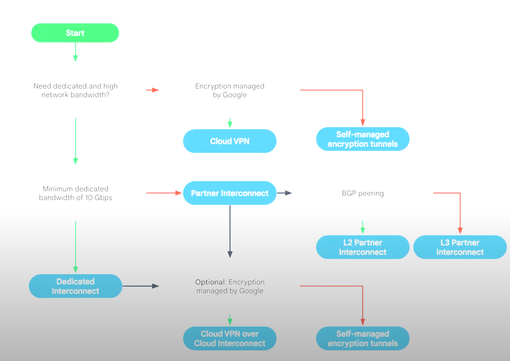

1. Definition & Value
   Concept: A private, isolated network hosted within Google’s public cloud.

​	Hybrid Benefit: Combines scalability (public) with data isolation (private).

2. Core Components
   Connectivity: Connects resources to each other and the internet.

​	Control Tools: * Firewall Rules: Restrict access to 	instances.

​	Static Routes: Forward traffic to specific destinations.

​	Segmentation: Organizes the network into subnets.

3. Global Architecture (High Probability Exam Topic) ⭐
   VPC Scope: Global. A single VPC can span multiple regions worldwide.

​	Subnet Scope: Regional. Subnets are defined within a region but can span multiple Zones.

​	Key Advantage: Resources (VMs) can be in different Zones but belong to the same Subnet.

4. Flexibility & Scaling
   IP Expansion: You can increase subnet size by expanding the IP range.

​	Zero Downtime: Expanding a subnet does not affect existing, configured VMs.


Compatibilities:

- Forward traffic from one instance to another within same network, across subnetworks, or between google cloud zones without external IP address
- Firewall, distributed firewall
- VPC Peering, two VPCs can exchange traffic; IAM control who and what in one project can interact with a VPC in another

## Network Layers 

### 7 Layers OSI (Open Systems Interconnect) Model

The model is typically viewed from the bottom (hardware) to the top (software).

1. Physical Layer

This is the actual hardware. It deals with the electrical signals, fiber optics, or radio waves (Wi-Fi) used to transmit raw bits (0s and 1s).

- **Examples:** Ethernet cables, Hubs, Repeaters.

2. Data Link Layer

This layer handles node-to-node data transfer. It packages bits into **frames** and handles error correction from the physical layer. It uses **MAC addresses** to ensure data gets to the right hardware on a local network.

- **Examples:** Switches, Bridges.

3. Network Layer

The Network Layer is responsible for **routing**. It decides the best physical path for the data to take. It uses **IP addresses** to transfer data packets between different networks.

- **Examples:** Routers, IP (IPv4/IPv6), ICMP.

4. Transport Layer

This layer ensures that data is delivered reliably and in the correct order. It breaks large data into **segments** and handles flow control (so a fast sender doesn't overwhelm a slow receiver).

- **Examples:** TCP (Transmission Control Protocol), UDP (User Datagram Protocol).

5. Session Layer

This layer manages the "conversation" between computers. It opens, maintains, and terminates the connection sessions between local and remote applications.

6. Presentation Layer

Often called the "syntax layer," it translates data between the application and the network. It handles encryption, decryption, and data compression.

- **Examples:** SSL/TLS, JPEG, GIF.

7. Application Layer

This is the only layer the user directly interacts with. It provides network services to end-user applications.

- **Examples:** HTTP/HTTPS (Web browsing), SMTP (Email), FTP (File transfer).

### TCP/IP Model

The **TCP/IP model** is what the internet actually runs on


## Networking subnets

Subnet:

1. Logical Grouping: You don't want your HR database sitting in the same "room" as your public-facing website code. Subnets let you group related resources.
2. Granular Security: You can apply different rules to different subnets.Example: A "Public Subnet" for your website (allows internet traffic). A "Private Subnet" for your Database (blocks ALL internet traffic, only allows the website to talk to it).
3. Geography (Google Specific): In Google Cloud, a VPC is global, but a Subnet is Regional. You create a subnet to define where in the world your resources physically live (e.g., a subnet in Tokyo, another in Iowa).

Subnets are used to manage IP, splite a large network into small chunks, reduce traffic congestion and improve safety.
It uses subnet mask to split IP

Purpose:

- Minimize broadcasting: If a network includes a thousand computers, and each computers is broadcasting, it will ruin the network.
- Security: Split financial and guest Wi-Fi into different subnet, so they cannot access data in each other
- Easy management: Let floor 1 use 192.168.1.x subnet and floor 2 use 192.168.2.x subnet

eg:
web-subnet-us use 10.0.1.0/24 for us VMs
web-subnet-asia use 10.0.2.0/24 for asian VMs
db-subnet-us use 10.0.3.0/24 for Cloud SQL and Storage

The subnet mask is to mask the first N bit, so that masked N bit are a subnet IP range, the rest bits are subnets IPs and can be used by hosts in the subnet
Like 10.0.1.0/24, they masked 10.0.1, so all the hosts in this subnets are IPs start from 10.0.1, and they can be arranged as 10.0.1.0 - 10.0.1.255 IPs except broadcasting, and other normal reserved IP, so maybe totally 250 IPs can be used by hosts in the subnet

Normally IP is public, but there are three IP reserved for subnets

1. 10.0.0.0/8 or 10.0.0.0 - 10.255.255.255 are class A subnet, usually used by big companies
2. 176.16.0.0/16 or 176.16.0.0 - 176.16.255.255 for class B subnet
3. 192.168.0.0/16 or 192.168.0.0 - 192.168.255.255 for class C subnet, usually used by personal home

## Network Architecture

**Scalibility**

increasing demands

**Security**

firewalls, access controls, and encryption

**Compliance**

observing guidelines, rules, and restrictions of your organization, industry, and pertinent government bodies

**Performance**

speed and responsiveness

**Cost efficiency**

## Connecting networks to Google VPC

Method 1:
Cloud Virtual Private Network(VPN), the tunnel, connects Cloud VPC and other network like (AWS network or your own data center)

1. VPN is encrypt
2. Cloud Router use Border Gateway Protocol to tell each side the existance of each other (route information). (While Normal case is route table)

Security and bandwidth concerns

Method 2:
Peering, putting a router in the same public data center as a Google point of presence, and exchange traffic

1. networks stay seperate
2. Internal IPs
3. No IP Overlap
4. Transitive Peering is NOT allowed
5. Administration: Each side of the peering must independently agree to the connection (one side "requests," the other "accepts").

Each GC project has a default network

### Cloud VPN

Layer 3, use IP

1.5 to 3 Gbps per tunnel

**Concepts**

1 **Service Level Agreement**

A Service Level Agreement (SLA) is a documented, formal contract between a service provider and a customer that defines specific, measurable performance metrics (e.g., 99.9% uptime, 4-hour response time).

2 **Gateway**

- Handle Encryption and Decryption
- Ensures only authorized traffic can enter.
- For example, for a Cloud side Gateway, when data from on premises arrive, it decrypt it and then transit it to VPC. And when packet leaves Google Cloud, the gateway encrypt it then send out so nobody on the Internet can read it except the on premise gateway which can decrypt it.

Detailed Example:

1. A server sent an envelop with content password, from a private subnet (10.0.1.5) to a private subnet on-premises (192.168.10.20). Private IPs cannot travel on Internet, routers will discard it if they saw one.
2. Cloud VPN Gateway recognize it's a VPN traffic
3. Encrypt the entire original envelope (Source IP, destination IP and message)
4. Put it inside a NEW envelop with Cloud Gateway IP as source IP, on-premises Gateway IP as destination IP. payload encrypted.

In comparison with HTTPS, the browser or server encrypt the data, even routers can see the content, but it is not informative.

Cloud Gateway is a Regional Resources

3 **Router**

- Direct traffic, tells traffic where to go next
- Does not encrypt data at this level
- Router just do Routing and NAT (Network Address port Translation)
  -  Router read the envelop source IP and destination IP, it checks it's routing table and routing the envelop.
  -  NAT: relabeling station so your private IP becomes as public IP, mainly for TCP (which includes HTTP, HTTPS, SSH, FTP), UDP, which are all have port, so NAT is associate with them.
- Like a map. Static (Manual Map): does not change
- Dynamic/BGP (Live GPS): pass new changes

### Cloud Router and BGP

The Map. Cloud router is like a device, and BGP (Border Gateway Protocol) is it's application, only with the application, Cloud Router can do it's job. The Cloud router dynamically exchange data, write to routing table using Border Gateway Protocol.

Example:

1. Cloud Router and on-premises router exchange each others' private subnet information.
2. on-prem router: know how to get private subnet 192.168.10.0/24, so send data here through tunnel
3. cloud router: Got it, and I know my private subnet `10.0.1.0/24` (the VPC subnet), send your data here. Also write on-perm subnet information into VPC, so VPC added a new on-perm subnet on it's routing table.
4. Then if a VM server in VPC send data to 192.168.10.20, it sends data to VPC, the VPC found the destination written by cloud router is bound to HA VPN gateway, then send it to VPN gateway.
5. After processed at the gateway, the package sends to destination via internet.

**BGP multi-exit discriminator or MED**

Rout priority

MED tells your neighbor, which route is the best to came to your home.

The smallest number is better, from 0 to 65535. 0 is the highest priority

Example:

1. There are two tunnels between your HA VPN gateway and on-premises, your BGP MED setting is tunnel 1 = 20, tunnel 2 = 50. Cause tunnel 1 is 10 GBP and tunnel 2 is 1 GBP
2. When on-premises send packet to VPC, its router finds that tunnel1 has higher priority so sends the packet through tunnel 1.

While in **Google Cloud VPC**, it's a global VPC, so when setting the MED, there is another parameter **Region Cost**

The finally **MED** value in GCP equals to 1. MED set by BGP + 2. Region cost

Near region has low region cost

Example:

1. VPC is located at us-central, tunnel 1 peer device is at euro-central, tunnel 2 peer device is at us-west
2. us-central to us-west region cost is 200, us-central to euro-central region cost is 300
3. So even BGP set tunnel 1 MED is 50, tunnel 2 is 20, finally packet still goes to tunnel 1, as it has a final lower MED value. 

**Dynamic VS Static**

Dynamic routers exchange their subnet information automatically cause they know it, and they update to date the information.

Static routers, the cloud admin has to write on-prem private subnet into it's routing table, and vise versa. If there is any change like adding a new subnet, we have to inform another side admin and let them manually update the table.  

### Classic VPN

- 99.9% SLA
- Has only a single external IP address (single interface)
- Routing: Support Static Routing  (both policy-based and route-based) and Dynamic Routing


Classic VPN connects an on-premises network to a Google Cloud VPC network through an IPsec VPN tunnel.

encrypted by one VPN gateway, then decrypted by the other VPN gateway

in order to connect to your on-premises network and its resources, you need to configure your Cloud VPN gateway, on-premises VPN gateway, and two VPN tunnels.

maximum transmission unit, or MTU, for your on-premises VPN gateway cannot be greater than 1460 bytes.

### HA VPN

 High Availability VPN

- SLA (Service Level Agreement) 99.99%
- Architecture: A HA VPN gateway automatically provides two external IP addresses (two interfaces). So on premises gateway must configure a tunnel on each of these interfaces. So on the on-premises side, the peer VPN device has three form of configures
  - Two peer VPN devices each with one IP address
  - One peer VPN device with two IP addresses (two interfaces)
  - One peer VPN device wit one Ip address

- Routing: Exclusively use Dynamic Routing. Must use a Cloud Router to manage Border Gateway Protocol BGP sessions.

through an IPsec VPN connection in a single region

## Interconnect

Most of of them are building connection at Layer 2, and on the layer 2 basis, the layer 3, google cloud enforce Interconnect use BGP 

Direct access to RFC1918 IPs in your **VPC**, private IP connect to VPC

### Dedicated Interconnect

Layer 2, use VLAN Virtual local area network

10 Gbps or 100 Gbps per link

Provides physical connection between on-premises network and Google's network.

For solutions where Google has direct control over the physical hardware and the connection termination point.

- 99.9% or 99.99% SLA

Need a colocation facility between on-premises and VPC

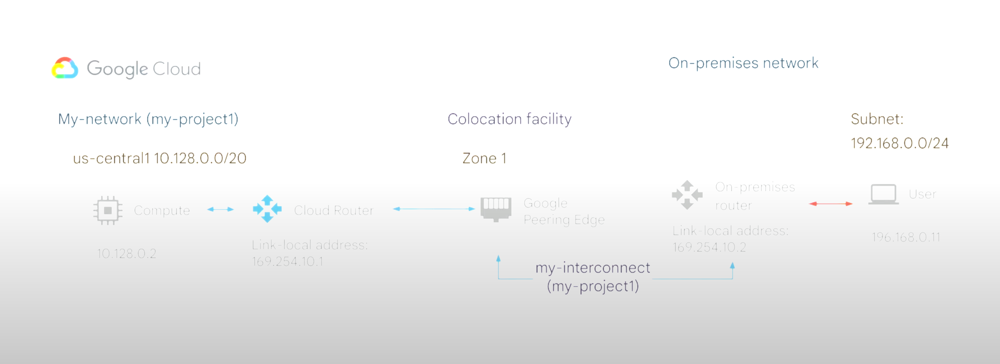

Peering is to send traffic between your business/the server and Google

Network Tier is to send traffic between Google and end user/the customer

### Partner Interconnect

Layer 2 or Layer 3

50 Mbps to 50 Gbps per connection

On-premises ---- Google Partner Network Provider ---- VPC

- 99.9% or 99.99% SLA

### Cross-Cloud Interconnect

Layer 2

10 Gbps or 100 Gbps

Another cloud provider act like Network Provider

Eg: AWS VPN ---- Google Cloud VPC

## Peering

Access to Google **public IPs**, without SLA

- Largest scope is different projects in different organizations
- Decentralized approach, each VPC network can maintain its own global firewall and routing tables

### Direct Peering

Layer 3, use IP

BGP routes

Your business ----- Google edge location(Points of Presence) ---- Google Public Services (Cloud APIs, Google Workspace, YouTube)

A fiber or logic connection to Google directly
You and Google handshake

Relies on a third-party provider's network; your SLA is with the carrier not Google

### Carrier Peering

Layer 3, use IP

Your business ----- Service Provider ----- Google Edge (PoP) ---- Google Public Service (Cloud APIs, Google Workspace, YouTube)

The provider do the handshake with Google
Applicable when your data center location does not have a Google edge location(Points of Presence)

Routes traffic over the public Internet; Google cannot guarantee internet hop performance.

## Shared VPC

Allows **an** organization to connect resources from multiple projects to a common Virtual Private Cloud (VPC) network

- User internal IP addresses
- Shared VPC works within the **across projects** in **same organization**.
- Centrally manage the VPC networks while still segregating workloads that use these networks.
  - Segregating workloads means: We have a VPC administrator manages the shared VPC network, and the host project. We have service project admin or network user, who can use the shared network and manage their own service project.


Designate a project as a host project and attach one or more other service projects to it

- A standalone project is not a host project neither a service project, it does not participate this group
- A standalone VPC is not from a host project, but can from service project or standalone project. When it from service project, the project has two types of VPCs, one is standalone VPC, another is shared VPC

VPC Peering

Allows private RFC 1918 connectivity across two VPC networks, regardless of whether they belong to the same project or the same organization.

Historically we use VPN or external IP address to connect with VPCs, this incurs:

- Network latency, security, and cost drawbacks that are present when using external IP addresses or VPNs.

VPC Features:

- Private communication between VPC networks **in different organizations**, you have to use VPC Network Peering.

- Private communication between VPC networks **in the same project**, you have to use VPC Network Peering.
- Each VPC must config firewall rule to allow another one access to it
- Each VPC must peer another one so to activate it
- Decentralized, distributed. Each VPC network is managed by its own administration, like routes, firewalls, VPNs, and other traffic management tools
- No subnet IP ranges overlap across peered VPC networks, eg: two default VPC with default subnets can not peer
- Transitive peering is not supported
- After peering is established, the two networks automatically exchange **subnet routes**.
- There is also **Custom routes**, includes followings. Only VPC A manually config export routes, and VPC B manually config import routes, it will be valid 
  - Static routes (manually configured)
  - Dynamic routes (BGP router learned from somewhere else

## Network Topology

### **Hub-and-Spoke**

Eg: 

1. VPC Peering
2. Cloud VPN
3. NCC Network Connectivity Center 

**Hub-and-Spoke（以及 NCC）** 的逻辑是**“把好几个独立的房子连在一起”**。

- 每个 Spoke 都是一个**独立且完整**的 VPC。
- 它们有自己的路由表、防火墙规则和管理边界。
- NCC 的作用是作为一个“中央交换机”，让这些独立的房子能够互相通信（解决传递性路由问题）。

对比之下Shared VPC只有一个VPC网络，大家都在里面通信，集中管理

Two main types of spokes that can be connected to a hub: VPC spokes and Hybrid spokes (Cloud VPN, Cloud Interconnect, Router Appliance)

**Global Spoke and Regional Spoke**

是VPC的路由行为

| **特性**       | **Regional Spokes (或受限模式)**                             | **Global Spokes (全球模式)**                           |
| -------------- | ------------------------------------------------------------ | ------------------------------------------------------ |
| **路由可见性** | Spoke 只能看到与之连接的同一 Region 内的路由。               | Spoke 可以看到整个 Hub 内部、全球所有 Region 的路由。  |
| **典型场景**   | 对延迟极其敏感，或有严格合规要求，数据不能跨区传输。         | **企业级标准架构**。需要跨国/跨区 office 和 VPC 互通。 |
| **费用**       | 仅限区域内流量费（通常较低）。                               | 涉及跨区域数据传输费（Inter-region Data Transfer）。   |
| **配置点**     | VPC 的动态路由模式（Dynamic Routing Mode）设为 **Regional**。 | VPC 的动态路由模式设为 **Global**。                    |

- 如果你的 VPC 开启了 **Global Dynamic Routing**，那么当它作为 Spoke 加入 NCC Hub 时，它就表现为 **Global Spoke**，能学到全球各地的路由。

- 如果你的 VPC 开启了 **Regional Dynamic Routing**，它就只能看到同一区域内的 Spoke 路由。

### Mesh topology

The multiple paths between nodes in a mesh network ensure that if one connection fails, traffic can be rerouted.

- high uptime

Full mesh: GKE

Partial mesh: automatic failover

### Mirrored topology

- For disaster recovery
- For testing and development

### Gating topologies

managing and securing network traffic flows in cloud environments, particularly in hybrid and multi-cloud scenarios.

## Comparison Interconnect  VS Peering VS Shared VPC VS VPC Peering


Colocation facility:
For your company private network.
Imagine a data center owned by Equinix where you rent space to place you servers.
Google rent space in level 3 and place some servers for interconnect
You or your network provider rent a room at level 1
You pay the money to connect a fiber from your service in level 1 to the google server in level 3.

Edge point of presence (PoP):
For public internet access.
Google rent space at level 2 or some other place and place some servers for peering.
You at home or your server at home access to google.com, your traffic through public internet and reach google edge PoP.

Connect between **on-premises** to **private VPC resources (GKE, VMs)**
Interconnect

- Where: Connect to private VPC, through colocation facilities
- How: Use Google's private IPs
- Performance: up to 99.99% SLA
- Router: BGP routes

VPN

Connect between **on-premises** to **Cloud Public services (Google APIs, Workspace, Map, Youtube, etc.)**
Peerings (direct peering, carrier peering, and partner peering)

- Where: Connect to google edge of presence
- How: Use Google's Public IPs for service 
- Performance: No SLA
- Router: BGP routes

Connect amongst seperate **VPCs** in same project or different organizations
VPC Peerings

- Where: google private VPC --- google private VPC, through google network
- How: Use private IPs
- Performance: globally valid, network latency depends on distance, but cause it's within google's network, low hops and network congestion.
- Router: Google Cloud’s underlying SDN (Software Defined Network), no BGP

Connect across projects into one VPC, only within same organization
Shared VPC

- Where: Only one VPC, different projects use one VPC
- How: Use private IPs to communicate, one project host the VPC and other projects use it
- Performance: globally valid, network latency depends on distance, but cause it's within google's network, low hops and network congestion.
- Router: software defined

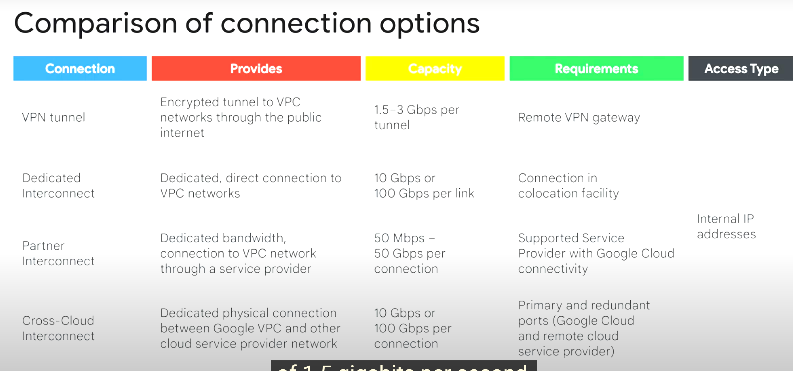


**Standard Network Tier**

Routes traffic over the public Internet; Google not gurantee hop performance.

**Premium Network Tier**

## Multiple network interfaces

What's this?

Devices (VM, virtual appliance) use MNI to connect to multiple networks

Why use this?

Let data flow through different networks (VPCs) securely and under control

Normal scenario:

	1. Two VPCs are connected via VPC Peering
	1. A VM is attached to one VPC, VPC A
	1. A request from outside sent to the VM -- under VPC A, which as a proxy sends the data from VPC A to VPC B using receiver's internal IP in VPC B.
	1. After the VM sent the data, the data is out of control.

Main defects:

1. Two VPCs are not separated (shared hallway), so data flow through smoothly even with **firewall rule** (software rule), all data mixed together, hard to do **data trace**
2. VM in VPC A as a proxy, when send data by itself, the original IP loss, hard to track problem
3. If VPC A is attacked by DDOS, which is overwhelmed, the VPC B is also stuck.

Use MNI instead:

1. A VM has two network interfaces, one connects to VPC A, the customer portal, one connects to VPC B the inner control panel.
2. Internet -> VPC A Router -> NIC 0 -> VM CPU -> NIC 1 -> VPC B Router -> Destination.

Benefit:

1. Isolation. Physical-style (Network-level separation)
2. Security. Use the VM as a lock
3. Audit Trails


Usage:

- Configure an instance as a network appliance for load balancing.
- Traffic separation such as separation of data plane traffic from management plane traffic.

Feature:

- Multiple network interfaces let you create configurations in which an VM instance connects directly to several VPC networks.
- Each interface has an internal IP and external IP
- only configure a network interface when you create an instance
- You cannot delete a network interface without deleting the instance.
- Each network interface configured in a single instance must be attached to a different VPC network.
- internal DNS, domain name system, query is made with primary interface nic0 of the instance

3. 


# Cloud Load Balancing

Senario: 40 VMs handle requests
Distribute user traffic across multiple instances of an application

- Fully-distributed, software-defined
- In front of HTTP, HTTPS, TCP, SSH, UDP
- cross-region load balancing

A load balancer usually contains **three parts**:

1. Forwarding rule

   Role: The **Entrance gate**. 

   Logic: Check IP, protocol, port

   Placement: Reside in a standard subnet

   Scope: In **Cross-region** mode, the forwarding rule is global and itself exposes a regional IP to let others connect it. If a forwarding rule points to a global target proxy, then it is called a **Global Forwarding Rule**.  

   Function: It captures incoming traffic and directs it to the Target Proxy.

2. Target Proxy & URL Map

   Role: The **"Dispatcher."**

   Logic:

   - **Target Proxy:** Terminates the connection (handles SSL/TLS decryption).

   - **URL Map:** The "Rulebook" that checks the request path (e.g., `/api` vs `/static`) or the hostname.

   Function: It decides *which* backend service should handle the specific request

3. Backend Service

   Role: The **"Manager."**

   **Logic:** It tracks the health of your **Backend Groups** (Instance Groups or NEGs).

   **Scope:** In **Cross-Region** mode, this component is **Global**, allowing it to see backends across different regions.

   **Function:** It distributes the traffic to healthy individual instances and manages features like session affinity and connection draining.

**Traditional 3 tier web service**

Backend to DB does not need LB

服务器端渲染 (SSR)

1. A user clicks a button on the web page, sends request to web frontend.
2. It firstly access the external ALB, which receive the request, target proxy to a health Web frontend.
3. Web frontend in the container sends an API call
4. Web frontend and Backend are in a same VPC, so it calls https://internal-lb-ip/api
5. The internal LB takes effect here.

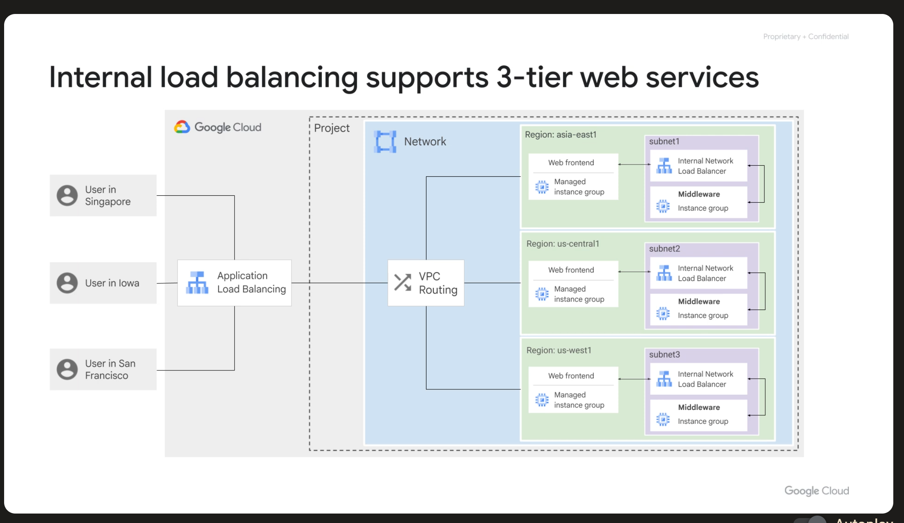

**客户端渲染 (SPA）**

We do not need the internal LB, cause when a user sends a request, it access the external ALB which proxy to backend service based on URL map. 

**BFF 模式 (Backend For Frontend)**

1. User access https://example.com/api, which goes to external ALB
2. External ALB send request to Web BFF, a light way middle service layer, like Node service
3. Web BFF as a proxy, in the VPC, send request to internal LB so to access the real backend service.

**Reverse proxy**

The load balancing could act as a reverse proxy, who stands in front of backend servers. So users only see the load balancers, do handshake with load balancers. And the load balancer **uses url** map the request to backends dependently. The backend services sit behind the load balancer, it's safe and cannot be touch directly by the Internet.

**Forwarding proxy**

A **Forward Proxy** sits in front of the **client** (user). Think of a corporate office where all employees must go through a proxy to reach the internet. It hides the *client's* identity from the web.


## Application Load Balancer

- Work on application layer (7), for HTTP and HTTPS
- reverse proxies
- internet facing / external and internal application

**External ALB** using Google Front Ends or managed proxies

- Global, GFEs
- Regional, GFEs
- Classic

GFEs offer multi-region load balancing in the Premium tier, directing traffic to the closest healthy backend that has capacity and terminating HTTP(S) traffic as close as possible to your users.

It specifies:

-  External IP address
- Port
- Target HTTP(S) proxy

Normally, use round-robin algorithm to distribute requests among available instances

Session affinity attempts to send all requests from the same client to the same virtual machine instance.

**Internal ALB** is **Envoy proxy-based regional** Layer 7 load balancers

The Internal ALB itself is a **regional resource**, cause itself it located in a subnet, it must use a private IP to indicates itselives entry point. The VPC subnet is a regional resource so does the ALB.
The internal ALB **could be regional**, which means the ALB is deployed in one region, and all the backends should be deployed at the same region.

The internal ALB could be **cross-regional**, which means the ALBs could deployed in many regions, and backend services can be deployed **globally**. When a single region like region A, its service down, the ALB in region A know that and forwards traffic to region B service, where it accomplish a global manner. (fail over to another region)

and the backend services it serves should also be **regional or cross-regional**. The requests it receives could be **globally**.


**Target HTTPS proxy**

In comparison with target HTTP proxy

- At least one signed SSL certificate
- Client session terminates at the load balancer
- QUIC is a transport layer protocol that allows faster client connection initiation, eliminates head-of-line blocking in multiplexed streams, and supports connection migration when a client's IP address changes.

**Network endpoint groups NEG**

Before load balancer only talk to VMs

It allows the Load Balancer to talk to things that aren't just standard VMs, like containers, serverless functions, or even servers in your own office.

- Zonal NETs (Containers & VMs)
  - it points to an **IP:Port** combination
- Serverless NEGs (Cloud Run / Functions)
- Internet NEGs (Outside Google Cloud)
  - These point to a URL or IP address that is **not** on Google Cloud
- Hybrid Connectivity NEGs (On-Premise)
  - These point to your own physical data center via VPN or Interconnect.

## Network Load Balancer

- Work on network layer (layer 4)

- TCP, UDP, other IP protocols

  **Proxy NLB**

  1. Reverse proxies, terminating client connections and establishing new ones to backend services

  2. TCP traffic only

  3. Support multiple regions

  4. Can be Internal and external NLB

     **For external proxy NLB**, usually we can encrypt the TCP traffic with SSL, which configured in NLB. So the traffic flow is:

     1. End users use Public SSL cert to encrypt TCP traffic, send to NLB
     2. NLB decrypt it, and it can encrypt it again use Backend SSL Cert, send the TCP packet to backend service.
     3. Backend service is supposed to have the ability to decrypt the package 

     **For internal proxy NLB**, powered by Envoy proxy software

     - Accessible to clients in the same VPC or clients connected to your VPC
     - Terminate the connect at NLB, and open a new to the backend
     - Regional internal: all clients and backends are from the same region.
     - Cross-region internal deployment: NLB deployed regionally, backends deploy globally.

  **Passthrough NLB**

  1. do not modify or terminate connections

  2. regional

  3. forward traffic and preserving original source IP address

  4. Responses from the backend VMs go directly to the clients, not back through the load balancer.

  5. wider range of IP protocols: such as TCP, UDP, ESP, GRE, ICMP, and ICMPv6

     **Internal and external**

     **External**, two types of architecture:

     1. use a regional backend service to set up the backend
     2. use a target pool (same region) to set up the backend
        1. A packet is sent to the NLB
        2. Based on the forwarding rule, the NLB checks packet original IP, protocol, port, decide which target pool it transit the packet to.
        3. The target pool uses hash based on source IP, port, destination IP, port, protocol to determine which VM it will send the packet to. This ensure same original traffic can be processed by same VM.
        4. each target pool can have only one health check

     **Internal**

     - Regional, private load balancer
     - software-defined load balancing that directly delivers the traffic from the client instance to a backend instance.

# Cloud CDN

Cloud CDN, or Content Delivery Network

Use Google's globally distributed edge points of presence to cache HTTP(S) load-balanced content close to your users.

Providing faster delivery of content to your users while reducing serving costs.

Cache modes:

USE_ORIGIN_HEADERS 

In this mode, the CDN does exactly what your backend tells it to do. It looks for standard HTTP headers like `Cache-Control` or `Expires`.

CACHE_ALL_STATIC

This is the **default and recommended** mode for most web projects. It tries to be helpful by identifying "static-looking" files.

The CDN looks at the file extension. If it’s a `.jpg`, `.css`, `.js`, or `.pdf`, the CDN will automatically cache it even if the backend didn't explicitly say to.

FORCE_CACHE_ALL

This mode ignores the back end's instructions entirely. It is a "brute force" approach to caching.

# Cloud DNS

8.8.8.8 Domain Name Service
Translate internet hostname to addresses

Cloud DNS help to find hostnames and addresses built in Coogle Cloud

Content Delivery Network:

Edge caching refers to use caching servers to store content closer to end users


# Compute Engine

As a solution of IaaS

Pricing: billed by second with one-minute minimum

Preemptible or Spot VMs:
You can use it with a cheap price, if someone else use it, the VM will let them to use and you will be stopped to use it. 


- High Avilibility and Disaster Recovery.
  eg: application on even Zone fails
  ans: use Regional managed, Multi-Regional

- Updating Applications
  eg: update application on 100 VMs with zero downtime
  ans: Rolling update, provide a new instance, MIG replace one by one

- Storage Performance and Persistence
  eg: lowest latency for disk I/O
  ans: Local SSD

- Security, Shielded vs Conditional VMs
  eg: While it is being processed in memory
  ans: Confidential Computing (COnfidential VMs) Encrypts data in-use (in RAM)

  Shielded VMs: Protect against boot-level malware

- Cost Optimization
  eg: Compute Engine cost too high, CPU use 10%
  ans: Rightsizing Recommendations. GC analyzes usage and suggests smaller machine types
  If workloadis predictable in 1-3 years, use Comminuted use Discounts

- Health-check and Self-Healing
  eg: VM on but application inside was crashed
  ans: Application-level Health Check

## Managed Instance Groups (MIGs)

Always the answer for scaling and auto-healing.

- Instance Templates: You cannot edit a template; you must create a new version and update the MIG.
- Update all instances by specifying a new template in a rolling update
- Metadata & Startup Scripts: Used to configure VMs automatically when they boot up.

Work with **load balancing** to distribute network traffic to all instances in the group

**Regional managed instance groups** are generally recommended over zonal managed instance groups

When create the instance group, type of group: **stateless serving (website) or batch workloads (database)**

IP Addresses: Use Alias IP ranges if you are running containers (like GKE) on your VMs.

AutoScaling:

Based on CPU utilization, load balancing capacity, or monitoring metrics, or by a queue-based workload like Pub/Sub or schedule such as start-time, duration and recurrence.

Health check:

The health criteria define how often to check whether an instance is healthy (that’s the check interval); 

how long to wait for a response (that’s the timeout); 

how many successful attempts are decisive (that’s the healthy threshold); 

and how many failed attempts are decisive (that’s the unhealthy threshold).

Configuring stateful IP addresses in a managed instance group ensures that applications continue to function seamlessly during autohealing, update, and recreation events.  ----> If you have other internal services (like a database or a legacy app) that have that specific IP hardcoded, they don't need to be updated. They can find the "new" VM at the "old" address immediately.

But for web service, we do not need to keep the stateful IP, cause load balancer is pointing to the instance group, and the LB update the states of each instances and IPs, so the stateful IP is not necessary.

# GKE

GKE at scale

## Multi-cloud and multi-cluster

- Compliance
- Minimize risk
- Increase resilience
- Leveraging existing cloud commitments

### Centralize

With GKE, you can manage your clusters in one place, regardless of where they're located. From running clusters in Google Cloud, to Azure AKS, or AWS EKS, GKE provides a comprehensive, centralized, and fully managed Kubernetes experience.

Use additional features like Cloud Service Mesh, Policy Controller and
Config Controller, you must register your GKE clusters with a **GKE fleet.**

Authenticate

- For google cloud, use **Connect gateway** with Google ID 
- **Workforce identity federation** for third party identity

### Single cluster GKE and containers

containers

- portable, standalone, executable packages of software 
- include everything needed to run an application-- code, runtime, system tools, system libraries, and settings
- DevOps teams can leverage containers to rapidly deploy and scale applications

Kubernetes

- automated placement
- Service discovery and load balancing
- Automated rollouts and rollbacks
- Resource management
- Health monitoring and healing
- Centralized management

GKE

- A fully-managed service that handles
  infrastructure provisioning, networking, load
  balancing, security, and upgrades
- User friendly console, scalability, high availability,
  security, and cost-effectiveness

### **A simple env for GKE**

Configuration parts

- Config Sync
- Workload Identity
- Policy Controller
- Service Mesh: controls and secures traffic flow between your services

Clusters
- eg. 2 clusters for prod, 1 cluster for dev
- distributed across regions

Load Balancing
- Cloud Load Balancing distributes application traffic across regions to Kubernetes service objects (in each cluster).

### Namespaces and Tenants

Resource management and optimization

- Namespaces provide a fundamental way to divide a cluster into multiple virtual clusters
    - own resource quotas and limits, amount of CPU, memory
    - resource isolation
- tenants serve as an abstraction to represent multiple users and workloads
    - each with different permissions and roles.
    - tenants are implemented as namespaces

Explaination:
Cluster owns the acutal RAM, CPU, Disk
Namespace is the logical division of the cluster, like it holds 4GB RAM, 2 CPU, 100GB disk
Tenant is the abstraction of users and workloads that uses the namespace.

Eg.:
Cluster 1 us-east1-a:
    Namespace-1-prod-payment (Tenant 1): Service A, Service B
    Namespace-1-prod-inventory (Tenant 1): Service C, Service D
    Namespace-1-prod-frontend (Tenant 1): Service E, Service F
    
    Namespace-1-dev-payment (Tenant 1): Service A, Service B
    Namespace-1-dev-inventory (Tenant 1): Service C, Service D
    Namespace-1-dev-frontend (Tenant 1): Service E, Service F
    
    Namespace-2-prod-payment (Tenant 2): Service A, Service B
    ...
    Namespace-2-dev-payment (Tenant 2): Service A, Service B
    ...

Cluster 2 eu-west1-a:
    Namespace-1-prod-payment (Tenant 1): Service A, Service B
    ...
    Namespace-1-dev-payment (Tenant 1): Service A, Service B
    ...
    Namespace-2-prod-payment (Tenant 2): Service A, Service B
    ...
    Namespace-2-dev-payment (Tenant 2): Service A, Service B

### **Structure of GKE**


1. Common:
Cloud Build, Artifact Registry, and Cloud Deploy

2. Envs:
Production
- two clusters to cover high availability and disaster recovery use cases
Non-production
Development
- one cluster

3. Adjacent Cloud Services
like Cloud Monitoring and Cloud Logging

- 


## GKE

clusters across different projects, other provider, on-premises

- modernize your existing applications and infrastructure
- create, update, and optimize container clusters
- scale large multi-cluster applications
- enforce consistent governance and security

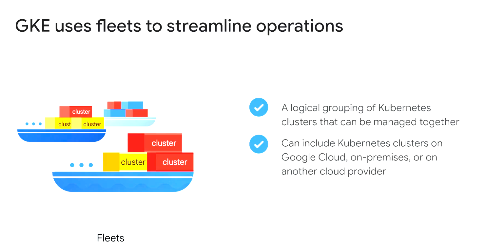

Additional GKE services and tools

- configuration and policy management
- Team management
- Cloud Service Mesh
- identity management features
- observability features

**Authentication and authorization**

- Using google credentials
- Google identity
- Third-party credentials
- SAML and LDAP 

### **Policy Controller**

Policy Controller is a Kubernetes policy enforcement engine (based on OPA Gatekeeper) used to validate and govern cluster resources.

- Consistent enforcement of security and regulatory compliance across a fleet can be challenging
- Validates every API requests to your Kubernetes cluster and ensures compliance

- only approved container registries are allowed
- required labels/annotations must exist
- privileged pods or hostPath mounts are blocked
- namespaces must follow naming/security standards

### **Cloud Service Mesh**

Cloud Service Mesh is Google’s managed service mesh (Istio-based) for service-to-service networking and security.
It provides:

- mTLS encryption between services
- traffic management (routing, canary, retries, failover)
- observability (metrics, traces, service-level telemetry)
- policy and access control between workloads

**Application-level security**

- Use binary authorization to deploy only trusted images on your clusters
- Use Kubernetes network policy to control communication between Pods and network endpoints
- Use Cloud Service Mesh to control communication between services

### **Observability**

- Observability and dashboard
- Cloud logging and Cloud monitoring
- Integrate tools


## Fleet

For disaster recover, high availability

- A fleet includes many same cluster, same ingress, same config, same services, VMs
- It is within a host project, spanning across Google Cloud, VPC networks, and projects
- A high level load balancer distribute traffic between them for disaster, high availability

Fleet-enabled components

- Workload identity pools: simplify service authentication and authorization
- Multi-cluster gateways: low latency and high availability (load-balancing)
- Cloud Service Mesh: monitor and manage a reliable service mesh on Google Cloud, on premises, or on other supported Cloud providers.
- Config Controller: deploys, monitors, and enforces declarative policies from a central Git repository

Benefits:

- same namespaces, services, workload identities, mesh identity, and access.
- Each fleet-aware resource, like a namespace or service, belongs to only one fleet.
- Security policies applied at the fleet level automatically extend to all clusters within it.
- communicate frequently can be placed in the same fleet
- Flexible service organization for easier administration
- centralizing policy and governance at the fleet level while retaining multiple clusters

Create fleet

Register a new cluster (Autopilot cluster, GKE standard cluster) to a fleet in (same project, different project)

### Config Controller

a fully managed service that allows you to manage Google Cloud resources (like bucket, DB, network) using Kubernetes-style declarative configuration.

extending Kubernetes's powerful configuration management tools to your entire Google Cloud infrastructure.

benefits

- No need to build tools from scratch, simplified management
- consistent configuration and policy management.
- scalable, automated, and reliable management of configurations and systems in production.
- Reduce risk with customizable and consistent policies across environments.

**Config Sync**

**“Multi-cluster consistency”**、**“GitOps”** , **“Declarative management”**

- syncs your clusters to a central set of configurations stored in one or more Git repositories.
- ensures consistent, auditable, and version-controlled configurations across clusters and environments.

For example: get YAML from git, move to clusters  

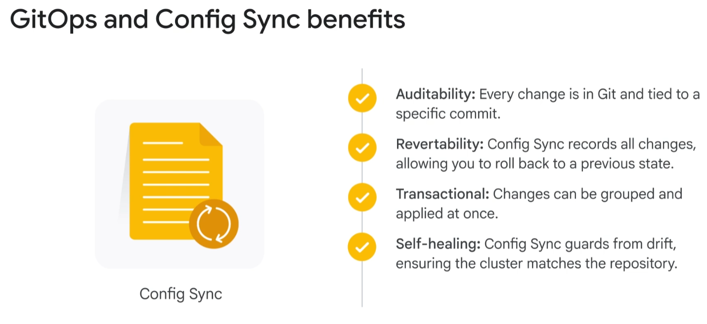

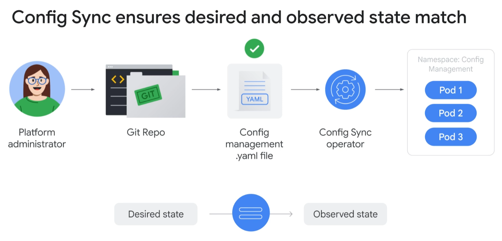

- Config Management Operator: they manage Config Sync components and require cluster admin permissions.

- Reconciler Manager: they create and manage reconcilers for RootSync and RepoSync objects, ensuring synchronization.

  

### **Policy Controller**

- enforces programmable policies
- prevent configurations from violating security and compliance controls
- features a library of pre-built policies
- review and maintain configuration compliance

It enforces security and compliance policies on the desired state.

For example: check YAML configuration follow compliance or any other rules

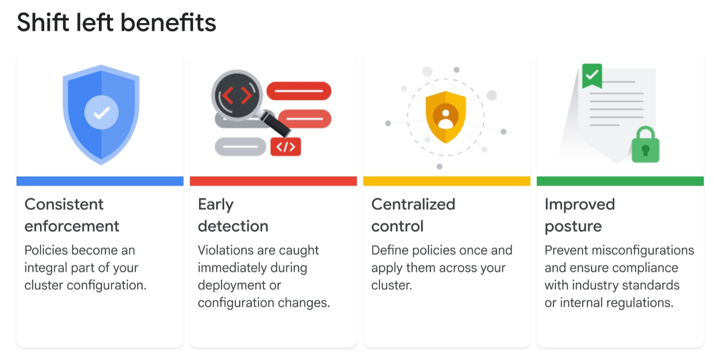

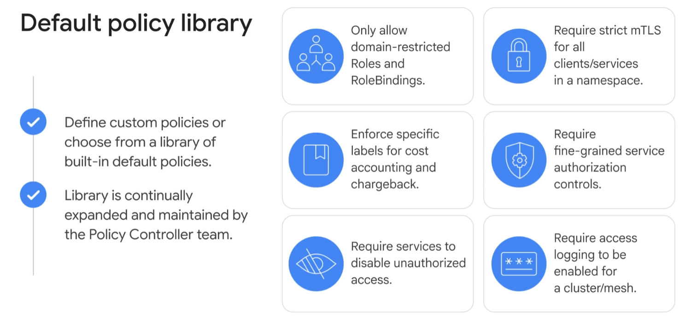

**图纸 (Template)** -> **规则 (Constraint)** -> **应用 (Enforcement)**

1. 图纸 vs 规则，ConstraintTemplate (约束模板 - "图纸")，**Constraint (约束 - "规则实体")**
2. Built-in Policy (内置策略库)
3. Custom Policy (自定义策略)
4. Policy Constraints 的执行动作 enforcement

### **Config Connector**

- uses an API endpoint to provision and orchestrate GKE and Google Cloud resources
- can also be run in your cluster

For example: run the YAML and do the work

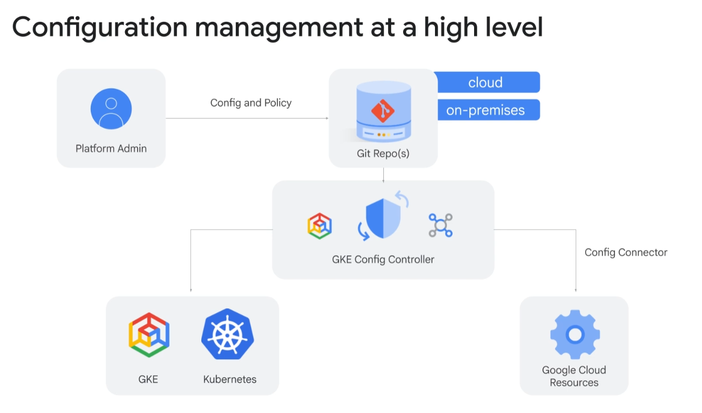

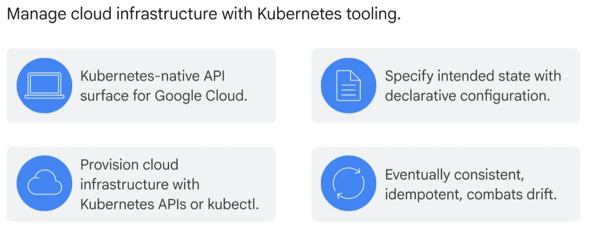

### Blueprints

To simplify matters and make things easier

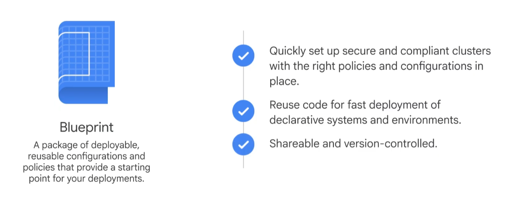

Google provides pre-built blueprints for both Kubernetes and Terraform.

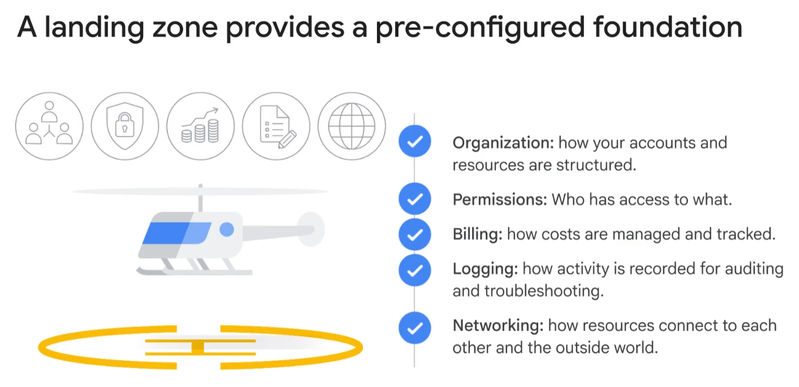

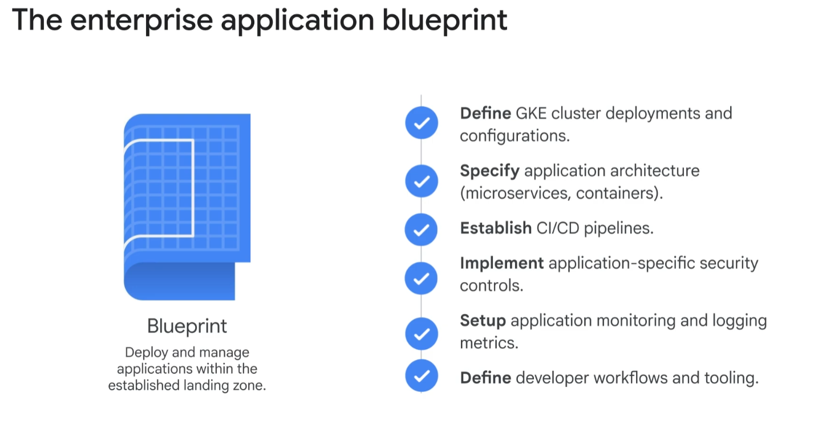

The landing zone blueprint specifies the environment where.

And the enterprise application blueprint indicates the applications, what and how.

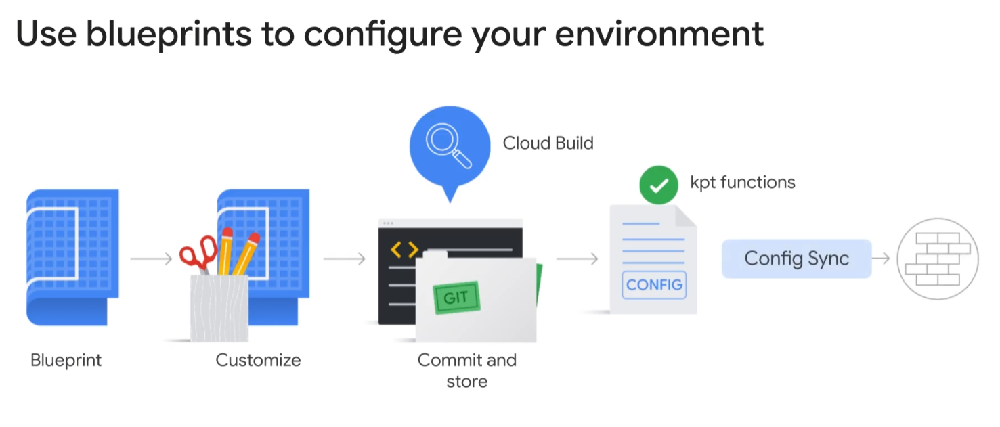

Google Cloud 提供了几种针对不同场景的蓝图：

1. **GKE Enterprise Foundation Blueprint:**
   - 这是最基础、也是 PCA 考试最常涉及的。它教你如何建立一个跨多区域、带治理功能的“基座”。
2. **Multitenant Batch Workload Blueprint:**
   - 专门针对运行批处理任务（如数据分析、AI 训练）的场景，优化了成本和资源隔离。
3. **PCI-DSS on GKE Blueprint:**
   - 如果你的 WMS 系统需要处理支付信息，这个蓝图会自动帮你配置好所有符合 PCI 安全标准的合规项。

### Sameness and trust

Sameness 

Kubernetes objects that have the same name, like namespaces, are treated equally, even if they are in different clusters.

Trust

resources can be managed at the fleet level instead of individually configuring each cluster.

Organize fleets based on organizational requirements

- fleet host project
- Clusters with services that frequently communicate with each other have significant advantages when managed in a fleet.

Teams

- Teams might go against the principles of sameness within GKE

### fleet management

**Team scope**

- operators and admins can access information defined by the scope, like resource utilization, logs, errors, and metrics.
- facilitate resource assessment, troubleshooting, and rollout sequencing upgrades.
- members can use Connect gateway to log in with their Google credentials and authenticate with Google groups

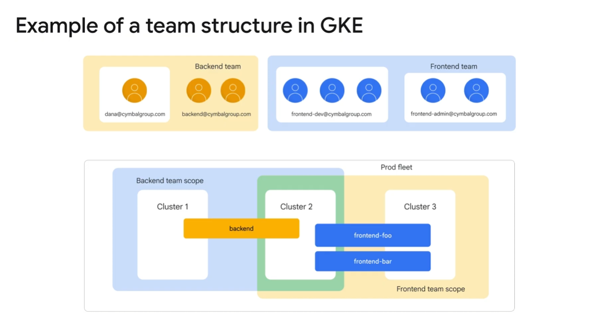

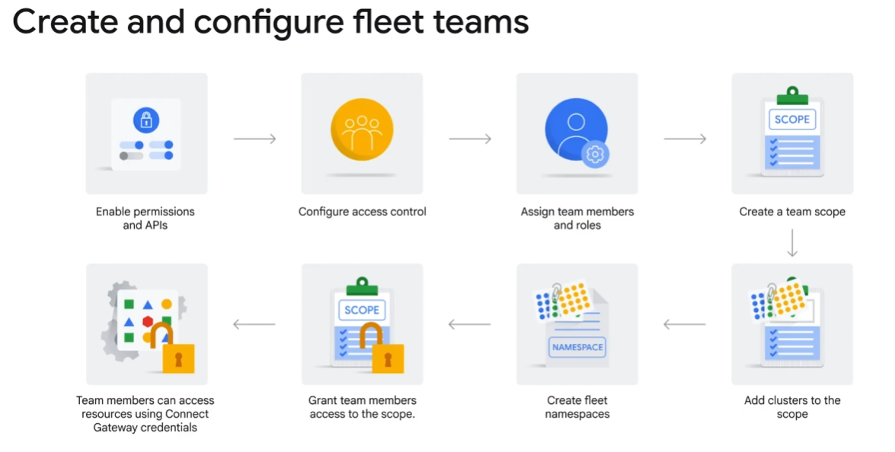

**Rollout sequencing**

fleet management feature used to manage software updates at scale.

在 GKE 中，Rollout Sequence 定义了**升级动作的具体步骤和策略**。它决定了流量如何从旧节点（蓝色）迁移到新节点（绿色），以及在什么阶段触发浸泡观察。

在一个典型的蓝绿升级中，Rollout Sequence 通常包含以下几个关键阶段，而 Soaking Time 嵌入在其中：

1. **排水阶段 (Drain Phase)**

Rollout Sequence 开始，系统会逐个“驱逐”旧节点上的 Pod。

- **动作：** 在新节点（绿色）上启动新 Pod，同时在旧节点（蓝色）上触发优雅停机。
- **目的：** 确保业务不中断。

2. **流量切换阶段 (Traffic Shift)**

这是序列中的关键点。你可以配置是“一次性全切”还是“分批切”。

- **联系：** 当流量完全切换到绿色节点池后，**Soaking Time 正式开启**。

**3. 浸泡阶段 (Soaking Phase)**

这是 Rollout Sequence 里的“暂停键”。

- **动作：** 序列在此处挂起（Pending）。
- **目的：** 给你时间运行自动化测试或人工观察。

**4. 确认/清理阶段 (Finalize/Cleanup)**

- **自动模式：** 如果 Soaking Time 结束且没有报警，Rollout Sequence 进入最后一步：删除旧节点池。
- **手动模式：** 你可以在序列中设置“手动确认”。即使浸泡时间到了，除非你点一下“完成”，否则旧节点会一直留着。

Google Cloud 选项

**Surge Upgrade**（默认）：速度快，省钱（只多收 1 个节点的钱），但没有真正的 Soaking Time，回滚较慢。

**Blue-Green Upgrade**：安全性最高。利用 **Rollout Sequence** 确保平滑过渡，利用 **Soaking Time** 确保万无一失。

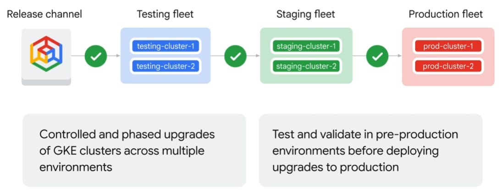

**Team-based sequences** require each team to have its own dedicated cluster, and team scope must be in a separate fleet.

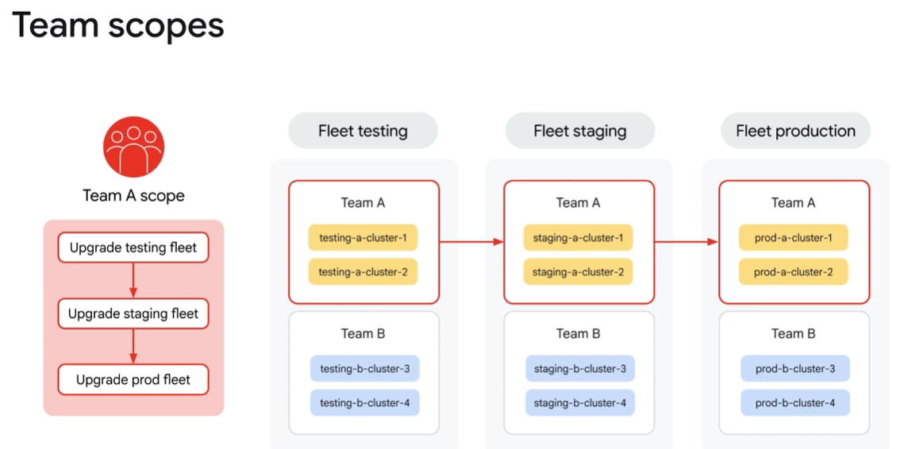

### Soak time

 is the delay between upgrades in different groups.

蓝绿升级（Blue-Green Upgrades）

在进行集群节点池的蓝绿升级时，GKE 会创建一个完整的新节点池（绿色环境），并将流量切过去。**Soaking Time 指的是：在旧节点池（蓝色环境）被彻底删除之前，新节点池维持运行并承载流量的这段等待时间。**

- 稳定性观察
- 快速回滚
- 业务验证

在 GKE 节点池升级过程中，流程通常如下：

1. **准备阶段：** GKE 创建新的“绿色”节点池。
2. **切换阶段：** 将工作负载从“蓝色”节点迁移到“绿色”节点。
3. **浸泡阶段（Soaking）：** 此时新旧节点池共存。**Soaking Time 开始计时。**
   - 如果计时结束前你没点“回滚”，也没有发生严重的异常，升级会自动完成。
   - 你可以手动缩短（完成）或延长这段时间。
4. **清理阶段：** Soaking Time 结束后，GKE 会自动删除旧的“蓝色”节点池，释放资源。

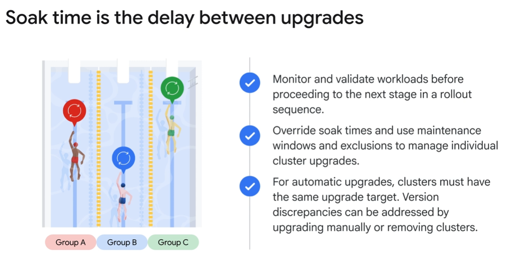

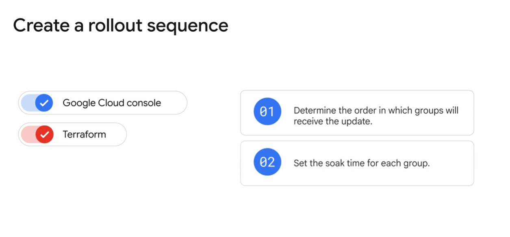

**Connect Agent**

- Manage fleet connections between Google Cloud and other cloud providers
- Automatically installed with cluster registration
- Securely connect cluster and Google Cloud host project
- This connection is authenticated and encrypted using Transport Layer Security, or TLS.
- If you want to manage an existing Kubernetes cluster with GKE, you must register it with a GKE fleet.

**Connect Gateway**

- a secure entry point for accessing your registered clusters from anywhere, regardless of your network location.

**Load balancing solutions**

Network Load balancer

Application Load balancer

- Within one fleet, among clusters

  There is a high level load balancer that can distribute traffic to different clusters in one fleet

**Authenticate**

- OIDC, Microsoft Entra AD or Azure AD, and Okta and bearer tokens.


### Fleet Solutions

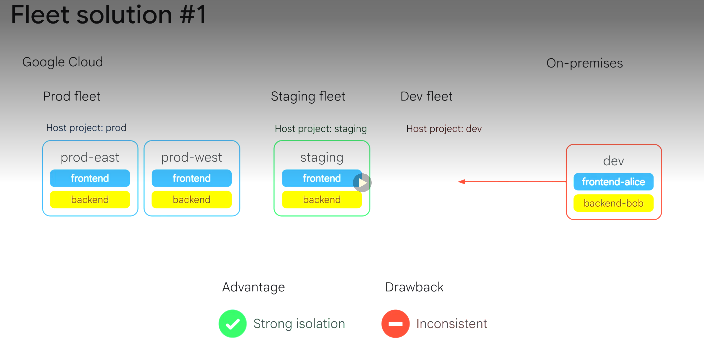

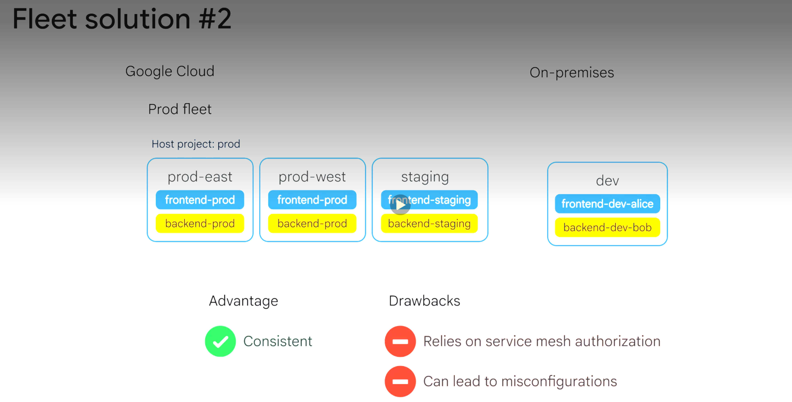

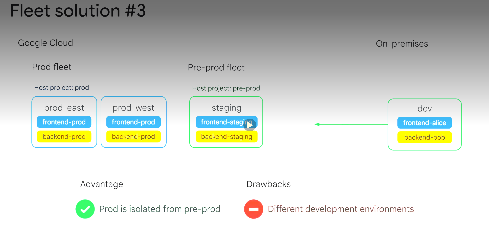


### Management

**Drift** is when the real-world state of your infrastructure differs from the state defined in your configuration.

To solve this challenge, you can manage configuration declaratively with **GitOps**.

Instead of individual teams or tools directly modifying the state of a cluster, changes are made and stored in a shared centralized repository.

automatically synchronize configurations and policies across clusters and Cloud resources

## Fleet Networking

| **技术名称**               | **缩写** | **核心功能（人话版）**                                       | **作用层级**           |
| -------------------------- | -------- | ------------------------------------------------------------ | ---------------------- |
| **Network Endpoint Group** | **NEG**  | **“定位器”**。把具体的 Pod IP 映射给负载均衡器，直接对接硬件。 | **L3/L4 (网络层)**     |
| **MultiCluster Services**  | **MCS**  | **“虚空之门”**。让 A 集群能直接用域名访问 B 集群的内网服务。 | **L4 (传输层/DNS)**    |
| **Multi-cluster Gateway**  | **MCG**  | **“海关/大门”**。外网流量进入多个集群的总入口，负责分流。    | **L7 (应用层/入口)**   |
| **Cloud Service Mesh**     | **CSM**  | **“智能交警+保镖”**。精细控制服务间怎么说话、加不加密、报不报警。 | **L7 (应用层/全路径)** |

- NEG不可替代，是IP层的硬件功能
- 在多集群服务治理场景下，CSM 确实替代了 MCS 的角色
- 现在的 **Cloud Service Mesh (1.23+)** 已经深度集成了 **Gateway API**。这意味着你以后可以用**同一种语法**（Gateway 规格）来配置 MCG 和 CSM

### Network Endpoint Group

Global HTTPS load balancers use Anycast IPs and Network Endpoint Groups, or NEGs, to distribute traffic efficiently.

#### **Service discovery mechanisms**

Problem: Pods are ephemeral, can be created and destroyed dynamically. So it's hard to communicate with each other

#### **Service**

Within one cluster

It is a permanent, logical object in the Kubernetes API. It's in the **Network Layer**. It includes

- **A selector**. A rule like app: orders-db
- **A Port Mapping**: it defines which port it listens on
- **An Endpoints list**: GKE maintains a hidden list called Endpoints, it's the real-time list of all healthy Pods IPs that match the selector.

The path of sending requests to a service

1. The frontend code sends a request to http://orders-db:3306
2. The frontend Pod asks the internal GKE DNS, the IP of orderes-db
   1. The Internal GKE DNS runs as a Pods inside your cluster (usually in the `kube-system` namespace). And both services are within in one cluster. Every node in your cluster has a small cache (NodeLocal DNSCache) to make these lookups fast.
3. DNS server responses the IP of the selector
4. The traffic hits the selector, and the selector redirects the traffic to actual Pod IP
   1. It's the Linux Kernel to route traffic to each nodes
   2. Every node in the cluster has a component called `kube-proxy`, it programs the **IPtables** (or IPVS) of the Linux kernel on that node based on the **Endpoint list**.

### MultiCluster Services MCS

MCS acts as a central definition for a service that spans multiple clusters

- MCS uses Cloud DNS to enable cross-cluster service discovery.
- Multicluster service configuration is separate from Istio and Cloud service mesh.
- Multicluster service is only available for GKE clusters, and those clusters must be using VPC native networking.

An MCS selects pods using labels and clusters.

- MCS chooses from clusters registered to the fleet called member clusters
- Then it generates a **derived service**, which creates a NEG (network endpoint group)
- NEG tracks POD endpoints for all pods that match the specified label selector in the cluster.
- If there is label selector in the cluster, NEG is empty, otherwise, those POD IPs will be added as backends for the multicluster gateway

the MCS is acting as the blueprint for the matching clusters to create a derived service from

While MCS typically schedules derived services on all target clusters, you can explicitly select specific clusters for deployment.

**Enable** **MCS**

1. First enable APIs-- MCS, Fleet Hub, Resource Manager, Cloud Service Mesh and Cloud DNS.
2. use the gcloud container fleet
3. Use command to enable the MCS feature for your project's fleet
4. use the gcloud container fleet memberships register command to register your GKE clusters to the fleet

### Multi-cluster gateway MCG

Gateway API has several key resources, including gateway class, gateways, routes, and policies

**Gateway class** provides a template for creating load balancers.

**Gateways** define where and how load balancers listen for traffic. Cluster operators create gateways based on a gateway class.

**HTTP routes** define rules for routing HTTP(S) requests from a gateway to Kubernetes services.

**Policies** define implementation-specific characteristics of a gateway resource -- for example, health checks and front end or back end configurations.

**Configure steps**

1. gateway Custom Resource Definition, CRD

2. gateway API is enabled

3. gateway YAML file, specify the 

   1. name of the resource 
   2. the target namespace
   3. The gatewayClassName, which determines the type of load balancer that will be provisioned.
   4. To load balance across clusters, include mc at the end of the load balancer name.
   5. create routes inside the gateway or in a separate HTTP route resource
      1. An HTTPRoute defines rules for routing HTTPS requests from a gateway to backend services.
      2. Use traffic splits to deliver requests based on weights
   6. supports the GCPBackendConfig resource
      1. connectionDraining to enable existing connections to complete when a backend is removed
      2. iap enables you to authenticate and authorize employees to use internal applications
      3. Cloud Armor Security policies help you protect your load balanced applications from web-based attacks, such as denial of service, cross-scripting injection, or SQL injection.
      4. Enabling logging can log all HTTP requests from clients to cloud logging at a sampling rate of your choice.

## Cloud Service Mesh

A service mesh is a transparent and intelligent network that sits alongside your application code managing how your various services interact with each other.

处理微服务之间的通信、安全和可观察性

### Two corn structure

#### Data plane

处理微服务之间的通信、安全和可观察性

#### Control plan

由 Google 全权负责维护。它负责存储配置、分发策略（如路由规则、安全设置）并管理网格中的身份验证


### Why need cloud service mesh

#### **流量管理 (Traffic Management)**

- 灰度发布/蓝绿部署
- 超时与重试
- 负载均衡

#### **安全 (Security)**

- 双向 TLS (mTLS) a cryptographic protocol that secures data transmitted over the internet through encryption, authentication, and data integrity.
- 身份验证与授权

#### **可观察性 (Observability)**

- 拓扑图
- 黄金指标

### 两种实现方式

#### **Sidecar 模式 (基于 Istio):**

如果你使用 gRPC 开发应用，可以直接让应用与控制面通信，省去了 Sidecar 代理带来的性能开销和资源占用。

在每个 Pod 里运行一个 Envoy 容器。这是最经典的 Service Mesh 模式，功能最全，对现有应用的侵入性极低。

#### **无代理模式 (Proxyless gRPC):**

如果你使用 gRPC 开发应用，可以直接让应用与控制面通信，省去了 Sidecar 代理带来的性能开销和资源占用。

### 使用流程

**1 API and fleet**

- 开启API

- 整个fleet设置成默认使用CSM，这样新的Cluster加进来的时候会自动启动CSM

**2 Enable applications use CSM**

2.1 Sidecar automatically inject at the namespace level

- 给namespace添加label，istio-injection=enabled，是GKE的功能标签，它区别于普通自定义标签。当开启了这个标签，GKE会意识到它并实行某种功能
- Admission Webhook。在要生成新pod之前，会先看是否有label，有的话它会先配置上Envoy Proxy容器的配置，镜像地址，卷挂载等信息

2.2 `annotate`（注解）

- 让 Google 帮你维护这些 Sidecar
- Envoy 代理的版本更新、安全补丁，你都不用管了，Google 帮你升级

2.3 无代理模式（Proxyless gRPC）

- 代码本来就是用 gRPC 写的，可以让应用直接和控制面说话

**3 接管流量（拦截原理）**

Envoy 是怎么强行截获流量的，是给Sidecar使用的。gPRC不走这里

**流派 A：Init 容器（默认做法）**

- 在你的应用启动前，先跑一个小容器，修改 Pod 内部的 `iptables`（网络防火墙规则）。

  **缺点：** 这种方式需要 `NET_ADMIN` 权限，有些对安全性要求极高的公司不给这个权限。

**流派 B：Istio CNI 插件（更安全）**

- 在 Pod 还没出生（网络设置阶段）就直接把规则写好。
- **优点：** 你的业务 Pod 不需要特殊权限，更安全，符合大型企业的合规要求。


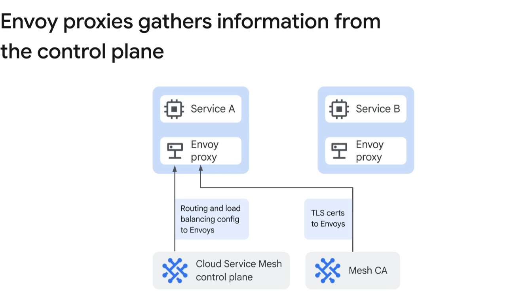

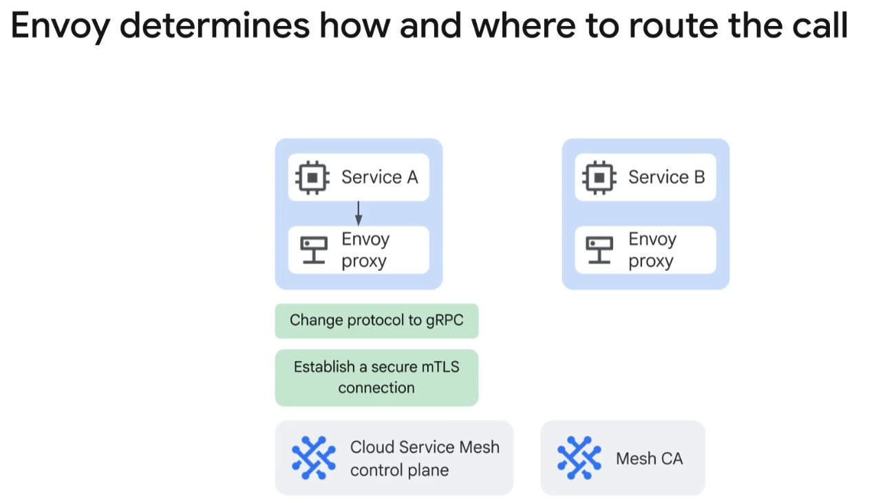

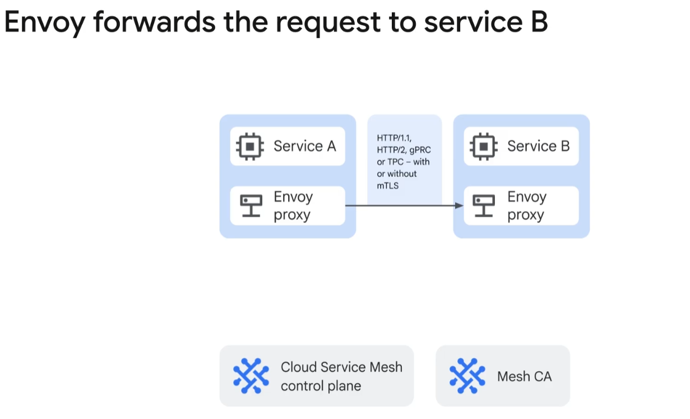

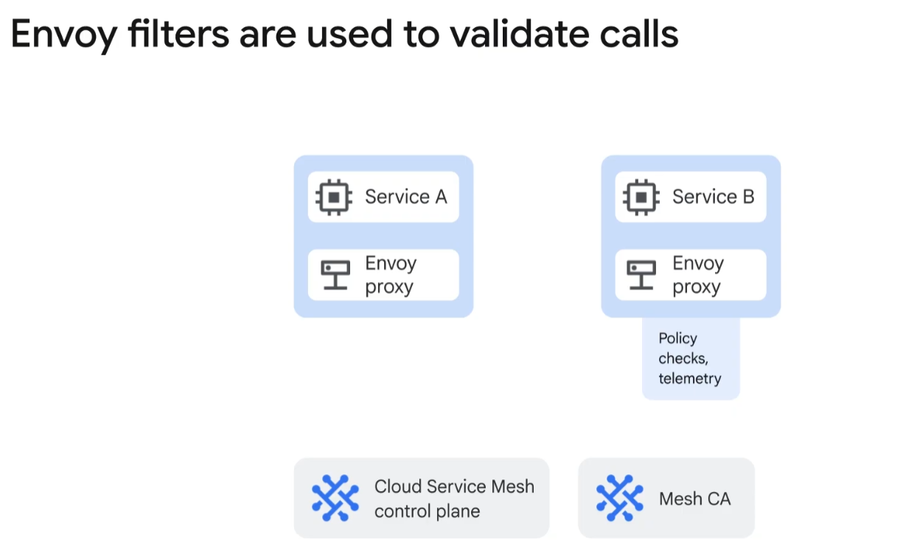

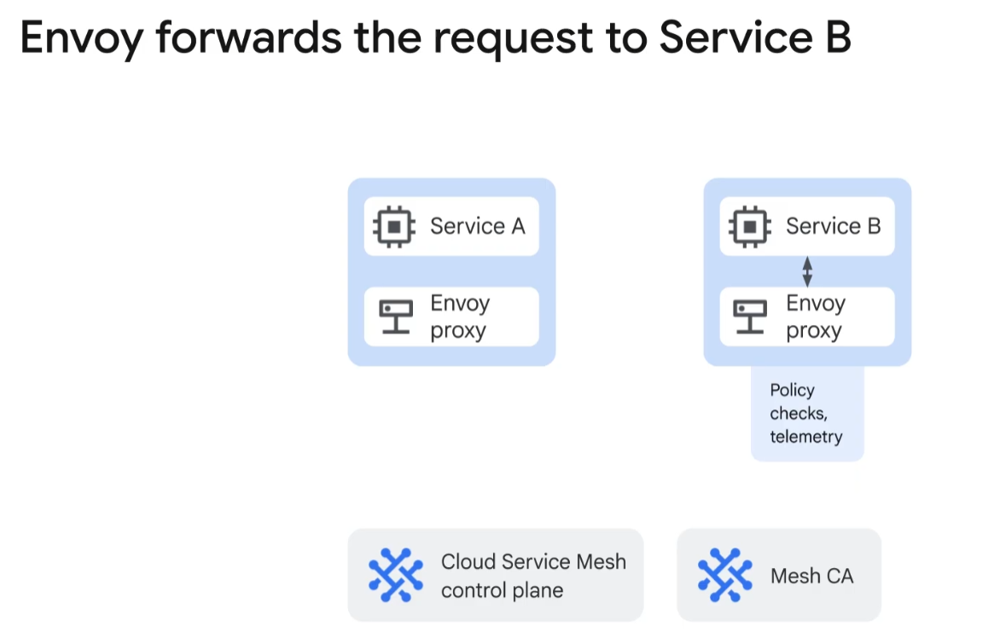

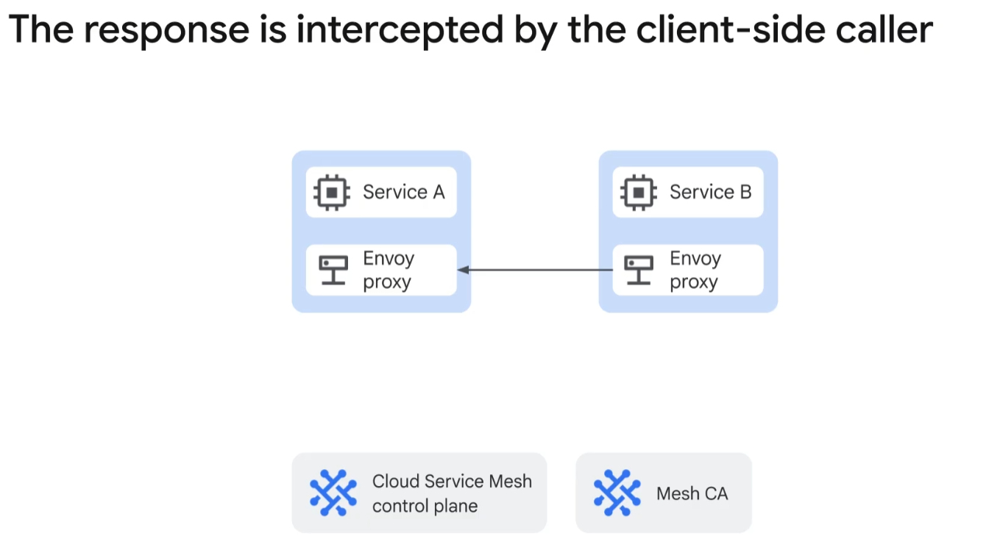

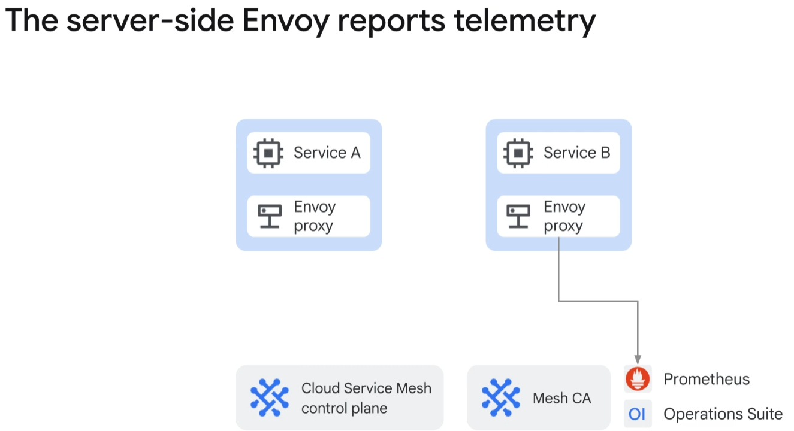

这一步打小报告 (Telemetry)：顺便记录下：*“这次请求花了 50ms，成功了”*。这个“打小报告”的操作，在底层就是通过 WebAssembly **Wasm 扩展** 实现的

但是Google 的 CSM (托管模式)不让自定义Wasm，因为很多不合格，造成Envoy崩溃。


Dashbaords:

latency, traffic, error, and saturation


Service Level Indicators, or SLIs, are the key metrics you must report on, for example, latency and availability.

After figuring out what to measure, SLIs, you can set targets for how good they need to be, SLOs.


CSM is available with GKE or as a standalone offering on Google Cloud.

Billing is determined by the Google APIs that are enabled on your project.


虽然 CSM 的内核是 Istio，但因为它是**托管服务**，Google 为了保证系统的“绝对稳定”和“云原生集成”，会对原生的 Istio 功能做一些**裁剪**或**限制**。

这就是为什么你会看到“**CSM 1.23 相比 Istio** 的局限性”：

| **维度**      | **原生 Istio (自建)**                       | **Cloud Service Mesh (CSM)**                            |
| ------------- | ------------------------------------------- | ------------------------------------------------------- |
| **控制权**    | **完全控制。** 你可以改源代码，装任何插件。 | **有限控制。** 控制面由 Google 锁死。                   |
| **Wasm 扩展** | 随意注入自定义 Wasm 模块。                  | **受限。** 因为未审核的代码可能导致托管服务崩溃。       |
| **API 支持**  | 永远支持最新的 Istio API 特性。             | **稍有延迟。** 只有经过 Google 测试稳定的特性才会放出。 |
| **CA 证书**   | 可以自建任何 CA 证书系统。                  | **默认集成。** 强制或推荐使用 Google Mesh CA。          |
| **多集群**    | 手动配置非常复杂，容易出错。                | **舰队 (Fleet) 模式。** 跨集群配置被大大简化。          |

### Routing

Configured in **YAML** file called **Kubernetes Custom Resource Definitions-- CRDs**

- Control panel shares them with the envoy proxies via the Envoy xDS API
- a set of protocols used by **Envoy proxies** or proxyless gRPC to **dynamically fetch** configurations from the control plane.

#### **VirtualService** How

looking at the incoming cars (requests) and deciding which lane they should take based on specific rules

- **Traffic Splitting:** Send 90% of traffic to `v1` and 10% to `v2` (Canary testing).
- **HTTP Matching:** Route traffic based on headers, URIs, or cookies (e.g., "If the user is on mobile, send them to the mobile-optimized service").
- **Fault Injection:** Purposefully delay or fail requests to test your application’s resilience.
- **Retries and Timeouts:** Define exactly how long to wait before giving up on a request.

**配置**

一般如果不设置VirtualService，走的是Round robin方案，即一个一个轮流转发过去

采用VirtualService则需要配置

1. hostnames, 可以是IP addresses, DNS names, Kubernetes short names. eg: api.example.com, *.myapp.com

2. conditions, 符合匹配的内容，eg: `uri: prefix: /v2`, `headers: end-user: exact: json`

   routing options, including **HTTP**
   **headers, URIs, ports, and source labels**

3. rules, 匹配conditions的请求，route到哪里，eg: `destination: host: my-app-v2-sve` `destination: host: reviews subnet: v3`

```yaml
apiVersion: networking.istio.io/v1
kind: VirtualService
metadata:
	name: reviews
spec:
    hosts:
    	- reviews
	http:
    - match:
    	- headers:
            end-user:
            	exact: Jason
            route:
            - destination:
                host: reviews
                subset: v2
        - destination:
        	host: reviews
        	ubset: v3
# requests from end-user go to reviews v2, all others go to reviews v3
spec:
  hosts:
  - api.example.com          # 匹配域名
  http:
  - match:
    - uri:
        prefix: /v2          # 匹配路径
    route:
    - destination:
        host: my-app-v2-svc  # 转发给对应的后端“业务程序”
```

这里每个host是一个service

- 单例模型中就是单一运行的一个程序
- K8s中是一群一摸一样的pods，带有相同标签如`app: my-app`
- Istio 中也是这么一群pods，不过这些pods有其他的标签属性如version来供进一步划分

其他用法：

- **Faults** test the resilience of your
  application.
- **Traffic mirroring** is a technique used to test shadow deployments and detect network intrusions

#### **DestinationRule** Where

Defines *what happens* when the traffic arrives, the DestinationRule is the set of rules for the destination itself

- **Subsets:** This is the most common use. It groups pods by labels (e.g., "The pods with the label `version: v1` are part of the 'stable' subset").
- **Load Balancing Algorithms:** Decide if you want standard Round Robin, Random, or Least Connections.
- **Circuit Breaking:** If a specific pod is failing, the DestinationRule can "trip the circuit" and stop sending traffic there for a while to let it recover.
- **TLS Settings:** Controls whether the connection between services should be encrypted (mTLS).

**配置**

1. 选定某一个host进行规则定义 `spec: host: ratings.prod.svc.cluster.local`
2. 通过为同一个host中的`pods`进一步进行subnets分组。先定义组名 `- name: v2-group`
3. 通过labels来把某些pods划分到该组 `labels: version: v2`

```yaml
apiVersion: networking.istio.io/v1alpha3
kind: DestinationRule
metadata:
  name: my-app-dr
spec:
  host: my-app-svc        # 指向 K8s 的那个“统称” Service
  trafficPolicy:
    loadBalancer:
        simple: LEAST_REQUEST
          subsets:
          - name: v1-group        # 起个名字叫 v1 组
            labels:
              version: v1         # 寻找带有 version: v1 标签的 Pod
          - name: v2-group        # 起个名字叫 v2 组
            labels:
              version: v2         # 寻找带有 version: v2 标签的 Pod
            trafficPolicy:
                loadBalancer:
                	simple: ROUND_ROBIN
```

**Routing strategies：**

- Load balancing options (round-robin, random, least request (最少请求, 谁闲给谁，根据正在处理的活跃请求数), and pass-through（直接把请求发送到客户端最初请求的那个 IP 地址，不负载均衡）)
- Configuring session affinity so that clients are consistently routed to the same service instance.
- Configuring circuit-breaking to limit the impact of failures and latency spikes.

**Traffic splitting**

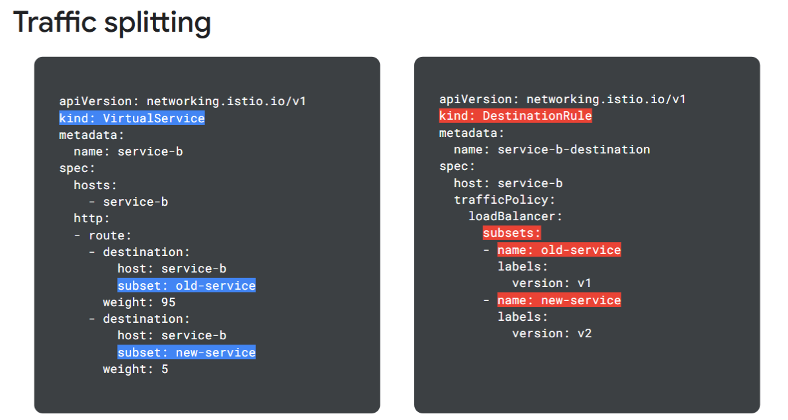

**canary, A/B, or blue-green**


#### **Gateway**

- greater granularity when configuring load balancing properties, TLS settings, and routing rules
- Gateways are applied to standalone Envoy proxies at the mesh edge, not to sidecar proxies, and they configure Layer 4-6 load balancing (ports, TLS).
- VirtualServices handle Layer 7 (application-level) routing bound to the Gateway.

#### Ingress gateways

**load balancers located at the edge of the mesh**. They receive HTTP/TCP connections

**VirtualService 是注入到 Gateway 内部的大脑里的**。流量并没有“跳”出 Gateway 去找 VirtualService，而是 Gateway 在接收到流量的那一瞬间，根据 VirtualService 赋予它的规则，决定了流量的去向。

**所以，VirtualService 的作用就是：定义 Gateway 在拿到流量后，该如何根据 HTTP 细节（路径、Header、权重等）进行精准的“分拣”**

```yaml
# Ingress gateway
# HTTP
# external certificates
apiVersion: networking.istio.io/v1
kind: Gateway
metadata:
	name: bookinfo-gateway
spec:
    selector:
    	istio: ingressgateway
    servers:
    - port:
        number: 443
        name: https
        protocol: HTTPS
    hosts:
    - "*"
    tls:
        mode: SIMPLE
        credeentialName: ext-cert
        
# VirtualService send traffic to the gateway
# *: it accepts all traffic from any destination and after evaluated routes traffic based on route attribute
apiVersion: networking.istio.io/v1
kind: VirtualService
metadata:
	name: bookinfo
spec:
    hosts:
    	- "*"
    gateways:
    - bookinfo-gateway
    http:
        - match:
            uri:
                exact: /productpage
            route:
            - destination:
                host: productpage
                port:
                    number: 9080
```


1. A Google **Cloud load balancer is created along with an ingress gateway**
2. Inbound traffic flows from a load balancer into the mesh. The load balancer forwards
   traffic to a NodePort and then to the ingress gateway pod.
3. The ingress gateway deployment has a single **Envoy container configured with**
   **VirtualServices and DestinationRules**
4. The ingress gateway's **Envoy processes requests and forwards them to the**
   **appropriate destination**

#### Egress gateways

Dedicated exit nodes for traffic leaving the mesh, controlling external network access.

- Egress Gateways are useful for notes that lack public IPs and are unable to access the internet.


#### East-west gateway 

 Proxies for cross-cluster traffic in multi-primary meshes

East-west gateways are essential for managing inter-cluster communication and applying policies to traffic flowing between clusters.


#### **ServiceEntry**

- Commonly used to enable requests to services outside of Cloud Service Mesh.
- Useful for accessing external APIs or integrating with legacy services that are not part of the mesh.
- Envoy proxies can send traffic to the service as if it was a service in your mesh
- Define **retry, timeout, and fault injection policies** for external destinations.
- **Add VMs** to your mesh and run services in them.
- **Configure a multi-cluster** Istio mesh by logically adding services from different

```yaml
apiVersion: networking.istio.io/v1
kind: ServiceEntry
metadata:
	name: svc-entry
spec:
    hosts:
    - ext-svc.example.com
    ports:
    - number: 443
        name: https
        protocol: HTTPS
    location: MESH_EXTERNAL
    resolution: DNS
```


#### **Sidecar**

- Used to fine-tune Envoy proxy settings.
- They are configured to accept traffic on all ports used by a workload by default.
- They can reach every workload in the mesh.

#### WorkloadEntry

- Used to onboard non-Kubernetes workloads into the mesh. Like virtual machines and bare metal servers
- A WorkloadEntry uses a ServiceEntry to select workloads and provide the service definition.

A WorkloadEntry must have a corresponding ServiceEntry, which defines the service itself (hostnames, ports). ServiceEntry uses label selectors to associate the service with the WorkloadEntry

Centralized workload monitoring and management: When a workload connects to Istio, its status is updated, containing its health and
other details


#### WorkloadGroup

- A collection of workload instances.
- Designed for non-Kubernetesworkloads.
- Replicates the sidecar injection and deployment model used in Kubernetes to bootstrap Istio proxies.
- WorkloadGroup is essentially a template for WorkloadEntry resources.


是一个WorkloadEntry的模板，当有新的资源（VM）接入的时候，需要bootstrap（引导）配置。该VM需要定义两个文件

1. /var/lib/istio/config/sidecar.env

   ```bash
   # 核心：告诉 Istiod 该套用哪个模版
   ISTIO_META_WORKLOAD_GROUP=oracle-db-group 
   
   # 告诉 Istiod 应该在哪找这个组
   ISTIO_META_NAMESPACE=database
   
   # 告诉 Istiod 这台 VM 叫什么名字（如果不写，通常会用 Hostname）
   ISTIO_META_WORKLOAD_NAME=vm-instance-01
   ```

2. /var/lib/istio/config/mesh.yaml

   这是 **“公共地图”**。它定义了整个网格的通用配置（比如 Istiod 的地址、CA 证书的验证方式等），通常所有 VM 都是一样的，它不负责区分具体的 Group。

当启动istio时，一个pilot-agent进程会启动，根据上面两个文件，在内存中动态生成一个Envoy 的初始配置文件 （Bootstrap Config）

Envoy 拿着这个包含 `ISTIO_META_WORKLOAD_GROUP` 标签的配置去连接 Istiod

Istiod 收到请求，看到 `oracle-db-group` ，于是去 K8s 找到定义的 `WorkloadGroup` 规则，然后把完整的路由规则（VirtualService 等）下发给这台 VM


### Security

#### Authentication and encryption

**Transport Layer Security TLS**

Server A uses the public key from Server B to encrypt the message. Then Server B
decrypts the message with its own private key. This process is called asymmetric
encryption

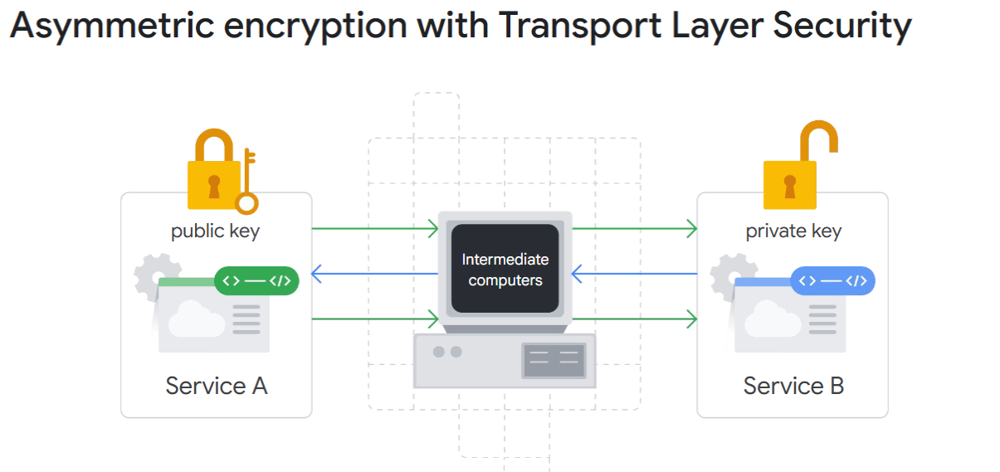


## Workload Identity

让运行在 GKE 里的 Pod 能像一个真实的“人”或“服务”一样，安全地去访问 Google Cloud 的其他资源

**K8s ServiceAccount (KSA)：** 是 Kubernetes 集群内部的身份

Workload Identity：只要是这个 KSA 发出的请求，就把它看作是那个指定的 IAM Service Account 在操作。

工作原理：

1. Pod 向 GKE 的元数据服务器请求令牌。
2. GKE 验证该 Pod 使用的 **Kubernetes ServiceAccount (KSA)**。
3. 通过 Workload Identity 映射，GKE 向 IAM 申请一个临时的、短寿命的 Access Token。
4. Pod 拿到 Token，成功访问 Google Cloud 资源。

**配置流程**：

**第一步：开启集群功能**

在创建或更新 GKE 集群时启用 Workload Identity

```bash
gcloud container clusters update CLUSTER_NAME \
    --region=REGION \
    --workload-pool=PROJECT_ID.svc.id.goog
```

**第二步：创建 IAM 角色并授权**

在 Google Cloud 端创建一个 IAM Service Account (GSA)，并给它分配访问 Storage 的权限

```bash
# 创建 GSA
gcloud iam service-accounts create my-gcp-sa

# 授权
gcloud projects add-iam-policy-binding PROJECT_ID \
    --member="serviceAccount:my-gcp-sa@PROJECT_ID.iam.gserviceaccount.com" \
    --role="roles/storage.objectViewer"
```


**第三步：建立身份绑定**

允许 Kubernetes 的 ServiceAccount (KSA) “冒充”这个 GSA：

```bash
gcloud iam service-accounts add-iam-policy-binding my-gcp-sa@PROJECT_ID.iam.gserviceaccount.com \
    --role="roles/iam.workloadIdentityUser" \
    --member="serviceAccount:PROJECT_ID.svc.id.goog[NAMESPACE/MY-K8S-SA]"
```

**第四步：在 K8s 中标注**

在 Kubernetes 内部创建一个 ServiceAccount，并添加一个特定的 **Annotation（注解）** 来指向 GSA：

```yaml
apiVersion: v1
kind: ServiceAccount
metadata:
  name: MY-K8S-SA
  namespace: NAMESPACE
  annotations:
    iam.gke.io/gcp-service-account: my-gcp-sa@PROJECT_ID.iam.gserviceaccount.com
```

**第五步：部署 Pod**

在 Pod 的配置中指定 `serviceAccountName: MY-K8S-SA`。此时，你的 Python 或 Go 代码只需要使用官方的 SDK（默认凭据），它就会自动识别并完成授权。

## Workload Identity Federation for GKE

直接绑定到 **IAM 策略** (无需中间的 GSA)

**对应第三步**

```bash
gcloud projects add-iam-policy-binding PROJECT_ID \
    --member "principal://iam.googleapis.com/projects/PROJECT_NUMBER/locations/global/workloadIdentityPools/PROJECT_ID.svc.id.goog/subject/ns/gke-mcs/sa/gke-mcs-importer" \
    --role "roles/compute.networkViewer"
```


# Infrastructure as code (IaC)

**Terraform**

Uses a system of highly structured templates and configuration files to document the infrastructure in an easily readable and understandable format.

- Create identity infrastructures for dev, test, and prod
- Can be part of a CI/CD pipleline
- Templates are the building blocks for disaster recovery procedures

**Cloud Marketplace**


# Managed Service

Most of them are serverless, except Dataproc, which you create the cluster and worker instances.

BigQuery

DataFlow

Dataflow processes stream and batch data

Automatic

DataPrep

Dataprep is an intelligent data service for visually exploring, cleaning, and preparing structured and unstructured data for analysis, reporting, and machine learning.

Dataproc

Dataproc is a fast, easy-to-use, fully managed cloud service for running Apache Spark and Apache Hadoop clusters in a simpler way.

Dataproc and Dataflow can both be used for data processing, and there’s overlap in their batch and streaming capabilities.

Manual


# Cloud Storage

## Defination

- website, archival, disaster recovery, distributing large data objects allow user direct download
- Not a file
- A collection of bucket that you place objects into
- Directories are is just another object

### Four classes

- Standard
  - eg: website, streaming video, data for mobile or gaming applications
  - freqently accessed, hot data, or stored for brief period of time
  - most expensive
  - **no minimum duration**
  - no retrieval cost
  - select the same location as GKE or CE to save the data, maximize the performance for data-intensive computations and reduce network charges
  - if in multi or dual region, it improves availability and is appropriate for data that is accessed around the world 
- Nearline
  - low cost, highly durable
  - infrequently accessed data like data backup, long-tail multimedia content and data archiving
  - **30-day** minimum storage duration
  - higher price than standard storage for data access and lower price for data storage 
- Codeline
  - very-low-cost, highly durable for storing infrequently accessed data
  - slightly low availability
  - **90-day** minimum storage duration
  - Higher cost than above two storages for data access and lowercost for storage
- archive 
  - lowest-cost, highly durable for data archiving, online backup, disaster recovery
  - **365-day** minimum storage

Auto class: transitions objects to appropriate storage classes

### Each provides three location types

- Multi-region
- Dual-region
- A Region
  The first two are geo-redundant

You can change data storage type of a bucket as well as an object but cannot change the location types

Access control:

- IAM, roles, for view, create buckets or objects
- Access control lists or ACL for finer control. 
  - Who can access the buckets or objects, 
  - maximum 100 ACL
  - one ACL consists of more entries
  - entries consists of two information:
    - A scope: **who** can perform the specific action (a user, a group)
    - A permission: **what actions** can be performed (read, write)
    - Allusers: everyone on the Internet is allowed
    - allAuthenticatedUsers: anywho who is authenticated with a Google account
- Signed URL provides a cryptographic key that give time-limited access to a bucket or object
  - Not using account-based authentication
- Signed policy document more finer: what file can be uploaded by people with a signed URL

### Object Lifecycle Management:

You set a few rules, and the system handles the cleanup or moving of files for you.
Benefit:

- Cost Optimization
- Compliance, like deleting user data after certain period
- Less Human Error
  "If This, Then That" logic
- Condition: "Is this file older than 365 days?" or "Is there a newer version of this file?"
- Action: e.g., "Delete it" or "Move it to a cheaper storage tier."
  Act asynchronize, so after update the rule, it may take 24 hours to be valid

Object Versioning

Can be enabled for a bucket

Create an archived version of an object 
archived version identified by generation number

Soft Delete:

- use Soft Delete instead of Object Versioning to protect against permanent data loss
- Soft Delete retains all deleted objects whether by overwriting, changing of the data

### Retention Lock

A retention configuration governs how long the object must be retained and has the option to permanently prevent the retention time from being reduced or removed.

### Upload large file to Storage

- Transfer Appliance
  - Hardware appliance
- Storage Transfer Service
  - import online data
- Offline Media Import
  - physical media is sent to a provider who uploads the data

Uploads are strongly consistent, never 404 or data inconsistent like read write problem

Deletions are global consistency, so after delete an object, immediately access the data will response 404

Bucket listing is strongly consistent

Object listing is also strongly consistent

### Directory Synchronization

Sync a VM directory with a bucket

## Cloud SQL

No global Scalability

fully managed service of either MySQL, PostgreSQL, or Microsoft SQL Server databases

patches and updates are automatically applied

High Availability configuration:

  - a primary instance and a standby instance 
  - synchronous replication to each zone's persistent disk, all writes made to the primary instance are replicated to disks in both zones before a transaction is reported as committed.
  - failover: In the event of an instance or zone failure, the persistent disk is attached to the standby instance, and it becomes the new primary instance.
  - automated and on-demand backups
  - Disadvantage: 
  - scale up, which does require a machine restart or scale out using read replicas. 
  - horizontal scalability using spanner 
    Connection:
  - Private IP connection: within the same Google Cloud project
  - Outside Google Cloud project or publicly connect to it:
    - Cloud SQL Auth Proxy, which handles authentication, encryption, and key rotation for you
    - SSL connection
    - authorizing a specific IP address to connect to your SQL server over its external IP address

## Spanner

horizontal scalability

全球级、强一致性的分布式关系型数据库
Like Relational DB

- Has schema, SQL, strong consistency
  Like Non-Relational DB
- high availability, horizontal scalability, and configurable replication.

A Spanner instance replicates data in N cloud zones, which can be within one region or across several regions.
The replication of data will be synchronized across zones using Google's global fiber network.

## Firestore

**Non-relational**
highly-scalable, NoSQL database
fully managed, **serverless**, cloud-native, NoSQL, **document database**


simplifies storing, syncing and querying data for your mobile, web, and IoT apps at global scale.

ACID transactions

Firestore even allows you to run sophisticated queries against your NoSQL data without any degradation in performance.

Firestore in Datastore mode for new server projects, and Native mode for new mobile and web apps.

- **No-SQL Non-relational**: Schema might change
- **Serverless**: Adaptable database, scale to zero
- low maintenance overhead
- transactional consistency
  If not transactional consistency, could consider Bigtable

**Document database**

Work with compute engine fleets, so they could have a shared file system.

- Application migration
- Media rendering
- Electronic Design Automation EDA
- Data analytics
  - without the need to lose valuable time on loading an offloading data to clients drives
- Genome sequencing 


## AlloyDB

**Relational**
For PostgreSQL, fully managed

- automates administrative tasks, such as backups, replication, patching and capacity management
- fast transactional processing
- enterprise workloads: high transaction throughput, large data sizes, or multiple read replicas.
  Need hybrid transactional and analytical processing (HTAP)

## Bigtable

Analytics

fully managed NoSQL database with petabyte-scale and very low latency

Perational and analytical applications, including IoT, user analytics, and financial data analysis, machine learning applications

Support open source industry standard HBase API

In Bigtable, data is indexed by a Row Key, a Column Family, a Column Qualifier, and a Timestamp.

1. Row key: Like the unique id in SQL
   Example: USER#12345

2. Column family: Like a table in SQL, and each row can have many tables, or families. Related columns together and are defined at the schema level
   Example: Family A: profile
           Family B: interactions

3. Column Qualifiers: Like a field in a SQL table, or dynamic and can be anything
   Under profile: display_name, country
   Under interactions: last_login, total_posts

4. Timestamps & Versioning


Bigtable is sparse, if "Bob" doesn't have a total_posts qualifier, it takes up zero space. There are no "NULL" values like in a SQL database.

**Tablets**
Bigtable doesn't store a whole table as one giant file. It chops your table into chunks of rows called Tablets    

**Nodes and Load Balancing**
It learns to adjust to specific access patterns based on workload.
Node: is like a VM or Compute instance that serves many tablets.

When a node is frequently accesssing a certain subset of data --- a tablet,
it will split the tablet into smaller tablets and move some of it to another node.
And update the index to point to the new location.
In this way, other nodes can distribute that workload.

so for every single node that you do add, you're going to see a linear scale of throughput performance, up to hundreds of nodes.
Each node you add will not be staled, it will be active and serving traffic, and you can see a linear increase in performance as you add more nodes.


**NoSQL** wide-column database

low latency, large numbers of reads and writes, and maintaining performance at scale.

Bigtable is also suited as a ‘fast lookup’ **non-relational** database

Row-level consistency

## BigQuery

Analytics

as a data warehouse, is the default storage for **tabular / relational** data, and is optimized for large-scale, ad-hoc SQL-based analysis and reporting.

it has a built-in cache, BigQuery works really well in cases where the data does not often change.

## Memorystore

**Non-relational**

Google Cloud's fully managed Redis service, **cache storage**

- have large spikes in traffic
- gaming environments and real-time analytics

- are replicated across two zones


