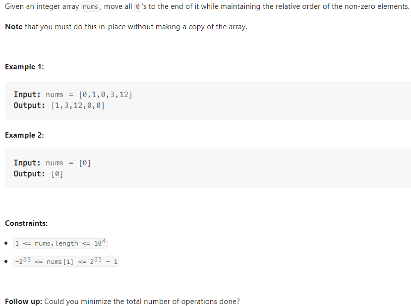
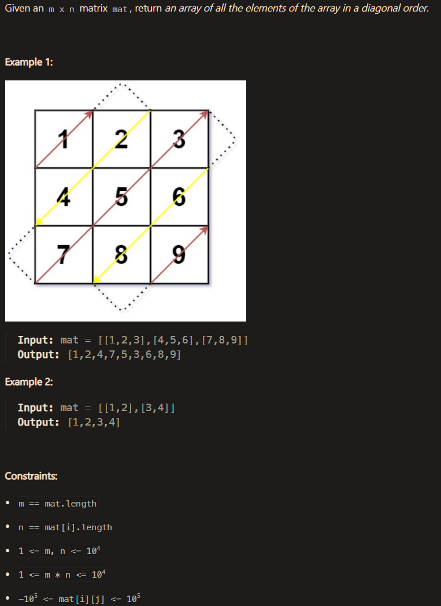
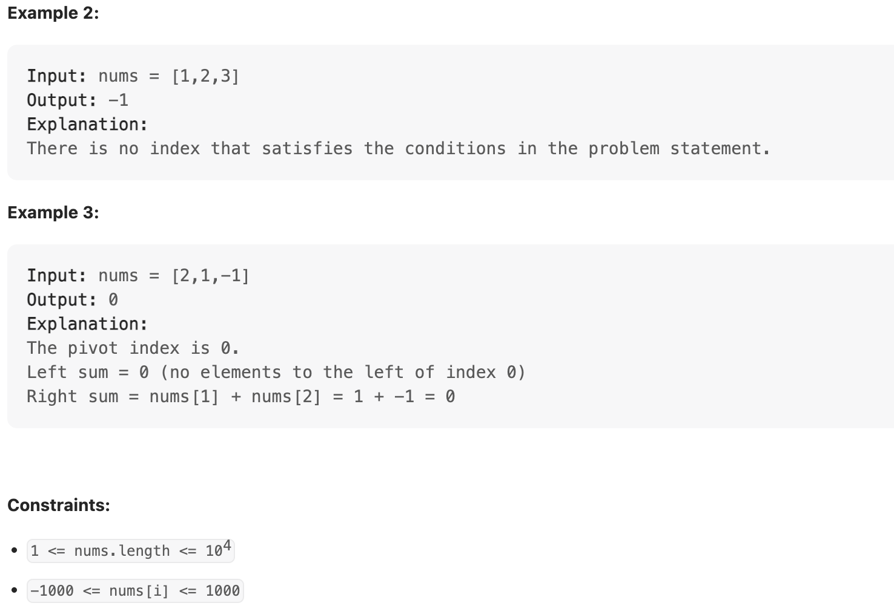
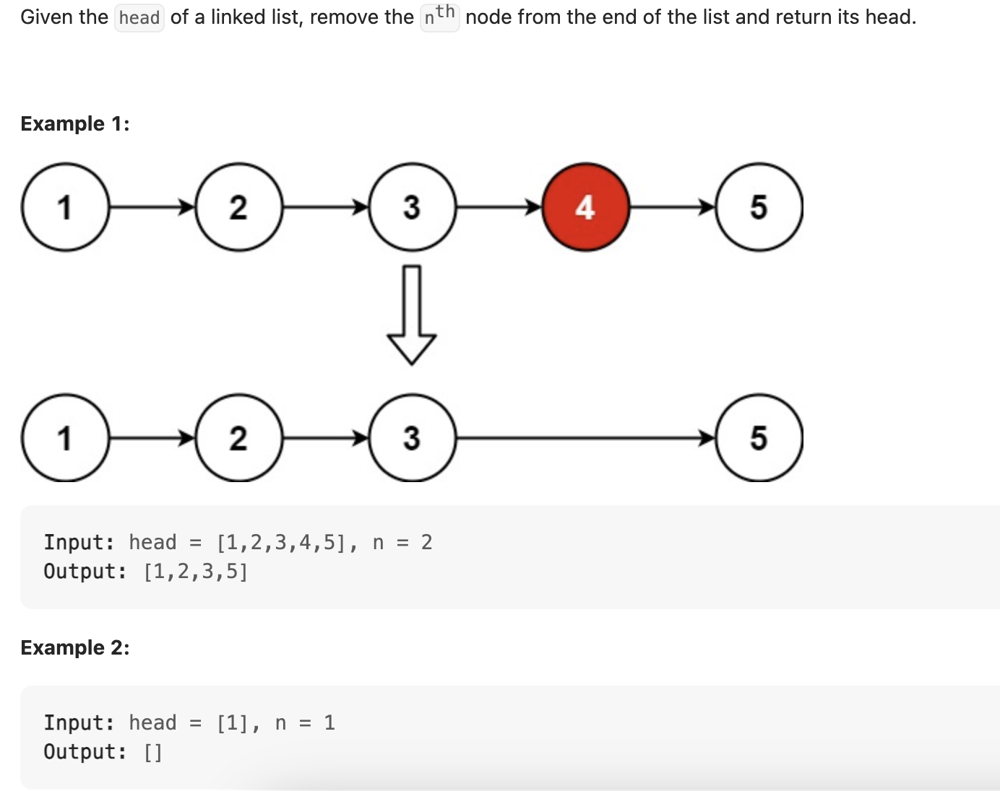
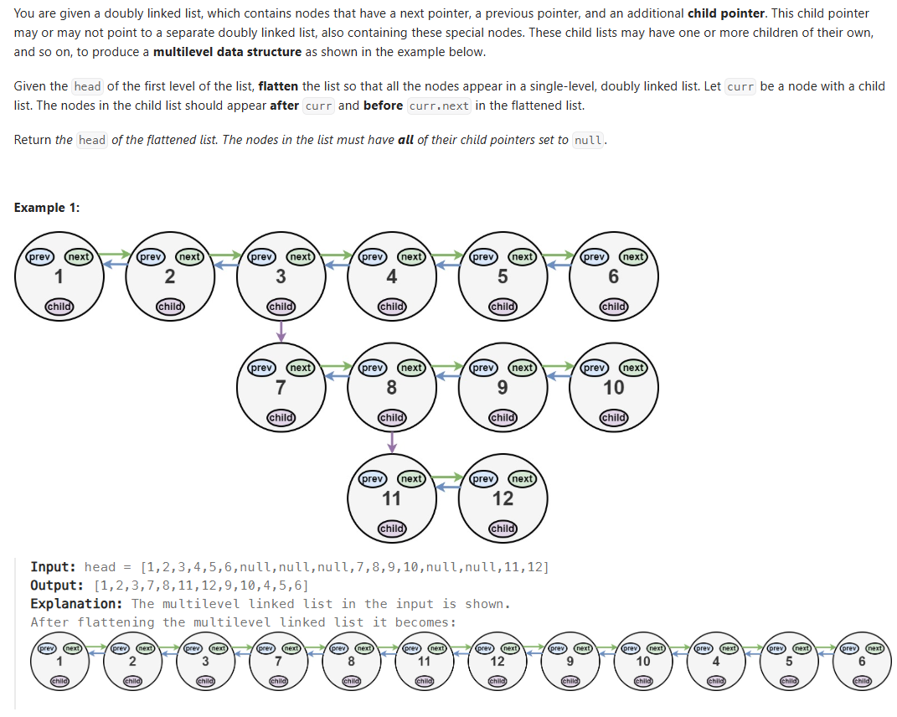
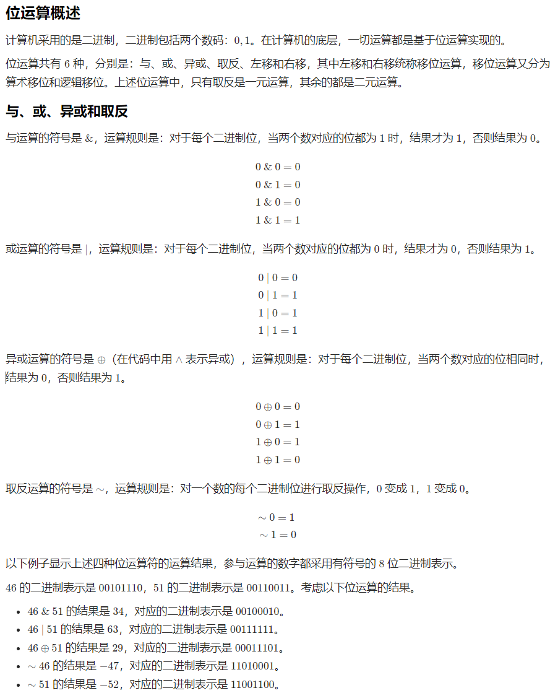

- [Tag](#tag)
- [Time Complexities](#time-complexities)
  - [Constant Time — 𝑂(1)O(1)](#constant-time--𝑂1o1)
  - [Logarithmic Time — 𝑂(log⁡𝑛)](#logarithmic-time--𝑂log𝑛)
  - [Linear Time — 𝑂(𝑛^2)](#linear-time--𝑂𝑛2)
  - [Linearithmic Time — 𝑂(𝑛log𝑛)](#linearithmic-time--𝑂𝑛log𝑛)
  - [Quadratic Time — 𝑂(𝑛^2)](#quadratic-time--𝑂𝑛2)
- [Space Complexities](#space-complexities)
  - [Constant Space — 𝑂(1)](#constant-space--𝑂1)
- [Computation](#computation)
  - [Python](#python)
  - [Division and Modulus](#division-and-modulus)
- [Random](#random)
  - [nextInt](#nextint)
- [List (Python)](#list-python)
  - [Slice (Python)](#slice-python)
  - [__iter__() Python](#iter-python)
- [Array](#array)
  - [Arrays方法](#arrays方法)
  - [List ArrayList](#list-arraylist)
  - [26. Remove Duplicates from Sorted Array](#26-remove-duplicates-from-sorted-array)
  - [27. Remove Element](#27-remove-element)
  - [35. Search Insert Position](#35-search-insert-position)
  - [48. Rotate Image](#48-rotate-image)
  - [54. Spiral Matrix](#54-spiral-matrix)
  - [56. Merge Intervals](#56-merge-intervals)
  - [66. Plus One](#66-plus-one)
  - [73. Set Matrix Zeroes](#73-set-matrix-zeroes)
  - [75. Sort Colors](#75-sort-colors)
  - [80. Remove Duplicates from Sorted Array II](#80-remove-duplicates-from-sorted-array-ii)
  - [88. Merge Sorted Array](#88-merge-sorted-array)
  - [118. Pascal's Triangle](#118-pascals-triangle)
  - [119. Pascal's Triangle II](#119-pascals-triangle-ii)
  - [189. Rotate Array](#189-rotate-array)
  - [209. Minimum Size Subarray Sum](#209-minimum-size-subarray-sum)
  - [283. Move Zeroes](#283-move-zeroes)
  - [414. Third Maximum Number](#414-third-maximum-number)
  - [448. Find All Numbers Disappeared in an Array](#448-find-all-numbers-disappeared-in-an-array)
  - [485. Max Consecutive Ones](#485-max-consecutive-ones)
  - [487. Max Consecutive Ones II](#487-max-consecutive-ones-ii)
  - [498. Diagonal Traverse](#498-diagonal-traverse)
  - [724. Find Pivot Index](#724-find-pivot-index)
  - [747.Largest Number At Least Twice of Others](#747largest-number-at-least-twice-of-others)
  - [905. Sort Array By Parity](#905-sort-array-by-parity)
  - [941. Valid Mountain Array](#941-valid-mountain-array)
  - [977. Squares of a Sorted Array](#977-squares-of-a-sorted-array)
  - [1089. Duplicate Zeros](#1089-duplicate-zeros)
  - [1295. Find Numbers with Even Number of Digits](#1295-find-numbers-with-even-number-of-digits)
  - [1299. Replace Elements with Greatest Element on Right Side](#1299-replace-elements-with-greatest-element-on-right-side)
  - [1346. Check If N and Its Double Exist](#1346-check-if-n-and-its-double-exist)
- [String (Python)](#string-python)
- [String](#string)
  - [Compare and substring](#compare-and-substring)
  - [toCharArray](#tochararray)
  - [StringBuilder](#stringbuilder)
  - [String, Integer, int](#string-integer-int)
  - [char, int](#char-int)
  - [Sort String](#sort-string)
  - [5. Longest Palindromic Substring](#5-longest-palindromic-substring)
  - [14. Longest Common Prefix](#14-longest-common-prefix)
  - [28. Find the Index of the First Occurrence in a String](#28-find-the-index-of-the-first-occurrence-in-a-string)
  - [67. Add Binary](#67-add-binary)
  - [151. Reverse Words in a String](#151-reverse-words-in-a-string)
  - [167. Two Sum II - Input Array Is Sorted](#167-two-sum-ii---input-array-is-sorted)
  - [344. Reverse String](#344-reverse-string)
  - [557. Reverse Words in a String III](#557-reverse-words-in-a-string-iii)
  - [561. Array Partition](#561-array-partition)
- [Linked List](#linked-list)
    - [Add](#add)
    - [Delete](#delete)
  - [Double linked list](#double-linked-list)
  - [2. Add Two Numbers](#2-add-two-numbers)
  - [19. Remove Nth Node From End of List](#19-remove-nth-node-from-end-of-list)
  - [21. Merge Two Sorted Lists](#21-merge-two-sorted-lists)
  - [61. Rotate List](#61-rotate-list)
  - [138. Copy List with Random Pointer](#138-copy-list-with-random-pointer)
  - [141. Linked List Cycle](#141-linked-list-cycle)
  - [142. Linked List Cycle II](#142-linked-list-cycle-ii)
  - [160. Intersection of Two Linked Lists](#160-intersection-of-two-linked-lists)
  - [203. Remove Linked List Elements](#203-remove-linked-list-elements)
  - [206. Reverse Linked List](#206-reverse-linked-list)
  - [234. Palindrome Linked List](#234-palindrome-linked-list)
  - [328. Odd Even Linked List](#328-odd-even-linked-list)
  - [430. Flatten a Multilevel Doubly Linked List](#430-flatten-a-multilevel-doubly-linked-list)
  - [707. Design Linked List](#707-design-linked-list)
- [Set (Python)](#set-python)
- [Hash Table (Python dict)](#hash-table-python-dict)
- [HashSet](#hashset)
- [HashMap](#hashmap)
  - [2. Tow Sum](#2-tow-sum)
  - [36. Valid Sudoku](#36-valid-sudoku)
  - [49. Group Anagrams](#49-group-anagrams)
  - [136. Single Number](#136-single-number)
  - [202. Happy Number](#202-happy-number)
  - [205.](#205)
  - [217. Contains Duplicate](#217-contains-duplicate)
  - [219. Contains Duplicate II](#219-contains-duplicate-ii)
  - [349. Intersection of Two Arrays](#349-intersection-of-two-arrays)
  - [350. Intersection of Two Arrays II](#350-intersection-of-two-arrays-ii)
  - [387. First Unique Character in a String](#387-first-unique-character-in-a-string)
  - [599. Minimum Index Sum of Two Lists](#599-minimum-index-sum-of-two-lists)
- [TreeSet](#treeset)
- [Queue](#queue)
  - [BSF](#bsf)
- [Deque or LinkedList](#deque-or-linkedlist)
- [Stack](#stack)
  - [DSF](#dsf)
- [Heap](#heap)
  - [PriorityQueue](#priorityqueue)
  - [](#)
  - [](#-1)
- [Binary Search](#binary-search)
- [Sorting 排序算法](#sorting-排序算法)
  - [快排 QuickSort](#快排-quicksort)
  - [Partition](#partition)
  - [1051. Height Checker](#1051-height-checker)
    - [?couting sort？](#couting-sort)
- [Bit manupulation (python)](#bit-manupulation-python)
- [Bit manipulation](#bit-manipulation)
  - [进制](#进制)
  - [计算机中的整数表示](#计算机中的整数表示)
  - [位运算的概述和性质](#位运算的概述和性质)
  - [Java中的二进制输出](#java中的二进制输出)
  - [Java位运算](#java位运算)
  - [137. Single Number II](#137-single-number-ii)
  - [160. Intersection of Two Linked Lists](#160-intersection-of-two-linked-lists-1)
  - [190. Reverse Bits](#190-reverse-bits)
  - [191. Number of 1 Bits](#191-number-of-1-bits)
  - [218. Bitwise AND of Numbers Range](#218-bitwise-and-of-numbers-range)
    - [Brian Kernighan 算法](#brian-kernighan-算法)
  - [371. Sum of Two Integers](#371-sum-of-two-integers)
- [滑动窗口](#滑动窗口)
  - [674. Longest Continuous Increasing Subsequ](#674-longest-continuous-increasing-subsequ)


# Tag
- Array
  - From right to left
  
- Two Pointers
  - One pointer point to iterate index, another pointer point to valid index
  - From right to left
  - From two ends
  - Find the middle, from middle to two ends
  - Iterate twice, first round collect info, second round process it
  - Slow pointer and fast pointer
    - fast pointer move twice as slow pointer
    - fast pointer move n steps (n from questions) in advance
  - For rotate problem, reverse and reverse part could achieve rotate effect
  - Use two pointers to reverse a string / list, by 
    - exchange two pointer if left < right 
    - use start and len-1-start and loop [start,(len-start)//2]
    - use left and right, and loop [left,left+(right-left)//2], len is right-left+1
  - 
- Sliding Window
  Normally need two pointers
  - Iternate left pointer in the range
    - Move left pointer to the valid start place
    - Assign right pointer to left pointer position, and move to valid end place (or the next position of valid end place)
    - Get a valid window and process
    - Assign left pointer to right pointer position
  - Use the outer loop to iternate the right pointer
    - Check if the range valid in every outer loop
      - if not valid, then keep iterate the right pointer
      - if valid, inside the outer loop, loop left pointer 
  
- Cyclic Sort
  - Regard value at the index as the next index

- Floyd’s Cycle Detection
  - Any thing if there is a cycle, we could use it to check. A fast pointer, a slow pointer
  - 
- Linked List
  - Find the common patter from the very first elements, and apply them to each elements to see if it applied, adjust to fit all boundry senario. Find a common state of each step, and loop them.
  - Add dummy head to avoid first element boundry problem
  - Find interaction point, Connect two linked list by loop one and then go another one.
  - N th from the end, Two pointers, one go n step first, and then another from start, the first one from where it is, this find the nth from the end 

- Recursion

- Matrix
  - Set from and start then loop, the row start, column start, row end, column end could be change to satisfy the condition
  - Use (row + column) to indicate diagnoses
  - 

- Dynamic Programming
  - 118 119 redo by using dynamic programming thoughts

- Hash Table
  - Check duplicate
  - Use space to optimize time
  - 
  


# Time Complexities

## Constant Time — 𝑂(1)O(1)

Description: Execution time remains constant regardless of input size.
Example: Accessing a specific element in an array.

```python
def get_first_element(arr):
    return arr[0]

```
## Logarithmic Time — 𝑂(log⁡𝑛)

Description: Execution time grows logarithmically with input size.
Example: Binary search in a sorted array.
**Notice: if having odd, even array consideration, use the minimum [0,1] and [0] and [0,1,2]**

```python
def binary_search(arr, target):
    left, right = 0, len(arr) - 1
    while left <= right:
        mid = (left + right) // 2
        if arr[mid] == target:
            return mid
        elif arr[mid] < target:
            left = mid + 1
        else:
            right = mid - 1
    return -1


# Use recursion to return bool
def binary_search(arr, target):
    if not arr:
        return False
    mid = len(arr) // 2
    if arr[mid] < target:
        return binary_search(arr[mid+1:], target)
    elif arr[mid] > target:
        return binary_search(arr[:mid], target)
    else:
        return True

# use recursion to return index of target
def start(arr, target):
    return binary_search_recursion_index(arr, target, 0, len(arr) - 1)
def binary_search_recursion_index(arr, target, left, right):
    if left > right:
        return -1
    mid = left + (right - left) // 2
    if arr[mid] < target:
        return binary_search_recursion_index(arr, target, left + 1, right)
    elif arr[mid] > target:
        return binary_search_recursion_index(arr, target, left, right - 1)
    else:
        return mid
```
## Linear Time — 𝑂(𝑛^2)

Description: Execution time grows linearly with input size.
Example: Linear search or traversing an array.
```python
def linear_search(arr, target):
    for index, value in enumerate(arr):
        if value == target:
            return index
    return -1
```
## Linearithmic Time — 𝑂(𝑛log𝑛)
Description: Execution time grows proportionally to 
𝑛log
⁡
Example: Efficient sorting algorithms like Merge Sort and Quick Sort (average case).
```python
def merge_sort(arr):
    if len(arr) <= 1:
        return arr
    mid = len(arr) // 2
    left = merge_sort(arr[:mid])
    right = merge_sort(arr[mid:])
    return merge(left, right)

def merge(left, right):
    result = []
    i = j = 0
    while i < len(left) and j < len(right):
        if left[i] < right[j]:
            result.append(left[i])
            i += 1
        else:
            result.append(right[j])
            j += 1
    result.extend(left[i:])
    result.extend(right[j:])
    return result
```
## Quadratic Time — 𝑂(𝑛^2)

Description: Execution time grows proportionally to the square of the input size.
Example: Simple sorting algorithms like Bubble Sort and Selection Sort.
```python
def bubble_sort(arr):
    n = len(arr)
    for i in range(n):
        for j in range(0, n-i-1):
            if arr[j] > arr[j+1]:
                arr[j], arr[j+1] = arr[j+1], arr[j]
    return arr
```
Exponential Time — 𝑂(2^𝑛)

Description: Execution time grows exponentially with input size, often impractical for large inputs.
Example: Naive recursive calculation of Fibonacci numbers.
```python
def fibonacci(n):
    if n <= 1:
        return n
    return fibonacci(n-1) + fibonacci(n-2)
```


# Space Complexities
## Constant Space — 𝑂(1)

Description: Requires a fixed amount of additional space regardless of input size.
Example: In-place algorithms like reversing an array without using extra storage.
```python
def reverse_array(arr):
    left, right = 0, len(arr) - 1
    while left < right:
        arr[left], arr[right] = arr[right], arr[left]
        left += 1
        right -= 1
    return arr
```
Linear Space — 𝑂(𝑛)O(n)

Description: Requires space proportional to the input size.
Example: Merge Sort, which uses additional arrays for merging.
```python
def merge_sort(arr):
    if len(arr) <= 1:
        return arr
    mid = len(arr) // 2
    left = merge_sort(arr[:mid])
    right = merge_sort(arr[mid:])
    return merge(left, right)

def merge(left, right):
    result = []
    i = j = 0
    while i < len(left) and j < len(right):
        if left[i] < right[j]:
            result.append(left[i])
            i += 1
        else:
            result.append(right[j])
            j += 1
    result.extend(left[i:])
    result.extend(right[j:])
    return result
```
Logarithmic Space — 𝑂(log𝑛)

Description: Requires space proportional to the logarithm of the input size, often seen in recursive algorithms due to stack space.
Example: Quick Sort's recursive implementation.
```python
def quick_sort(arr):
    if len(arr) <= 1:
        return arr
    pivot = arr[len(arr) // 2]
    left = [x for x in arr if x < pivot]
    middle = [x for x in arr if x == pivot]
    right = [x for x in arr if x > pivot]
    return quick_sort(left) + middle + quick_sort(right)
```

<br/>
<br/>
<br/>
<br/>
<br/>
<br/>
<br/>
<br/>
<br/>
<br/>
<br/>
<br/>
<br/>
<br/>
<br/>
<br/>
<br/>


# Computation

## Python

```python
# Exponential
5**2
pow(5,2)

# Divide
## Double divide
5/2 = 2.5
4/2 = 2.0
## Floor divide
5 // 2 = 2
4 // 2 = 2
```

## Division and Modulus


Java

Integer division

```java
5 / 3 = 1
5 / 2 = 2
```

Reminder / modulus operations

```java
5 % 3 = 2
5 % 2 = 1
```

Python

Integer division

```python
5 // 3 = 1
5 // 2 = 2
```

Reminder / modulus operations

```python
5 % 3 = 2
5 % 2 = 1
```


# Random

## nextInt

```java
Random random = new Random();
random.nextInt(10); // 0 - 9 integer
// get 10-20
random.nextInt(20 - 10 + 1) + 10;
```


# List (Python)
The python list does not have fix len
```python
>>> print(type([]))
>>> <class 'list'>
# 1. Initialize a list of length 5 with default values (0)
nums = [0] * 5  # [0, 0, 0, 0, 0]
>>> len(nums)
>>> 5
# The list can append more element which will increase the list len
nums.append(1)
>>> len(nums)
>>> 6
# 1.1 Initialize a list with specific values
nums = [1, 3, 5, 6, 7]
>>> len(nums)
>>> 5

# 2. Set value
nums[0] = 100
>>> nums[0]
>>> 100

# 3. add value
nums.append(5)
>>> nums[len(nums) - 1]
>>> 5
# 3.1 add at index 2
# nums.insert(index, value)
nums.insert(2, 8)

# 4. Len of list
>>> len(nums)
>>> 6

# 5. remove element
# 5.1 Remove the first occurance of value in list nums, if value is not in the list, raise ValueError
# O(n). Find O(n), shift O(n)
nums.remove(value) 

# 5.2 Remove the element in index, return the pop's element, raise IndexError if index of out out range. 
# O(n-i) -> O(n). Find, and shift rest element left by one
value = nums.pop(index) 

# 5.3 Remove element in index range, include start not include end, not raise any error
# O(n-i) -> O(n)
del nums[start:end]

# 5.4 Remove in place
def remove_ele(value, nums):
    nums_len = len(nums)
    j = 0
    for i in nums_len:
        if nums[i] == value:
            continue
        else:
            nums[j] = nums[i]
            j+=1
    new_len = j
    return nums, new_len

def remove_ele(index, nums):
    nums_len = len(nums)
    for i in range(index + 1, nums_len)
        nums[i - 1] = nums[i]
    # Optionally, remove the last one
    nums_len -= 1
    nums = nums[:nums_len]

    return nums, nums_len

# 6. Sort
# nums.sort, sort in place, return None 
# nums.sort(key=func, reverse=True|False) asc
# key: A function to specify the sorting criteria(s)
# reverse: default is false
nums.sort() # asc
nums.sort(reverse=True) # des
def get_len(ele):
    return len(ele)
nums = ["abcd", "ac", "abc", "D"]
>>> nums.sort(key=get_len)
>>> nums
>>> ["D", "ac", "abc", "abcd"]

nums.reverse() # reverse itself, no return
reversed_nums = nums[::-1] # slice reverse
reversed_nums = list(reversed(arr)) # 返回迭代器, 配合list使用

left, right = 0, len(arr) - 1
while left < right:
    arr[left], arr[right] = arr[right], arr[left]
    left += 1
    right -= 1

# 7. Copy range
# from index 1 to 4 (1 inclusive, 4 exclusive)
part_array = nums[1:4]

# 7.1 Copy
v1 = list(nums)
v2 = nums.copy()

# 8. Fill array with a specific value
arr = [-1] * 10

# 9. print multi-dimentional arrays
matrix = [
    [1, 2, 3],
    [4, 5, 6]
]
print(matrix[row][col]) # 2

# 10. Iterate
for ele in nums:
    print(ele)

for i in range(len(nums)):
    print(nums[i])

# 11. Clear all
nums.clear()

# 12. Comparable
nums1 = [1]
nums2 = [1]
>>> nums1 == nums2
>>> True

>>> nums1 is nums2
>>> False

```

## Slice (Python)
```python
arr[start:stop:step]

# 切片
print(arr[::1])   # [10, 20, 30, 40, 50] 正常顺序
print(arr[::2])   # [10, 30, 50] 隔一个取一个
print(arr[::-1])  # [50, 40, 30, 20, 10] 完整反转
```

## __iter__() Python
以下都实现了__iter__方法，可以使用 for, in, iter(), next()
```python
list, tuple, str, set, dict, range, bytes, bytearray, file, zip, map, filter, enumerate, reversed, deque, frozenset
```


# Array

**创建Array**


```java
int[] nums = new int[5]; // {0,0,0,0,0} 初始化都是0
>>> nums.length
>>> 5
int[] nums = {1,3,5,6,7}; // 带初始化
>>> nums.length
>>  5
```


**添加值 insert value**

```java
nums[0] = 5;
nums[2] = 3;
```


**删除**

不是真正的把array长度变短，而是创建变量length，来表示array的新长度

```java
// 删除第i位
let length = int_array.length;
for (int i = 1; i < length; i++) {
    // Shift each element one position to the left
    int_array[i - 1] = int_array[i];
}

length--;
```


## Arrays方法

```java
int[] array = new int[10];
// 1. Sort
Arrays.sort(arr); // 升序
Arrays.sort(arr, compare);
// custom comparator
List<String> list = Arrays.asList("Banana", "Apple", "Orange", "Mango");
// 使用匿名类创建自定义 Comparator
Collections.sort(list, new Comparator<String>() {
    @Override
    public int compare(String s1, String s2) {
        return s1.length() - s2.length(); // 按字符串长度排序
    }
});

// Use lambda
 list.sort((s1, s2) -> s1.length() - s2.length());

// 2. Copy range
int[] partArray = Arrays.copyOfRange(array, from. to); // from inclusive, to exclusive
// 3. Fill array with a specific value;
Arrays.fill(array, -1);
// 4. 打印多维数组
Arrays.deepToString(mulArr);
arr[row][col]
```


## List ArrayList

```java
 // 1. initialize
List<Integer> v0 = new ArrayList<>();
List<Integer> v1;                           // v1 == null
// 2. cast an array to a vector
Integer[] a = {0, 1, 2, 3, 4};
v1 = new ArrayList<>(Arrays.asList(a));
v1 = new ArrayList<>(Arrays.asList(1,2,3,4,7,8));
// 3. make a copy
List<Integer> v2 = v1;                      // another reference to v1
List<Integer> v3 = new ArrayList<>(v1);     // make an actual copy of v1
// copy a certain range to new ArrayList
List<Integer> v4 = Arrays.copyOfRange(left, right); // include left, exclude right
// 4. get length
System.out.println("The size of v1 is: " + v1.size());
// 5. access element
System.out.println("The first element in v1 is: " + v1.get(0));
// 6. iterate the vector
// size
System.out.print("[Version 1] The contents of v1 are:");
for (int i = 0; i < v1.size(); ++i) {
    System.out.print(" " + v1.get(i));
}
System.out.println();
System.out.print("[Version 2] The contents of v1 are:");
for (int item : v1) {
    System.out.print(" " + item);
}
System.out.println();
// 7. modify element
v2.set(0, 5);       // modify v2 will actually modify v1
System.out.println("The first element in v1 is: " + v1.get(0));

// 8. add element
v2.add(8);
// add element at index
v2.add(2, 8); // add 8 at index 2
// 9. clear all
v2.clear();
// 10. to array
int[] array = Arrays.toArray(v1);
```


```java
在末尾添加一个元素：void add(E e)
在指定索引添加一个元素：void add(int index, E e)
删除指定索引的元素：E remove(int index)
删除某个元素：boolean remove(Object e)
获取指定索引的元素：E get(int index)
获取链表大小（包含元素的个数）：int size()
```


`v1 = new ArrayList<>(Arrays.asList(a));`

```java
public ArrayList(Collection<? extends E> c)
// 继承Collection的类有
/*
List
	ArrayList
    LinkedList
    Vector
Set
	HashSet
    LinkedHashSet
    TreeSet
Queue
	PriorityQueue
    LinkedList（同时实现了 Queue 和 Deque）
    ArrayDeque
Deque
	ArrayDeque
	LinkedList
*/
    
Arrays.asList();

public static <T> List<T> asList(T... a) {
    return new ArrayList<>(a);
}

/*
<T>: 这是一个 泛型声明，表示这个方法是泛型方法。<T> 定义了一个类型参数 T，它在这个方法的上下文中可以用来表示任意类型。

List<T>: 这是这个方法的返回值类型，表示它返回一个 List，其中的元素类型是 T。

T... a: 这是可变参数（varargs），表示方法可以接收任意数量的类型为 T 的参数。实际上，它是一个数组，方法内部会将传入的参数打包成一个数组。
Arrays.asList(1, 2, 3);      // T 是 Integer，参数是 {1, 2, 3}
Arrays.asList("a", "b");
*/
```


## 26. Remove Duplicates from Sorted Array
Tag: Array, Sliding Window, Two Pointers


```python
class Solution6(object):
    def removeDuplicates(self, nums):
        """
        :type nums: List[int]
        :rtype: int
        """
        valid = 1
        for i in range(1, len(nums)):
            if nums[i - 1] != nums[i]:
                nums[valid] = nums[i]
                valid += 1
        return valid
```
**滑动窗口**

从第二位开始遍历，用k记录有多少个重复的数字，同时用来标记该赋值的地方

​	如果第二位与第一位不一样，则给第一位赋值

​	如果一样，则跳过本轮赋值，k+1

```
class Solution {
    public int removeDuplicates(int[] nums) {
        int k = 0;
        for (int i = 1; i < nums.length; i++) {
            if(nums[i-1] != nums[i]){
                nums[i-k] = nums[i];
                // or k++ here, and return k+1
            }else{
                k++;
            }
        }

        return nums.length - k;
    }
}
```


## 27. Remove Element
Tag: Array, Two Pointers 


```python
# TC: O(n)
# SC: O(1)
class Solution5(object):
    def removeElement(self, nums, val):
        """
        :type nums: List[int]
        :type val: int
        :rtype: int
        """
        n = len(nums)
        if n == 0:
            return 0
        valid = 0
        for i in range(n):
            if nums[i] != val:
                nums[valid] = nums[i]
                valid += 1
        
        return valid

        # Or:
        n = len(nums)
        if n == 0:
            return 0
        i = 0
        j = n - 1
        while i != j:
            if nums[i] != val:
                i += 1
            else:
                k = nums[i]
                nums[i] = nums[j]
                nums[j] = k
                j -= 1

        return i+1 if nums[i] != val else i
```

遍历，增加一个k来表示有效数字的index

​	如果不等于val，则把当前值赋值给k位置

​	如果等于val，则跳过本轮赋值

```java
class Solution {
    public int removeElement(int[] nums, int val) {
        int k = 0;
        for(int i = 0; i < nums.length; i++){
            if(nums[i] != val){
                nums[k] = nums[i];
                k++;
            }
        }
        return k;
    }
}
```

## 35. Search Insert Position

范围是 [0,...,len-1]的话，记住此时target是可以等于左右的

所以当target<mid的时候，则target不在mid中，所以下一次right就是mid-1

**记住自己的边界表示什么！**

```
    public int searchInsert(int[] nums, int target) {
        
        
        int left = 0;
        int right = nums.length - 1;
        while (left <= right){
            int mid = (right + left) / 2;
            if(target < nums[mid]){
                right = mid-1;
            }else if(target>nums[mid]){
                left = mid+1;
            }else {
                return mid;
            }
        }
        return left;
    }
```


## 48. Rotate Image

```java
// 一下旋转只适用nxn矩阵    
// clockwise, 先上下对称，再ij对调
// anticlockwise, 先ij对调，再上下对称
```

```java
   public void rotate(int[][] matrix){

        // clockwise, 先上下对称，再ij对调
        // anticlockwise, 先ij对调，再上下对称
        int n = matrix.length;
        for (int i = 0; i < n / 2; i++) {
            int[] temp = matrix[i];
            matrix[i] = matrix[n - 1 - i];
            matrix[n - 1 - i] = temp;
        }

        for (int i = 0; i < matrix.length; i++) {
            for (int j = i; j < matrix.length; j++) {
                int temp = matrix[i][j];
                matrix[i][j] = matrix[j][i];
                matrix[j][i] = temp;
            }
        }
        
        
        // 算出的公式，不太建议，不如下面的规律好用
//        int n = matrix.length;
//        int i=0, j = 0;
//        while (i < n-1){
//            j = i;
//            while(j<n-1-i){
//                int temp = matrix[i][j];
//                matrix[i][j] = matrix[n-1-j][i];
//                matrix[n-1-j][i] = matrix[n-1-i][n-1-j];
//                matrix[n-1-i][n-1-j] = matrix[j][n-1-i];
//                matrix[j][n-1-i] = temp;
//                j++;
//            }
//            i++;
//        }
    }
```

## 54. Spiral Matrix
Tag: Array, Matrix

```python
class Solution16:
    # TC: (m*n)
    # SC: (1)
    def spiralOrder(self, matrix: List[List[int]]) -> List[int]:
        m = len(matrix) -1
        n = len(matrix[0]) -1
        res = []
        i_start = 0
        j_start = 0
        while True:
            i = i_start
            for j in range(j_start, n + 1, 1):
                res.append(matrix[i][j])
            i_start += 1
            j = n
            for i in range(i_start, m + 1, 1):
                res.append(matrix[i][j])
            n -= 1
            i = m
            if m < i_start or n < j_start:
                break
            for j in range(n, j_start - 1, -1):
                res.append(matrix[i][j])
            m -= 1
            j = j_start
            for i in range(m, i_start - 1, -1):
                res.append(matrix[i][j])
            j_start += 1
            if m < i_start or n < j_start:
                break
        return res
```

方法1：

一圈一圈绕

方法2：

外面圈+往里一层，递归

```
public List<Integer> spiralOrder(int[][] matrix) {

        // 一圈一圈绕
        int top = 0;
        int left = 0;
        int down = matrix.length - 1;
        int right = matrix[0].length - 1;
        List<Integer> l = new ArrayList<>();
        while (top <= down && left<=right){
            for (int i = left; i <= right; i++) {
                l.add(matrix[top][i]);
            }
            top++;
            for (int i = top; i <= down ; i++) {
                l.add(matrix[i][right]);
            }
            right--;

            for (int i = right; i >= left && top <= down; i--) {
                l.add(matrix[down][i]);
            }
            down--;
            for (int i = down; i>= top && left <= right; i--) {
                l.add(matrix[i][left]);
            }
            left++;
        }
        return l;

        // int r = matrix.length;
        // int c = matrix[0].length;

        // int[] tp = {0,0};
        // int[] br =  {r-1, c-1};
        // return order(matrix,tp, br);
    }

    public List<Integer> order(int[][] matrix, int[] topLeft, int[] bottomRight){
        int c = bottomRight[1] - topLeft[1];
        int r = bottomRight[0] - topLeft[0];
        if(c<0 || r<0){
            return null;
        }
        List<Integer> l = new ArrayList<>();
        for (int i = topLeft[1]; i <= bottomRight[1]; i++) {
            l.add(matrix[topLeft[0]][i]);
        }
        for (int i = topLeft[0]+1; i <= bottomRight[0]; i++) {
            l.add(matrix[i][bottomRight[1]]);
        }
        for (int i = bottomRight[1] -1; i >= topLeft[1] && r>0; i--) {
            l.add(matrix[bottomRight[0]][i]);
        }
        for (int i = bottomRight[0] -1; i >= topLeft[0]+1 && c>0; i--) {
            l.add(matrix[i][topLeft[1]]);
        }
        int[] tl = {topLeft[0]+1, topLeft[1]+1};
        int[] br = {bottomRight[0]-1, bottomRight[1]-1};
        List<Integer> nl = order(matrix, tl, br);
        if(nl !=null){
            l.addAll(nl);
        }
        return l;
    }
```


## 56. Merge Intervals


```java
[[1,4],[0,4]]

[[1,4],[2,3]]

[[2,3],[4,5],[6,7],[8,9],[1,10]]
```

从左往右，下一个的0位比上一位的1位低的时候，可以纳入进来。所有可以纳入进来的，1值取最大

（所以前提就是，首位要排序，这样得到的0位是最小的）

```java
    public int[][] merge(int[][] intervals) {
        List<int[]> al = new ArrayList<>();
        int[] next = new int[2];
        Arrays.sort(intervals, (int[] num1, int[] nums2) -> num1[0] - nums2[0]);
        next = intervals[0];
        for (int i = 1; i < intervals.length; i++) {
            if(intervals[i][0] > next[1]){
                al.add(next.clone());
                next = intervals[i];
            }else{
                next[1] = Math.max(next[1], intervals[i][1]);
            }
        }
        al.add(next);

        return al.toArray(new int[al.size()][]);
    }
```


## 66. Plus One
Tag: Array
```python
class Solution:
    def plusOne(self, digits: List[int]) -> List[int]:
        n = len(digits)
        add_on = 1
        for i in range(n-1, -1, -1):
            total = digits[i] + add_on
            add_on = total // 10
            rest = total % 10
            digits[i] = rest
        if add_on != 0:
            digits.insert(0, add_on)
        return digits
```


## 73. Set Matrix Zeroes


每一行的第一个记录该行的状态（有0则第一位置为0）

第一列的第一个记录该列的状态（用col变量记录第一列的状态，00已经记录了第一行的状态）

```java
   int col = -1;
        for (int i = 0; i < matrix.length; i++) {
            for (int j = 0; j < matrix[0].length; j++) {
                if(matrix[i][j] == 0){
                    if(j == 0){
                        col = 0;
                    }else{
                        matrix[0][j] = 0;
                    }
                    matrix[i][0] = 0;
                }
            }
        }

        for (int i = matrix.length - 1; i >= 0; i--) {
            for (int j = matrix[0].length -1; j >= 1; j--) {
                if (matrix[i][0] == 0 || matrix[0][j] == 0) {
                    matrix[i][j] = 0;
                }
            }
            if (col == 0) {
                matrix[i][0] = 0;
            }
        }
```


## [75. Sort Colors](https://leetcode.cn/problems/sort-colors/)


解决思路，partition


**滑动窗口**

partition2

[0...zero] = 0

(zero...i] = 1

(i...tow] = 未知

(two...len-1] = 2

还可以别的分法，如[i...tow] = 未知，解答取决于怎么partition

```
        int len = nums.length;
        if (len < 2) {
            return;
        }
        int zero = -1;
        int two = len - 1;
        int i = -1;
        while (i < two) {
            if (nums[i+1] == 0) {
                zero++;
                swap(nums, i+1, zero);
                i++;
            } else if (nums[i+1] == 1) {
                i++;
            } else {
                swap(nums, i+1, two);
                two--;
            }
        }
```


## 80. Remove Duplicates from Sorted Array II


**滑动窗口**

```
```

**滑动2**

```
    public int removeDuplicates(int[] nums) {
        int k = 0;
        boolean hasShowTwice = false;

        for (int i = 1; i < nums.length; i++) {
            if(nums[k] != nums[i]){
                k++;
                nums[k] = nums[i];
                hasShowTwice = false;
            }else if(!hasShowTwice){
                k++;
                nums[k] = nums[i];
                hasShowTwice = true;
            }
        }

        return k + 1;
    }
```


## 88. Merge Sorted Array
Tag: Array, Two Pointers


```python
# TC: O(m+n)
# SC: O(1)
class Solution4(object):
    def merge(self, nums1, m, nums2, n):
        """
        :type nums1: List[int]
        :type m: int
        :type nums2: List[int]
        :type n: int
        :rtype: None Do not return anything, modify nums1 in-place instead.
        """
        i = m - 1
        j = n - 1
        if n == 0:
            return
        for cur in range(m + n - 1, -1, -1):
            # i -> cur
            if i == -1 or j == -1:
                break
            if nums1[i] >= nums2[j]:
                nums1[cur] = nums1[i]
                i-=1
            else:
                nums1[cur] = nums2[j]
                j-=1
        while j >= 0:
            nums1[j] = nums2[j]
            j-=1
```

**solution 1**

```
 void merge(vector<int>& nums1, int m, vector<int>& nums2, int n) {
     int i = m - 1, j = n - 1, k = m + n - 1;
     while(i >= 0 and j >= 0) {
         if(nums1[i] < nums2[j]) {
             nums1[k--] = nums2[j--];
         } else {
             nums1[k--] = nums1[i--];
         }
     }
     while(j >= 0) {
         nums1[k--] = nums2[j--];
     }
 }
```


**solution 2**

遍历m+n，从右往左比较两个数组的有效位

​	如果有一边已经全部遍历完，则只赋值另外一边

​	如果左边的比右边的大

​		赋值左边的到当前遍历位置

​		左边有效位--

​	如果右边的比左边的大

​		赋值右边的到当前遍历位置

​		右边有效位--

```java
class Solution {
    public void merge(int[] nums1, int m, int[] nums2, int n) {
		int k = m + n;
        for (int i = k - 1; i >= 0; i--) {
            if (m == 0) {
                nums1[i] = nums2[n - 1];
                n--;
                continue;
            }
            if (n == 0) {
                nums1[i] = nums1[m - 1];
                m--;
                continue;
            }
            if (nums1[m - 1] >= nums2[n - 1]) {
                nums1[i] = nums1[m - 1];
                m--;
            } else {
                nums1[i] = nums2[n - 1];
                n--;
            }
        }
    }
}
```


## 118. Pascal's Triangle
Tag: Array, Dynamic Programming

```python
class Solution:
    # TC: O(n^2)
    # SC: O(1)
    def generate(self, numRows: int) -> List[List[int]]:
        res = [
            [1]
        ]
        if numRows == 1:
            return res
        for i in range(1, numRows, 1):
            last_row = res[i - 1]
            cur_len = i + 1
            cur = [1]
            for j in range(1, len(last_row), 1):
                cur.append(last_row[j] + last_row[j-1])
            cur.append(1)
            res.append(cur)
        return res
```
方法：

121 ->

1211 ->

1 (1+2) (2+1) 1


```java
    public List<List<Integer>> generate(int numRows) {

       	List<List<Integer>> l = new ArrayList<>(numRows);
        List<Integer> l0 = new ArrayList<>();
        for (int i = 0; i < numRows; i++) {
            l0.add(1);
            for (int j = l0.size()-2; j >= 1; j--) {
                l0.set(j, l0.get(j)+l0.get(j-1));
            }
            l.add(new ArrayList<>(l0));
        }
        return l;


        //         List<List<Integer>> l = new ArrayList<>(numRows);
        // List<Integer> l0 = new ArrayList<>();
        // l0.add(1);
        // l.add(l0);
        // for (int i = 1; i < numRows; i++) {
        //     List<Integer> tempL = new ArrayList<>(i+1);
        //     tempL.add(1);
        //     List<Integer> lastL = l.get(i-1);
        //     for (int j = 1; j < lastL.size(); j++) {
        //         tempL.add(lastL.get(j-1) + lastL.get(j));
        //     }
        //     tempL.add(1);
        //     l.add(tempL);
        // }
        // return l;
    }
```

## 119. Pascal's Triangle II
Tag: Array, Dynamic Programming
```python
class Solution:
    # TC: O(n^2)
    # SC: O(1)
    def getRow(self, rowIndex: int) -> List[int]:
        res = [1]
        for i in range(0, rowIndex, 1):
            res.append(1)
            n = len(res)
            for j in range(n-2, 0, -1):
                res[j] += res[j-1]
        return res
```

## 189. Rotate Array
Tag: Array, Rotate, Two Pointers

```python
class Solution:
    # TC: O(n)
    # SC: O(1)
    # Use start and end is better, reduce calculations
    def rotate(self, nums: List[int], k: int) -> None:
        """
        Do not return anything, modify nums in-place instead.
        """
        n = len(nums)
        k = k % n
        self.rotate_range(nums, 0, n-1)
        self.rotate_range(nums, 0, k - 1)
        self.rotate_range(nums, k, n-1)

    def rotate_range(self, nums: List[int], start: int, end: int) -> None:
        while start < end:
            temp = nums[start]
            nums[start] = nums[end]
            nums[end] = temp
            start += 1
            end -= 1

    def rotate(self, nums: List[int], k: int) -> None:
        """
        Do not return anything, modify nums in-place instead.
        """
        n = len(nums)
        k = k % n
        for i in range(n//2):
            temp = nums[i]
            nums[i] = nums[n - 1- i]
            nums[n - 1- i] = temp
        for i in range(k//2):
            temp = nums[i]
            nums[i] = nums[k - 1- i]
            nums[k - 1- i] = temp
        for i in range(k, (n-k)//2 + k, 1):
            temp = nums[i]
            nums[i] = nums[n + k - 1 - i]
            nums[n + k - 1 - i] = temp
```

方法：

先全部反转

反转 0 到 k - 1

反转 k 到 最后

```java
    public void rotate(int[] nums, int k) {
        k = k % nums.length;
        reverse(nums, 0, nums.length - 1);
        reverse(nums, 0, k-1);
        reverse(nums, k, nums.length - 1);

    }

    public void reverse(int[] nums, int start, int end){
        while (start < end){
            int temp = nums[start];
            nums[start++] = nums[end];
            nums[end--] = temp;
        }
    }
```


## 209. Minimum Size Subarray Sum
tag: Array, Two Pointers, Sliding Windows

```python
class Solution:
    # TC: O(n) right pointer move n times and left pointer move at most n times
    # SC: O(1)
    def minSubArrayLen(self, target: int, nums: List[int]) -> int:
        left = 0 # 0 - n-1
        right = 0 # 1 - n
        n = len(nums)
        sm = 0
        res = float('inf')
        while right < n:
            sm += nums[right]
            right += 1 # is larger than 1 bit
            while sm >= target:
                res = min(res, right - left)
                sm -= nums[left]
                left += 1
        return 0 if res == float('inf') else res

    def minSubArrayLen(self, target: int, nums: List[int]) -> int:
        left = 0 # 0 - n-1
        right = 1 # 1 - n
        n = len(nums)
        sm = 0
        res = n
        while left < right and right <= n:
            while sm < target and right <= n:
                sm += nums[right-1]
                right += 1
            if sm < target:
                return res if res != n else 0
            while sm >= target and left < right:
                sm -= nums[left]
                left += 1
            res = min(res, right - left)
        return res
```

方法1：

一个一个加，然后判断

方法2：

右指针直接加到大于等于target的地方，

左指针直接减到小于target的地方

```
    public int minSubArrayLen(int target, int[] nums) {
        int min = Integer.MAX_VALUE;
        int sum = 0;
        int j = 0;
        int i = 0;
        while (j < nums.length){
            sum += nums[j++];
            while (sum >= target){
                sum -= nums[i++];
                min = Math.min(min, j-i+1);
            }
        }
        return min == Integer.MAX_VALUE ? 0: min;

//  int left = 0, right = 0;
//         int min = Integer.MAX_VALUE;
//         int sum = 0;
//         while (left < nums.length && right<nums.length){
//             while (right < nums.length && sum < target){
//                 sum += nums[right];
//                 right++;
//             }
//             if(left == 0 && right == nums.length && sum < target){
//                 return 0;
//             }
//             while (left<nums.length && sum >= target){
//                 sum -= nums[left];
//                 left++;
//             }

//             min = Math.min(min, right-left+1);
//         }
//         return min;
    }
```


## 283. Move Zeroes
Tag: Array



```python
# TC: O(n)
# SC: O(1)
class Solution(object):
    def moveZeroes(self, nums):
        """
        :type nums: List[int]
        :rtype: None Do not return anything, modify nums in-place instead.
        """
        cur = 0
        n = len(nums)
        for i in range(n):
            if nums[i] != 0:
                temp =nums[cur]
                nums[cur] = nums[i]
                nums[i] = temp
                cur+=1

        # cur = 0
        # n = len(nums)
        # for i in range(n):
        #     if nums[i] != 0:
        #         nums[cur] = nums[i]
        #         cur += 1

        # for j in range(cur, n, 1):
        #     nums[j] = 0
```


和26题一样的解法

```java
    public void moveZeroes(int[] nums) {
        int position = 0;

        for (int i = 0; i < nums.length; i++) {
            if(nums[i] != 0){
                nums[position] = nums[i];
                position ++;
            }
        }

        for (int i = position; i < nums.length; i++) {
            nums[i] = 0;
        }
    }
```

或者：

从左到右，遇到不是0的，则与最左边的0交换，一直到结尾

```java
        int snowBallSize = 0;
        for (int i=0;i<nums.length;i++){
            if (nums[i]==0){
                snowBallSize++;
            }
            else if (snowBallSize > 0) {
                int t = nums[i];
                nums[i]=0;
                nums[i-snowBallSize]=t;
            }
        }
```


## 414. Third Maximum Number
Tag: Array

```python
# TC: O(n)
# SC: O(1)
class Solution(object):
    def thirdMax(self, nums):
        """
        :type nums: List[int]
        :rtype: int
        """
        m1 = None
        m2 =None
        m3 =None
        for ele in nums:
            if ele == m1 or ele == m2 or ele == m3:
                continue
            if m1 is None or ele > m1:
                m3 = m2
                m2 = m1
                m1 = ele
            elif m2 is None or ele > m2:
                m3 = m2
                m2 = ele
            elif m3 is None or ele> m3:
                m3 = ele
        return m1 if m3 is None else m3
```


方法1：

先sort，然后用HashSet来装所有的元素

如果set大于等于3，则取倒数第三个值

否则，取最大的值


a


方法2：

用三个变量来标记三个最大的值

在遍历的时候

​	若某一个最大值为空或者大于某一个最大值，则变更前三大数字


```
    public int thirdMax(int[] nums) {
        //         Arrays.sort(nums);
        // HashSet<Integer> hs = new HashSet<Integer>();
        // for (int i = nums.length - 1; i > -1 ; i--) {
        //     hs.add(nums[i]);
        //     if(hs.size() == 3){
        //         return nums[i];
        //     }
        // }
        // return nums[nums.length -1];

        Integer first = null;
         Integer second = null;
         Integer third = null;
         for (Integer num : nums) {
             if(num.equals(first) || num.equals(second) || num.equals(third)){
                    continue;
             }
             if(first == null || num > first){
                 third = second;
                 second = first;
                 first = num;
             }else if(second == null || num > second){
                 third = second;
                 second = num;
             } else if (third == null ||num > third) {
                 third = num;
             }
         }


         return third == null ? first : third;

    }
```


## 448. Find All Numbers Disappeared in an Array
Tag: Array, Cyclic Sort


```python
# TC: O(n)
# SC: O(n)
class Solution(object):
    def findDisappearedNumbers(self, nums):
        """
        :type nums: List[int]
        :rtype: List[int]
        """
        n = len(nums)
        output = [0] * (n + 1)
        for ele in nums:
            output[ele] = 1
        res = []
        for i in range(1, len(output), 1):
            if output[i] == 0:
                res.append(i)
        return res

# Iterate each positions value as its an index
# TC: O(2n) -> O(n)
# SC: O(1)
class Solution(object):
    def findDisappearedNumbers(self, nums):
        """
        :type nums: List[int]
        :rtype: List[int]
        """
        n = len(nums)
        for i in range(n):
            cur = i
            nv = nums[cur]
            while nv != cur + 1:
                temp = nums[nv - 1]
                nums[nv - 1] = nv
                cur = nv - 1
                nv = temp
        res = []
        for i in range(n):
            if nums[i] != i + 1:
                res.append(i + 1)
        return res
```


方法0：

遍历

​	把第i位与其该在的位置交换 ----> 一直换到第i位正确，或者第i位与其该在的位置数字一样才停止  `!(nums[i] == i+1 || nums[i] == nums[nums[i] - 1])`

遍历找出第i位不是i+1的数字

```java
    public List<Integer> findDisappearedNumbers(int[] nums) {
        for (int i = 0; i < nums.length; i++) {
            while (nums[i] != i+1 && nums[i] != nums[nums[i] - 1]){
                int temp = nums[nums[i] - 1]; // 调换记得先调换不影响nums[i]值的那个数字，否则调换失败
                nums[nums[i] - 1] = nums[i];
                nums[i] = temp;
            }
        }
        ArrayList<Integer> al = new ArrayList<>();
        for (int i = 0; i < nums.length; i++) {
            if(nums[i] != i+1){
                al.add(i+1);
            }
        }
        return al;
    }
```


方法1：

把nums[i] 的值看成index，把对应位数的数字变成负数来表示该位有数

```java
	public List<Integer> findDisappearedNumbers(int[] nums) {
			for (int i = 0; i < nums.length; i++) {
            int index;
            if (nums[i] < 0) {
                index = nums[i] * -1 -1;
            }else{
                index = nums[i]-1;
            }
            
            nums[index] = nums[index] < 0 ? nums[index] : nums[index] * -1;
        }

        ArrayList<Integer> al = new ArrayList<>();
        for (int i = 0; i < nums.length; i++) {
            if(nums[i] > 0){
                al.add(i+1);
            }
        }
        return al;
    }
```


方法2：

用一个长度相当的新的数组，用它的index有值来表示原来数组的某个位置有数

然后查找从1-n，没有被标记的index为没有出现的数字

```java
    public List<Integer> findDisappearedNumbers(int[] nums) {
        int[] resultArr = new int[nums.length + 1];
        for (int num:
             nums) {
            resultArr[num] = 1;
        }
        ArrayList<Integer> resultList = new ArrayList<>();

        for (int i = 1; i < nums.length + 1; i++) {
            if(resultArr[i] != 1){
                resultList.add(i);
            }
        }
        return resultList;
    }
```


## [485. Max Consecutive Ones](https://leetcode.com/problems/max-consecutive-ones/)
tag: Array, Two Pointers, Sliding Window

```python
# TC: O(n)
# SC: O(1)
class Solution(object):
    def findMaxConsecutiveOnes(self, nums):
        """
        :type nums: List[int]
        :rtype: int
        """
        max_value = 0
        cur_value = 0
        for ele in nums:
            if ele == 1:
                cur_value += 1
                max_value = max(max_value, cur_value)
            else:
                cur_value = 0
        return max_value

# TC: O(n)
# SC: O(1)
class Solution1(object):
    def findMaxConsecutiveOnes(self, nums):
        """
        :type nums: List[int]
        :rtype: int
        """
        left = 0
        right = 0
        max_cons = 0
        nums_len = len(nums)
        while left < nums_len:
            left = right
            while left < nums_len and nums[left] == 0:
                left += 1
            right = left
            while right < nums_len and nums[right] == 1:
                right += 1
            max_cons = max(max_cons, right - left)
        return max_cons
```


```java
    public int findMaxConsecutiveOnes(int[] nums) {
    // 双指针
        int start = 0;
        int right = 0;
        int max = 0;
        while (start<nums.length && right<nums.length){
            start = right;
            while (start<nums.length && nums[start] == 0){start++;}
            right = start;
            while (right<nums.length && nums[right] == 1){right++;}
            max = Math.max(right-start, max);
        }
        return max;
   // 一般解法
        int max = 0;
        int count = 0;
        for(int i: nums){
            count = i == 1 ? count + 1 : 0;
            max = count > max ? count : max;
        }
        return max;
    }
```


## [487. Max Consecutive Ones II](https://leetcode.com/problems/max-consecutive-ones-ii/)


```java
        int[] pre = new int[nums.length];
        int[] suff = new int[nums.length];
		// pre
        for (int i = 0; i < nums.length; i++) {
            if(nums[i] == 1){
                if(i == 0){
                    pre[i] = 1;
                }else{
                    pre[i] = pre[i-1] + 1;
                }
            }else{
                pre[i] = 0;
            }
        }
		// suff
        for (int i = nums.length - 1; i >= 0; i--) {
            if(nums[i] == 1){
                if(i == nums.length - 1){
                    suff[i] = 1;
                }else{
                    suff[i] = suff[i+1] + 1;
                }
            }else{
                suff[i] = 0;
            }
        }
		// all 1: [1,1,1,1]
        if(pre[nums.length - 1] == nums.length){
            return nums.length;
        }
		// pre+i0+suff
        int ans = 0;
        for (int i = 0; i < nums.length; i++) {
            if(nums[i] == 0){
                int len = 0;
                // 下面这种写法考虑到了 0 和 n-1的情况
                if(i > 0) {
                    len+=pre[i-1];
                }
                if(i < nums.length -1){
                    len+=suff[i+1];
                }
                ans = Math.max(len + 1, ans);
            }
        }
        return ans;
```

## 498. Diagonal Traverse
Tag: Array, Matrix


```python
**class Solution:
    # TC: O(m*n)
    # SC: O(1)
    def findDiagonalOrder(self, mat: List[List[int]]) -> List[int]:
        m = len(mat)
        n = len(mat[0])
        i = 0
        j = 0
        res = []
        while True:
            res.append(mat[i][j])
            if i == m - 1 and j == n - 1:
                break
            if (i + j) % 2 == 0:
                if i == 0 or j == n - 1:
                    if j < n - 1:
                        j += 1
                    else:
                        i += 1
                else:
                    i -= 1
                    j += 1
            else:
                if i == m - 1 or j == 0:
                    if i < m - 1:
                        i += 1
                    else:
                        j += 1
                else:
                    i += 1
                    j -= 1
        return res
```

## 724. Find Pivot Index
Tag: Array




```python
class Solution:
    def pivotIndex(self, nums: List[int]) -> int:
        # TC: O(n)
        # SC: O(1)
        r_sum = 0
        for ele in nums:
            r_sum += ele
        l_sum = 0
        n = len(nums)
        for i in range(n):
            r_sum -= nums[i]
            if i > 0:
                l_sum += nums[i-1]
            if l_sum == r_sum:
                return i
        return -1
```

```java
  public int pivotIndex(int[] nums) {
  
  // 这个没有考虑负数，以为两边都是正数，审题！
//        int sum1 = 0;
//        int sum2 = 0;
//        int left = 0;
//        int right = nums.length - 1;
//
//        while (left<right){
//            if(sum1 >= sum2){
//                sum2 += nums[right--];
//            }else {
//                sum1 += nums[left++];
//            }
//        }
//
//        if(sum1 == sum2){
//            return left;
//        }
//        return -1;

        int sum = 0;
        for (int num :
                nums) {
            sum += num;
        }
        int left = 0;
        for (int i = 0; i < nums.length; i++) {
            if(i != 0){
                left += nums[i-1];
            }
            sum -= nums[i];
            if(left == sum){
                return i;
            }
        }

        return -1;
    }
```

## 747.Largest Number At Least Twice of Others
Tag: Array

```python
class Solution:
    # TC: O(n)
    # SP: O(1)
    def dominantIndex(self, nums: List[int]) -> int:
        l = None
        l2 = None
        idx = -1
        n = len(nums)
        for i in range(n):
            ele = nums[i]
            if l is None:
                l = ele
                idx = i
            else:
                if ele > l:
                    l2 = l
                    l = ele
                    idx = i
                elif l2 is None:
                    l2 = ele
                elif ele > l2:
                    l2 = ele
        return idx if l >= l2*2 else -1
```

## 905. Sort Array By Parity
Tag: Array, Two Pointers

```python
# TC: O(n)
# SC: O(1)
class Solution(object):
    def sortArrayByParity(self, nums):
        """
        :type nums: List[int]
        :rtype: List[int]
        """
        cur = 0
        n = len(nums)
        for i in range(n):
            if nums[i] %2 == 0:
                temp = nums[i]
                nums[i] = nums[cur]
                nums[cur] = temp
                cur += 1
        return nums
```
遍历，用position标记下一个偶数放的位置

​	如果遇到偶数，与position交换，position++


```
        int position = 0;
        for (int i = 0; i < nums.length; i++) {
            if(nums[i] % 2 == 0){
                int temp = nums[position];
                nums[position] = nums[i];
                nums[i] = temp;
                position++;
            }
        }
        return nums;
```


创建新数组，遍历，使用一头一尾两个index表示偶数与非偶数的位置

​	如果遇到偶数，放开头

​	如果不是偶数，放结尾

```
		int[] result = new int[nums.length];
        int position = 0;
        int none = nums.length - 1;
        for (int num : nums) {
            if (num % 2 == 0) {
                result[position++] = num;
            }else{
                result[none--] = num;
            }
        }

        return result;
```


## 941. Valid Mountain Array
Tag: Array, Two Pointers

```python
# TC: O(n)
# SC: O(1)
class Solution8(object):
    def validMountainArray(self, arr):
        """
        :type arr: List[int]
        :rtype: bool
        """
        up = 0
        n = len(arr)
        down = n - 1
        while up < n - 1:
            if arr[up] < arr[up+1]:
                up += 1
            else:
                break

        while down > 0:
            if arr[down] < arr[down-1]:
                down-=1
            else:
                break
        return True if up == down and up > 0 and down < n - 1 else False
```

从头开始查，升序到尽头的index1

从尾开始查，降序到尽头的index2

比较两个index，且不是两头时，则时mountain array

solution

```java
class Solution {
    public boolean validMountainArray(int[] arr) {
        int n = arr.length;
        int i = 0;
        int j = n-1;
        while (i+1 < n && arr[i] < arr[i+1]){
            i++;
        }
        while(j-1 >= 0 && arr[j] < arr[j-1]){
            j--;
        }
        return i > 0 && j < n-1 && i == j;
    }
}
```

solution 1

```java
class Solution {
    public boolean validMountainArray(int[] arr) {
        
        int maxIndex = 0;
        boolean up = false;
        boolean down = false;
        for (int i = 0; i < arr.length; i++) {
            if(arr[maxIndex] < arr[i]){
                maxIndex = i;
            }
        }
        for(int i = 1; i <= maxIndex; i++){
            if(arr[i] <= arr[i-1]){
                return false;
            }
            up = true;
        }

        for(int i = maxIndex+1; i < arr.length; i++){
            if(arr[i] >= arr[i-1]){
                return false;
            }
            down = true;
        }
        return up && down;
    }
}
```

solution 2

```java
class Solution {
    public boolean validMountainArray(int[] arr) {
        if(arr.length < 3){
            return false;
        }
        boolean door = true;
        boolean up = false;
        boolean down = false;
        for (int i = 1 ; i < arr.length; i++) {
            if(arr[i] == arr[i-1]){
                return false;
            }
            if(door){
                if(arr[i] > arr[i-1]){
                    up = true;
                }else{
                    door = false;
                    down = true;
                }
            }else{
                if(arr[i] > arr[i-1]){
                    return false;
                }
            }
        }
        return up && down;
    }
}
```


## [977. Squares of a Sorted Array](https://leetcode.com/problems/squares-of-a-sorted-array/)
Tag: Array, Two Pointers


```python
# from ends to middle
# TC: O(n)
# SC: O(n)
class Solution(object):
    def sortedSquares(self, nums):
        """
        :type nums: List[int]
        :rtype: List[int]
        """
        left = 0
        right = len(nums) - 1
        res = [0] * len(nums)
        i = right
        while left <= right:
            if nums[left] ** 2 < nums[right] ** 2:
                res[i] = nums[right] ** 2
                right -= 1
            else:
                res[i] = nums[left] ** 2
                left += 1
            i -= 1
        return res

# from middle to two ends
# TC: O(n)
# SC: O(n)
class Solution(object):
    def sortedSquares(self, nums):
        """
        :type nums: List[int]
        :rtype: List[int]
        """
        nums_len = len(nums)
        left = 0
        right = 0
        res = [0] * nums_len
        i = 0
        for index in range(nums_len):
            if nums[index] < 0:
                left = index
                continue
            else:
                break
        right = left + 1
        while left >= 0 and right < nums_len:
            if nums[left]**2 < nums[right]**2:
                res[i] = nums[left]**2
                left -= 1
            else:
                res[i] = nums[right]**2
                right += 1
            i+=1
        while left >= 0:
            res[i] = nums[left] ** 2
            left -= 1
            i += 1
        while right < nums_len:
            res[i] = nums[right] ** 2
            right += 1
            i += 1
        return res


```


用两个指针标记头和尾，比较他们的绝对值大小，从result数组的结尾开始赋值


```
    public int[] sortedSquares(int[] nums) {
        int i = 0;
        int j = nums.length - 1;

        int[] result = new int[nums.length];
        for (int k = nums.length - 1; k >= 0; k--) {
            if(Math.abs(nums[i]) > Math.abs(nums[j])){
                result[k] = nums[i] * nums[i];
                i++;
            }else{
                result[k] = nums[j] * nums[j];
                j--;
            }
        }
        return  result;
    }
```


## [1089. Duplicate Zeros](https://leetcode.com/problems/duplicate-zeros/)
Tag: Array, Two Pointers


```python
# TC: O(n)
# SC: O(1)
class Solution3(object):
    def duplicateZeros(self, arr):
        """
        :type arr: List[int]
        :rtype: None Do not return anything, modify arr in-place instead.
        """
        i = 0
        zeros = 0
        last_zero = False
        n = len(arr)
        while i + zeros < n:
            if arr[i] == 0:
                if i + zeros == n - 1:
                    last_zero = True
                else:
                    zeros += 1
            i += 1
        j = n - 1
        while j >= 0:
            if j == n - 1 and last_zero:
                arr[j] = 0
                j -= 1
                continue
            if arr[j - zeros] == 0:
                arr[j] = 0
                arr[j - 1] = 0
                zeros -= 1
                j -= 2
            else:
                arr[j] = arr[j - zeros]
                j -= 1

```


1. 算出一共往右边移动了几位，用两个变量来记录

   1. 第一个变量记录往右边移动了几位
   2. 第二个变量记录特殊情况，即当中间某一位0被移动到最后一位时，不用复制0（因为已经达到数组的最后）

   过程：

   遍历的长度从0到 总长度 - 移动的位数

   ​	如果遇到0

   ​		如果此时是 总长度 - 移动的位数 ----> 则上述第二个变量为true，即最后一位为不用复制的0

   ​		如果不是 总长度 - 移动位数 ----> 则第一个变量++

2. 从数组最右边开始赋值，从右到左遍历

   ​	如果是最后一位，且变量2为true ----> 则只赋值最后一位为0，进入下一轮循环

   ​	（其实此时里面有另一个循环，是从长度 - 位移，到0的循环）

   ​	如果长度 - 位移是0

   ​		赋值当前位数和上一位为0

   ​		外循环减少一轮

   ​		位移减少1

   ​	如果不是0

   ​		当前数组为 = 长度 - 位数的数组值

   ```java
   class Solution {
       public void duplicateZeros(int[] arr) {
           if(arr.length == 1){
               System.out.println(arr[0]);
               return;
           }
   
           int leftShift = 0;
           boolean isZeroEndButNotDouble = false;
           for(int i = 0; i < arr.length - leftShift; i++){
               if(arr[i] == 0){
                   if(i == arr.length - leftShift - 1){
                       isZeroEndButNotDouble = true;
                       break;
                   }
                   leftShift++;
               }
           }
   
           for(int j = arr.length - 1; j >= 0; j--){
               if(j == arr.length - 1 && isZeroEndButNotDouble){
                   arr[j] = 0;
                   continue;
               }
               if(arr[j - leftShift] == 0){
                   arr[j] = 0;
                   leftShift--;
                   j--;
                   arr[j] = 0;
               }else{
                   arr[j] = arr[j - leftShift];
               }
           }
   
       }
   }
   ```

   

## [1295. Find Numbers with Even Number of Digits](https://leetcode.com/problems/find-numbers-with-even-number-of-digits/)

Tag: Array


```python
# TC: O(n)
# SC: O(1)
class Solution(object):
    def findNumbers(self, nums):
        """
        :type nums: List[int]
        :rtype: int
        """
        count = 0
        for ele in nums:
            if len(str(ele)) % 2 == 0:
                count += 1
        return count
```


## 1299. Replace Elements with Greatest Element on Right Side
Tag: Array


```python
# TC: O(n)
# SC: O(1)
class Solution9(object):
    def replaceElements(self, arr):
        """
        :type arr: List[int]
        :rtype: List[int]
        """
        # 1. Two for loop, find the biggest
        # 2. From right to left
        max_value = -1
        n = len(arr)
        for i in range(n-1, -1, -1):
            if arr[i] > max_value:
                # switch
                temp = max_value
                max_value = arr[i]
                arr[i] = temp
            else:
                arr[i] = max_value
        return arr
```

从右往左遍历，用max记录右边最大值

​	如果当前值比最大值大，两个值替换

```
    public int[] replaceElements(int[] arr) {

        int max = -1;
        for (int i = arr.length - 1; i >= 0 ; i--) {
            if(arr[i] > max){
                int tempMax = arr[i];
                arr[i] = max;
                max = tempMax;
            }else{
                arr[i] = max;
            }
        }
        return arr;
    }
```


## 1346. Check If N and Its Double Exist
Tag: Array


```python
# TC: O(n)
# SC: O(n)
class Solution7(object):
    def checkIfExist(self, arr):
        """
        :type arr: List[int]
        :rtype: bool
        """
        s = set()
        for ele in arr:
            if ele * 2 in s or (ele % 2 == 0 and ele // 2 in s):
                return True
            else:
                s.add(ele)
        return False
```


**solution 1**

利用hashset

如果里面有当前数字的一半或者两倍，则为true，否则添加进去

```

```


**solution 2**

ez题目，一个一个找就行

O(n^2)

遍历

​	如果当前值的2倍在整个列表中（再遍历）有的话，则返回true

都没有，返回false

```java
class Solution {
    public boolean checkIfExist(int[] arr) {
        for (int i = 0; i < arr.length; i++) {
            if(checkn(arr, i)){
                return true;
            }
        }
        return false;
    }

    public static boolean checkn(int[] arr, int index){
        for (int i = 0; i < arr.length; i++) {
            if(i == index){
                continue;
            }
            if(arr[i] == arr[index]*2){
                return true;
            }
        }
        return false;
    }
}
```


# String (Python)

```python
# 1. compare
'aaa' == 'aaa' # True
# 2. Concatenate
s1 = "hello"
s1 += " world"
# 3. Find character
idx = s1.find('o') # first occurrence
idx = s1.rfind('o') # last occurrence
# 4. Substring
s1[6:11] # from inclusive, end exclusive
# 5. toCharArray
char_list = list(s1)
char_list[4]
# Convert back to string
"".join(char_list)
# 6. StringBuilder, use string and list


# 7. Convert int to str
n = 1
s = str(1)
>>> s
>>> "1"
s = int(s)
>>> 1
# 8. Convert char to int
>>> ord('a')
>>> 97
>>> ord('a') - ord('0')
>>> 0
a = '0'
ord(a) - ord('0') # 0
# 9. Sort string
# sorted and reversed return an iterator
"".join(sorted(s))
"".join(reversed(s))

```

# String

## Compare and substring

```java
// compare using equals
System.out.println("s1 and s2: " + s1.equals(s2));
// compare using compareTo
System.out.println("s1 and s2: " + (s1.compareTo(s2) == 0));

String s1 = "Hello World";
// 1. concatenate
s1 += "!";
System.out.println(s1);
// 2. find
System.out.println("The position of first 'o' is: " + s1.indexOf('o'));
System.out.println("The position of last 'o' is: " + s1.lastIndexOf('o'));
// 3. get substring
System.out.println(s1.substring(6, 11));
//For instance, if the length of the string is N, the time complexity of both finding operation and substring operation is O(N).
```

## toCharArray

```java
// If you want your string to be mutable, there are some substitutions:
String s = "Hello World";
char[] str = s.toCharArray();
str[5] = ',';
System.out.println(str);

// revert char[] back to string
new String(str); // better
// or
String.valueOf(str);
```

## StringBuilder

```java
//  If you have to concatenate strings often, it will be better to use some other data structures like StringBuilder. The below code runs in O(n) complexity.
int n = 10000;
StringBuilder str = new StringBuilder();
StringBuilder str = new StringBuilder("ABCD");
// using stringbuilder, time complexity is O(n), if using str +=, time complexity is O(n^2)
for (int i = 0; i < n; i++) {
    str.append("hello");
}
String s = str.toString();

// append
str.append("hello");

// index char by index
char c = str.charAt(0);

// delete substring
str.delete(0,2);

// indexOf, lastIndexOf
// length
int l = str.length();

// toString
str.toString();
```

## String, Integer, int

```java
// String to int
String str = "123";
int num = Integer.parseInt(str);
// String to Integer;
Integer num = Integer.valueOf(str);
// int to String;
String s = String.valueOf(num);
String s = Integer.toString(num);
String s = num + "";
```

## char, int

```java
// char 是基于 Unicode 的字符编码，而字符在底层实际上被表示为整数（char 的数值范围是 0 到 65535），int则表示 -2^31 到 2^31-1，在算数运算和比较时，char会自动转换为int，这是安全的。
char a = '0';
int num = a - '0';
'h' == 104; // true

```

## Sort String

```java
    String sortString(String s){
        char[] cs = s.toCharArray();
        Arrays.sort(cs);
        return new String(cs);
    }
```


## 5. Longest Palindromic Substring


```java
class Solution {
  public String longestPalindrome(String s) {
  
        // Optimized two pointer, 优化地方：当下一个值与当前值相同时，必定是在该回文中
        int start = 0;
        int len = 1;
        for (int i = 0; i < s.length(); i++) {
            char c = s.charAt(i);
            int j = i;
            while(j+1 < s.length() && s.charAt(j+1) == c){ // 找到后面与当前值不相同当index，然后再从两头开始搜索
                j++;
            }
            if(j-i+1 > len){
                start = i;
                len = j-i+1;
            }
            if(i-1 >= 0 && j+1 < s.length()){
                int extend = search2(s, i-1, j+1);
                if(j-i +1 + (2*extend) > len){
                    start = i-extend;
                    len = j-i+1+ (2*extend);
                }
            }
            i = j;
        }
        return s.substring(start,start+len);
  	
        // dp dynamic programming
//        boolean[][] state = new boolean[s.length()][s.length()];
//        for (int i = 0; i < state.length; i++) {
//                state[i][i] = true;
//        }
//        int start = 1, len = 1;
//        for (int i = state[0].length - 1; i >= 0; i--) {
//            for (int j = i+1; j <= state[0].length - 1; j++) {
//                if(s.charAt(i) == s.charAt(j) && (state[i+1][j-1] || j-i == 1)){
//                    state[i][j] = true;
//                    if(j-i+1 > len){
//                        start = i;
//                        len = j - i + 1;
//                    }
//                }else{
//                    state[i][j] = false;
//                }
//            }
//        }
//
//        return s.substring(start, start + len);

        
        // 从i开始向两边扩散（加上i和i+1相同的情况），双指针
        // String str = s.substring(0,1);
        // for (int i = 0; i < s.length(); i++) {
        //     char c = s.charAt(i);
        //     if(i-1 >= 0 && i+1 < s.length()){
        //         String temp = search(s, i-1, i+1);
        //         if(temp.length() > str.length()){
        //             str = temp;
        //         }
        //     }
        //     if(i+1 < s.length() && s.charAt(i+1) == c){
        //         if(str.length() < 2){
        //             str = s.substring(i, i+2);
        //         }
        //         String temp = search(s, i-1, i+2);
        //         if(temp.length() > str.length()){
        //             str = temp;
        //         }
        //     }
        // }
        // return str;
    }
    
    public String search(String s, int l, int r){ // 从l，r开始向两边搜索，返回搜索到的最长的字符串
        while (l>=0 && r<s.length()){
            if(s.charAt(l) == s.charAt(r)){
                l--;
                r++;
            }else{
                return s.substring(l+1, r);
            }
        }
        return s.substring(l+1, r);
    }
    
    public int search2(String s, int l, int r){ // 从l，r开始向两边搜索，返回单边增加了多少
        int i = 0;
        while (l>=0 && r<s.length()){
            if(s.charAt(l) == s.charAt(r)){
                l--;
                r++;
                i++;
            }else{
                return i;
            }
        }
        return i;
    }
}
```


## 14. Longest Common Prefix
Tag: String, Trie

```python
class Solution:
    def longestCommonPrefix(self, strs: List[str]) -> str:
        # String
        # TC: O(m*n)
        # SC: O(1)
        common  = strs[0]
        n = len(strs)
        for i in range(1,n,1):
            m_l = min(len(common), len(strs[i]))
            for j in range(m_l, -1, -1):
                if common[:j] == strs[i][:j]:
                    common = common[:j]
                    break
            if len(common) == 0:
                return ""
        return common
```
```java
String result = strs[0];
for (String str :strs) {
    if(result.length() > str.length()){
        result = result.substring(0,str.length());
    }
    for (int j = 0; j < Math.min(str.length(), result.length()); j++) {
        if(result.charAt(j) != str.charAt(j)){
            result = str.substring(0,j);
            if(j == 0){
                return "";
            }
        }
    }
}
return result;
```

## 28. Find the Index of the First Occurrence in a String
Tag: String

```python
class Solution:
    # TC: O(m*n) slice caused O(stop-start)
    # SC: O(1)  ignoring temporary slices since they’re garbage collected
    def strStr(self, haystack: str, needle: str) -> int:
        res  = 0
        n = len(haystack)
        l = len(needle)
        for i in range(n):
            if i+l <= n and haystack[i: i+l] == needle:
                return i
        return -1
    def strStr(self, haystack: str, needle: str) -> int:
        # TC: O(m*n)
        # SC: O(1)
        res  = 0
        n = len(haystack)
        l = len(needle)
        for i in range(n):
            if haystack[i] == needle[0]:
                all_match = True
                for j in range(1, l, 1):
                    if i+j < n and haystack[i + j] == needle[j]:
                        pass
                    else:
                        all_match = False
                        break
                if all_match:
                    return i
        return -1
        
```
注意substring

i的范围在  i=0; i<haystack.len 的时候， substring取 i,i+1，取一个字符

所以当substring取len个字符，即 i到i+len的时候，haystack.len - (len-1)

```java
    public int strStr(String haystack, String needle) {
        int len = needle.length();

        for (int i = 0; i < haystack.length() - (len-1); i++) {
            if(haystack.substring(i, i+1+len-1).equals(needle)){
                return i;
            }
        }
        return -1;
    }
```


## 67. Add Binary


注意输入的取值范围，大于32位的Integer 4 byte，大于64位的long 8byte。只做单纯二进制加法

方法：

carry记录进位，sum%2, sum/2取值

```
	public String addBinary(String a, String b) {
        int al = a.length() - 1;
        int bl = b.length() - 1;
        StringBuilder sb = new StringBuilder();
        int sum;
        int carry = 0;
        while (al >= 0 || bl >= 0 ){
            sum = carry;
            if (al >= 0){
                sum+=a.charAt(al--) - '0';
            }

            if (bl >= 0){
                sum+=b.charAt(bl--) - '0';
            }
            sb.append(sum % 2);
            carry = sum / 2;
        }
        if(carry != 0){
            sb.append(carry);
        }
        
        return  sb.reverse().toString();
    }
```


## 151. Reverse Words in a String
Tag: String, Two Pointers, Sliding Window


```python
class Solution:
    # TC: O(n)
    # SC: O(1) or O(n)
    def reverseWords(self, s: str) -> str:
        # sliding windows
        # use list save each words
        n = len(s)
        left = n-1
        right = n-1
        res = []
        while left >= 0:
            right = left
            while s[right] == ' ' and right >= 0:
                right -= 1
            left = right
            while s[left] != ' ' and left >= 0:
                left -= 1
            if left != right:
                res.append(s[left+1: right + 1])
        return " ".join(res)

```
方法1:

- 反转string
- 反转每个单词
- 清除多余的空格

方法2:

- 筛出每个单词并保存（stack）
- 反向穿起来

方法3:

- java内置方法
- 先trim两边的空格
- 再通过 空格+ 正则分开单词
- 再通过Collections.reverse反转单词顺序
- 再通过String.join 连接所有单词

```

 class Solution {

    public String reverseWords(String s) {
        // reverse all string
        // reverse each word
        // clean spaces
        char[] chars = s.toCharArray();
        reverse(chars, 0 , s.length()-1);
        reverseWord(chars);
        return cleanSpaces(chars);

        // java build-in method
//        String[] words = s.trim().split(" +");
//        Collections.reverse(Arrays.asList(words));
//        return String.join(" ",words);

        // save each word, concat reversely
//        Stack<int[]> stack = new Stack<>();
//        int[] starAndLen = {-1,-1};
//        boolean isWord = false;
//        for (int i = 0; i < s.length(); i++) {
//            if(s.charAt(i) == ' '){
//                if(!isWord){
//                    continue;
//                }
//                starAndLen[1] = i-1;
//                stack.push(starAndLen.clone());
//                isWord = !isWord;
//            }else{
//                if(!isWord){
//                    starAndLen[0] = i;
//                    isWord = true;
//                }
//            }
//        }
//        if(isWord){
//            starAndLen[1] = s.length()-1;
//            stack.push(starAndLen.clone());
//        }
//        StringBuilder sb = new StringBuilder();
//        while (!stack.empty()){
//            int[] temp = stack.pop();
//            sb.append(s, temp[0], temp[1]+1);
//            sb.append(" ");
//        }
//        return sb.substring(0,sb.length()-1);
    }

    public void reverse(char[] chars, int i , int j){
        while (i<j){
            char temp = chars[i];
            chars[i++] = chars[j];
            chars[j--] = temp;
        }
    }

    public void reverseWord(char[] chars){
        int i = 0, j=0;
        int n = chars.length;
        while (i<n){
            while (i<j || i<n && chars[i] == ' ')i++; // 右边是skip space（到达non-space地方）, 左边是到下一个space到地方
            while (j<i || j<n && chars[j]!= ' ')j++; // 右边是skip non-space，左边是到下一个non-space的地方
            reverse(chars, i, j-1);

            // can also write as below
//            while (i<n && chars[i] == ' ')i++;
//            j=i+1;
//            while (j<n && chars[j] != ' ')j++;
//            reverse(chars, i, j-1);
//            i=j;
        }

        // whole as this
//        int start;
//        for (int i = 0; i < chars.length; i++) {
//            if(chars[i] != ' '){
//                start = i;
//                while (i < chars.length && chars[i] != ' '){
//                    i++;
//                }
//                reverse(chars, start, i-1);
//            }
//        }
    }

    public String cleanSpaces (char[] chars){
        int i = 0, j = 0, n = chars.length;
        while (j<n){
            while (j<n && chars[j] == ' ')j++; // i skip space
            while (j<n && chars[j] != ' ')chars[i++] = chars[j++]; // keep non space
            while (j<n && chars[j] == ' ')j++; // i skip space
            if(j<n)chars[i++] = ' '; // 上一步skip space，且还没有到n，说明还有单词，所以可以加空格
        }
        return new String(chars, 0, i);
    }

    public String cleanSpaces2 (char[] chars){
        StringBuilder sb = new StringBuilder();
        sb.append(chars[0]);
        for (int i = 1; i < chars.length; i++) {
            if (chars[i-1] == ' ' && chars[i] == ' ') {
                continue;
            }
            sb.append(chars[i]);
        }
        return sb.toString().trim();
    }
}

```

## 167. Two Sum II - Input Array Is Sorted
Tag: Array, Two Pointers

```python
class Solution:
    def twoSum(self, numbers: List[int], target: int) -> List[int]:
        # TC: O(n)
        # SC: O(1)
        n = len(numbers)
        start = 0
        end = n - 1
        while start != end:
            t = numbers[start] + numbers[end]
            if t == target:
                return [start + 1, end + 1]
            elif t < target:
                start += 1
            else:
                end -= 1
        return [0,0]
```

暴力解法会超时

用双指针，因为一定会有解，从两边开始找

```java
    public int[] twoSum(int[] numbers, int target) {
        int left = 0;
        int right = numbers.length - 1;
        while (true){
            if(numbers[left] + numbers[right] > target){
                right --;
            }else if(numbers[left] + numbers[right] < target){
                left++;
            }else {
                return new int[]{left+1, right+1};
            }
        }     
    }
```


## 344. Reverse String
Tag: Array, String

```python
    def reverseString(self, s: List[str]) -> None:
        """
        Do not return anything, modify s in-place instead.
        """
        # TC: O(n)
        # SC: O(1)
        n = len(s)
        for i in range(n//2):
            temp = s[i]
            s[i] = s[n-1-i]
            s[n-1-i] = temp
```
```java
    public void reverseString(char[] s) {
                for (int i = 0; i < s.length/2; i++) {
            char temp = s[i];
            s[i] = s[s.length - 1- i];
            s[s.length - 1- i] = temp;
        }
    }
```

## 557. Reverse Words in a String III
Tag: String, Two Pointers, Sliding Window
```python
class Solution:
    # TC: O(n + n) O(n)
    # SC: O(n)
    # When reverse single word, we could also use two pointers and exchagne them in half word length to reduce half time complexity
    def reverseWords(self, s: str) -> str:
        res = []
        left = 0
        right = 0
        n = len(s)
        while right < n:
            left = right
            while left < n and s[left] == ' ':
                left += 1
            right = left
            while  right < n and s[right] != ' ':
                right += 1
            res.append(s[left:right][::-1])
        return ' '.join(res)

    def reverse_str(self, s: str, left: int, right: int)->str:
        res = ''
        for i in range(right, left - 1, -1):
            res += s[i]
        return res
```

## 561. Array Partition


```java
    public int arrayPairSum(int[] nums) {
                Arrays.sort(nums);
        int sum = 0;
        for (int i = 0; i < nums.length; i+=2) {
            sum += nums[i];
        }
        return sum;
    }
```


# Linked List


```java
// Definition for singly-linked list.
public class SinglyListNode {
    int val;
    SinglyListNode next;
    SinglyListNode(int x) { val = x; }
}
```

### Add


### Delete


Constructor

```
LinkedList()

LinkedList(Collection<? extends E> c)
```

## Double linked list

```java
// Definition for doubly-linked list.
class DoublyListNode {
    int val;
    DoublyListNode next, prev;
    DoublyListNode(int x) {val = x;}
}
```


Build-in LinkedList

```java
LinkedList<Integer> deque = new LinkedList<>();
// 1. add first
deque.addFirst(10); // [10]
// 2. add to last
deque.addLast(20);  // [10, 20]
// 3. remove first
deque.removeFirst();
// 4. remove last
deque.removeLast();
```


## [2. Add Two Numbers](https://leetcode.com/problems/add-two-numbers/)
Tag: Linked List,

```python
# Definition for singly-linked list.
# class ListNode(object):
#     def __init__(self, val=0, next=None):
#         self.val = val
#         self.next = next
# TC: O(max(m, n))
# SC: O(max(m, n)) but answer is not count as space complexity, so O(1)
class Solution(object):
    def addTwoNumbers(self, l1, l2):
        """
        :type l1: Optional[ListNode]
        :type l2: Optional[ListNode]
        :rtype: Optional[ListNode]
        """
        dummy_h = ListNode(0)
        h = dummy_h
        add_on = 0
        while l1 is not None or l2 is not None or add_on != 0:
            a1 = 0 if l1 is None else l1.val
            a2 = 0 if l2 is None else l2.val
            total = a1 + a2 + add_on
            add_on = total // 10
            h.next = ListNode(total % 10)
            h = h.next
            if l1 is not None:
                l1 = l1.next
            if l2 is not None:
                l2 = l2.next
            
        return dummy_h.next
```


```java
 public ListNode addTwoNumbers(ListNode l1, ListNode l2) {
        // return addTwoNumbers2(l1,l2,0);

        // Method2:
          ListNode head = new ListNode(0);
        ListNode prev = head;
        int add = 0;
        while (l1!=null || l2 != null || add != 0){
            ListNode cur = l1 != null ? l1:(l2 != null? l2 : new ListNode(0));
            int v = (l1!=null ? l1.val: 0) + (l2 != null ? l2.val : 0) + add;
            add = v / 10;
            v %= 10;
            cur.val = v;
            head.next = cur;
            head = head.next;

            l1 = l1 == null ? l1:l1.next;
            l2 = l2 == null ? l2:l2.next;
        }
        return prev.next;
        
        //  ListNode head = new ListNode();
        // ListNode originHead = head;
        // int v = 0;
        // int add = 0;
        // while (l1!=null || l2 != null || add != 0){
        //     v = (l1!=null ? l1.val: 0) + (l2 != null ? l2.val : 0) + add;
        //     add = v / 10;
        //     v %= 10;
        //     head.val = v;
        //     if((l1 == null || l1.next == null) &&(l2 == null || l2.next == null) && add == 0){
        //         break;
        //     }
        //     head.next = new ListNode();
        //     l1 = l1 == null ? l1:l1.next;
        //     l2 = l2 == null ? l2:l2.next;
        //     head = head.next;
        // }
        // return originHead;
    }
    public ListNode addTwoNumbers2(ListNode l1, ListNode l2, int add) {
        if(l1 == null && l2 == null){
            if(add == 1){
                return new ListNode(1);
            }else{
                return null;
            }
        }
        int v = (l1!=null ? l1.val: 0) + (l2 != null ? l2.val : 0) + add;
        if(v >= 10){
            v = v-10;
            add = 1;
        }else{
            add = 0;
        }

        if(l1 == null && l2!=null){
            l2.val = v;
            l2.next = addTwoNumbers2(l1, l2.next, add);
            return l2;
        }
        if(l2 == null && l1!=null){
            l1.val = v;
            l1.next = addTwoNumbers2(l1.next, l2, add);
            return l1;
        }

        l1.val = v;
        l1.next = addTwoNumbers2(l1.next,l2.next,add);
        return l1;
    }
}
```


## [19. Remove Nth Node From End of List](https://leetcode.com/problems/remove-nth-node-from-end-of-list/)
Tag: Linked List, Two Pointers



```python
# Definition for singly-linked list.
# class ListNode(object):
#     def __init__(self, val=0, next=None):
#         self.val = val
#         self.next = next
# TC: O(n)
# SC: O(1)
class Solution(object):
    def removeNthFromEnd(self, head, n):
        """
        :type head: Optional[ListNode]
        :type n: int
        :rtype: Optional[ListNode]
        """
        dumy_h = ListNode(0)
        dumy_h.next = head
        p1 = dumy_h
        p2 = dumy_h

        while n > 0:
            p1 = p1.next
            n-=1
        while p1.next is not None:
            p1 = p1.next
            p2 = p2.next
        p2.next = p2.next.next
        return dumy_h.next
        
        # 下面方法跑了两遍
        # TC: O(2n)
        # SC: O(1)
        # dumy_h = ListNode(0)
        # dumy_h.next = head
        # p = dumy_h
        # i = 0
        # while p is not None:
        #     p = p.next
        #     i += 1
        # steps = i - n
        # p = dumy_h
        # while steps - 1 > 0:
        #     p= p.next
        #     steps -= 1
        # p.next = p.next.next
        # return dumy_h.next
        
        # 下面没有使用dummy head，多了许多判断和漏了边界条件，可以添加dummy head
        # p = head
        # i = 0
        # while p is not None:
        #     p = p.next
        #     i += 1
        # if i == 1 and n == 1:
        #     return None
        # if n == i:
        #     return head.next
        # steps = i - n
        # p = head
        # while steps -1 > 0:
        #     p = p.next
        #     steps -= 1
        # p.next = p.next.next if p.next is not None else None
        # return head
```

```
/**
 * Definition for singly-linked list.
 * public class ListNode {
 *     int val;
 *     ListNode next;
 *     ListNode() {}
 *     ListNode(int val) { this.val = val; }
 *     ListNode(int val, ListNode next) { this.val = val; this.next = next; }
 * }
 */
class Solution {
    public ListNode removeNthFromEnd(ListNode head, int n) {
                // method1: two pointers, let the fast pointer step n steps first, and when it reaches the end
        // the slow pointer is at the n-1 from end.
        ListNode p1 = new ListNode();
        ListNode p2;
        ListNode p3;
        p2=p1;
        p3=p1;
        p1.next = head;
        int t = n+1;
        while (t-->0){
            p2=p2.next;
        }
        while (p2!=null){
            p2 = p2.next;
            p1=p1.next;
        }
        p1.next = p1.next.next;
        return p3.next;
        //         if(head.next == null){
        //     return null;
        // }
        // ListNode p1 = head;
        // ListNode p2 = head;
        // while (n-->0){
        //     p2=p2.next;
        // }
        //         if(p2==null){
        //     head = head.next;
        //     return head;
        // }
        // while (p2.next!=null){
        //     p1=p1.next;
        //     p2=p2.next;
        // }
        // p1.next = p1.next.next;
        // return head;
        // int size = 1;
        // ListNode hs = head;
        // while (hs.next!=null){
        //     hs=hs.next;
        //     size++;
        // }
        // hs=head;
        // if(n == size){
        //     return head.next;
        // }
        // int pass = size - n-1;

        // while(pass-- != 0){
        //     hs=hs.next;
        // }
        // hs.next=hs.next.next;

        // return head;
    }
}
```

## 21. Merge Two Sorted Lists
Tag: Linked List, Recursion

```python
# Definition for singly-linked list.
# class ListNode(object):
#     def __init__(self, val=0, next=None):
#         self.val = val
#         self.next = next
class Solution(object):
    def mergeTwoLists(self, list1, list2):
        """
        :type list1: Optional[ListNode]
        :type list2: Optional[ListNode]
        :rtype: Optional[ListNode]
        """
        # TC: O(m+n)
        # SC: O(1)
        dummy_h = ListNode(0)
        h = dummy_h
        while list1 is not None and list2 is not None:
            if list1.val < list2.val:
                h.next = list1
                list1 = list1.next
            else:
                h.next = list2
                list2 = list2.next
            h=h.next
        if list1 is None:
            h.next = list2
        else:
            h.next = list1
        
        return dummy_h.next

        # Recursion
        # TC: O(m+n)
        # SC: O(m+n)
        if list1 is None:
            return list2
        
        if list2 is None:
            return list1

        
        if list1.val < list2.val:
            list1.next = self.mergeTwoLists(list1.next, list2)
            return list1
        else:
            list2.next = self.mergeTwoLists(list1, list2.next)
            return list2
```
```java
public class ez21MergeTwoSortedLists {

    public static void main(String[] args) {
        ListNode l1 = new ListNode(1);
        ListNode l2 = new ListNode(2);
        ListNode l3 = new ListNode(4);
        l1.next = l2;
        l2.next= l3;


        ListNode n1 = new ListNode(1);
        ListNode n2 = new ListNode(3);
        ListNode n3 = new ListNode(4);
        n1.next = n2;
        n2.next = n3;

        ez21MergeTwoSortedLists test = new ez21MergeTwoSortedLists();
        ListNode result = test.mergeTwoLists(l1, n1);
        System.out.println();
    }

    public ListNode mergeTwoLists(ListNode list1, ListNode list2) {

        if(list1 == null){
            return list2;
        }
        if(list2 == null){
            return list1;
        }
        if(list1.val < list2.val){
            list1.next = mergeTwoLists(list1.next,list2);
            return list1;
        }else{
            list2.next=mergeTwoLists(list1,list2.next);
            return list2;
        }

        // Method1: merge one list into another
//        // list1 as origin,
//        // merge list2 into list1
//        if(list1 == null){
//            return list2;
//        }
//        if(list2 == null){
//            return list1;
//        }
//
//        if(list1.val < list2.val){
//            return merge(list1, list2);
//        }else{
//            return merge(list2, list1);
//        }

        // Method2: merge two lists into a new listnode
        //    if(list1 == null){
        //        return list2;
        //    }
        //    if(list2 == null){
        //        return list1;
        //    }
        //     ListNode head = new ListNode();
        //     ListNode originHead = head;
        //     while(list1 != null && list2 != null){
        //         if(list1.val <= list2.val){
        //             head.val = list1.val;
        //             list1 = list1.next;
        //         }else{

        //             head.val = list2.val;
        //             list2 = list2.next;
        //         }
        //         head.next = new ListNode();
        //         head = head.next;
        //     }
        //     if(list1 == null){
        //         head.val = list2.val;
        //         head.next = list2.next;
        //     }else{
        //         head.val = list1.val;
        //         head.next = list1.next;
        //     }
        //     return originHead;

    }

    public ListNode merge(ListNode list1, ListNode m){
        ListNode origin = list1;
        ListNode next =  origin.next;
        while (m != null){
            if(next == null){
                origin.next = m;
                break;
            }
            if(m.val >= origin.val && m.val <= next.val){
                origin.next = new ListNode(m.val, next);
                m = m.next;
            }
            origin = origin.next;
            next = origin.next;
        }
        return list1;
    }

}

```

## 61. Rotate List
Tag: Linked List, Two Pointers


```python
# Definition for singly-linked list.
# class ListNode(object):
#     def __init__(self, val=0, next=None):
#         self.val = val
#         self.next = next
class Solution(object):
    def rotateRight(self, head, k):
        """
        :type head: Optional[ListNode]
        :type k: int
        :rtype: Optional[ListNode]
        """
        # TC: O(n)
        # SC: O(1)
        if head is None:
            return head
        l = 0
        h = head
        while h is not None:
            h = h.next
            l += 1
        res = k % l
        if res == 0:
            return head
        fast = head
        while res > 0:
            fast = fast.next
            res -= 1
        slow = head
        while fast.next is not None:
            fast = fast.next
            slow = slow.next
        n_h = slow.next
        slow.next = None
        fast.next = head
        return n_h
```


## 138. Copy List with Random Pointer
Tag: Linked List, Hash Table


先复制，连接，再拆分


```python
"""
# Definition for a Node.
class Node:
    def __init__(self, x, next=None, random=None):
        self.val = int(x)
        self.next = next
        self.random = random
"""
class Solution(object):
    def copyRandomList(self, head):
        """
        :type head: Node
        :rtype: Node
        """
        # 先连接复制，再拆分
        # TC: O(n)
        # SC: O(1)
        if head is None:
            return head
        h = head
        while head is not None:
            next = head.next
            head.next = Node(head.val)
            head.next.next = next
            head = next
        head = h
        while head is not None:
            if head.random is not None:
                head.next.random = head.random.next
            head = head.next.next
        head = h
        res = head.next
        while head is not None:
            next = head.next.next
            if next is not None:
                head.next.next = next.next
            head.next = next
            head = next
        return res


        # Hashtable
        # TC: O(n)
        # SC: O(n)
        d = {}
        dummy_n = Node(0)
        n = dummy_n
        h = head
        while head is not None:
            temp = Node(head.val)
            n.next = temp
            d[head] = temp
            n = n.next
            head = head.next
        n = dummy_n.next
        while h is not None:
            if h.random is not None:
                n.random = d.get(h.random)
            h = h.next
            n = n.next
        return dummy_n.next


```


## 141. Linked List Cycle
Tag: Two Pointers, Floyd’s Cycle Detection


```python
# TC: O(n)
# SC: O(1)
class Solution11(object):
    def hasCycle(self, head):
        """
        :type head: ListNode
        :rtype: bool
        """
        fast = head
        slow = head

        while fast is not None and fast.next is not None and fast.next.next is not None:
            fast = fast.next.next
            slow = slow.next
            if fast == slow:
                return True
        return False
```

Solution:

1. Using two pointers
2. One go one step each time, another go two steps each time.
3. If there is a circle, the longer step will catch up the shorter step pointer.

```java
    public boolean hasCycle(ListNode head) {
        ListNode n1 = head;
        ListNode n2 = head;

        while(n2 != null && n2.next != null && n2.next.next != null ){
            n2 = n2.next.next;
            n1 = n1.next;
            if(n1 == n2){
                return true;
            }
        }
        return false;
    }
```

## 142. Linked List Cycle II
Tag: Two Pointers, Floyd’s Cycle Detection


```python
'''
x len to circle start
k the first round steps
r circle len

2k - k = nr
because: 
nr = x + a
so:
x = nr - a
so:
x = n-1 (r) + rest
A new pointer start from start and the slower pointer also start move from where it is. They will meet at the start of the circle
'''
# TC: O(n)
# SC: O(1)
class Solution(object):
    def detectCycle(self, head):
        """
        :type head: ListNode
        :rtype: ListNode
        """
        fast = head
        slow = head

        while fast is not None and fast.next is not None:
            fast = fast.next.next
            slow = slow.next
            if fast is slow:
                break
        if fast is None or fast.next is None:
            return None
        
        ano_start = head
        while True:
            if ano_start is slow:
                break
            ano_start = ano_start.next
            slow = slow.next
        return slow

```

using two pointers, one of them one step at a time. another pointer each take two steps. Suppose the first meet at step ***k***,the length of the Cycle is ***r***. so..**2k-k=nr,k=nr**
Now, the distance between the start node of list and the start node of cycle is ***s***. the distance between the start of list and the first meeting node is ***k***(the pointer which wake one step at a time waked k steps).the distance between the start node of cycle and the first meeting node is ***m***, so...**s=k-m,
s=nr-m=(n-1)r+(r-m),here we takes n = 1**..so, using one pointer start from the start node of list, another pointer start from the first meeting node, all of them wake one step at a time, the first time they meeting each other is the start of the cycle.

```java
public class Solution {
    public ListNode detectCycle(ListNode head) {
        if(head == null){
            return null;
        }
        ListNode p1 = head;
        ListNode p2 = head;
        while(p2.next != null && p2.next.next != null){
            p1 = p1.next;
            p2 = p2.next.next;
            if(p1.equals(p2) ){
                break;
            }
        }
        
        if(p2.next == null || p2.next.next == null){
            return null;
        }

        ListNode p3 = head;
        while(p1 != p3){
            p1 = p1.next;
            p3 = p3.next;
        }
        return p1;
    }
}
```


## 160. Intersection of Two Linked Lists


Solution 1:

Add one ListNode to another, so to get two same size of ListNodes.

```
        ListNode a = headA;
        ListNode b = headB;

        while(a != b){
            a = a == null ? headB : a.next;
            b = b == null ? headA : b.next;
        }

        return a;
```


My solution:

1. Find each size of two ListNode as **sizeA** **sizeB**.
2. Cut the extra part that one ListNode is longer than another, which is **diff of sizeA and sizeB**, Making two ListNodes as same size.
3. Two ListNodes start go next one step every time, finding if there is a common node.

```java
     		
// solution 2 get The Diff
				ListNode a = headA;
        ListNode b = headB;
        int sizeA = 0;
        int sizeB = 0;
        while(a != null){
            sizeA ++;
            a = a.next;
        }
        while(b != null){
            sizeB ++;
            b = b.next;
        }

        a = headA;
        b = headB;
        int diff = sizeA - sizeB;
        
        if(diff != 0){
            if(diff > 0){
                while(diff != 0){
                    a = a.next;
                    diff--;
                }
            }else{
                while (diff != 0){
                    b = b.next;
                    diff++;
                }
            }
        }
        
        while(a != null){
            if(a.equals(b)){
                return a;
            }
            a = a.next;
            b = b.next;
        }
        return null;
    }
```

## [203. Remove Linked List Elements](https://leetcode.com/problems/remove-linked-list-elements/)
Tag: Linked List, Recursion

```python

# Definition for singly-linked list.
# class ListNode(object):
#     def __init__(self, val=0, next=None):
#         self.val = val
#         self.next = next

class Solution(object):
    def removeElements(self, head, val):
        """
        :type head: Optional[ListNode]
        :type val: int
        :rtype: Optional[ListNode]1
        """
        dummy_h = ListNode(0)
        dummy_h.next = head
        h = dummy_h
        while h.next is not None:
            if h.next.val == val:
                h.next = h.next.next
            else:
                h = h.next
        return dummy_h.next

        # TC: O(n)
        # SC: O(n)
        # Recursion, 局部变量，返回地址，参数等会压入call stack
        # if head is None:
        #     return head
        # head.next = self.removeElements( head.next,val)
        # if head.val == val:
        #     return head.next
        # return head

```

```
/**
 * Definition for singly-linked list.
 * public class ListNode {
 *     int val;
 *     ListNode next;
 *     ListNode() {}
 *     ListNode(int val) { this.val = val; }
 *     ListNode(int val, ListNode next) { this.val = val; this.next = next; }
 * }
 */
class Solution {
    public ListNode removeElements(ListNode head, int val) {
           // recursive
        if(head == null){
            return null;
        }
        head.next = removeElements(head.next,val);
        if(head.val == val){
            return head.next;
        }else{
            return head;
        }
        // ListNode n = new ListNode();
        // ListNode n2 = new ListNode();
        // n2 = n;
        // n.next = head;
        // while (n.next!=null){
        //     if (n.next.val == val) {
        //         n.next = n.next.next;
        //     }else {
        //         n=n.next;
        //     }
        // }
        // return n2.next;
    }
}
```


## [206. Reverse Linked List](https://leetcode.com/problems/reverse-linked-list/)
Tag: Linked List

```python
# TC: O(n)
# SC: O(1)
# Definition for singly-linked list.
# class ListNode(object):
#     def __init__(self, val=0, next=None):
#         self.val = val
#         self.next = next
class Solution(object):
    def reverseList(self, head):
        """
        :type head: Optional[ListNode]
        :rtype: Optional[ListNode]
        """
    
        prev = None
        while head is not None:
            next = head.next
            head.next = prev
            prev = head
            head = next

        return prev
```
```java
/**
 * Definition for singly-linked list.
 * public class ListNode {
 *     int val;
 *     ListNode next;
 *     ListNode() {}
 *     ListNode(int val) { this.val = val; }
 *     ListNode(int val, ListNode next) { this.val = val; this.next = next; }
 * }
 */
class Solution {
public ListNode reverseList(ListNode head) {

        // ListNode prev = null;
        // ListNode next;

        // while (head != null){
        //     next = head.next;            
        //     head.next = prev;
        //     prev = head;
        //     head = next;
        // }
        // return prev;

                return reverseList(head, null);


        // if(head == null){
        //     return null;
        // }
        // ListNode newHead = head;
        // while(newHead.next != null){
        //     newHead = newHead.next;
        // }
        // reverse(head);
        // return newHead;x
    }

    // return the tail of the List
    public ListNode reverse(ListNode head){
        if(head.next == null){
            return head;
        }
        ListNode reversedTail = reverse(head.next);
        head.next = null;
        reversedTail.next = head;
        return head;
    }

        public ListNode reverseList(ListNode head, ListNode prev){
        if(head == null){
            return prev;
        }
        ListNode next = head.next;
        head.next = prev;
        prev = head;
        head = next;
        return reverseList(head, prev);
    }
}
```

## [234. Palindrome Linked List](https://leetcode.com/problems/palindrome-linked-list/)
Tag: Linked List, Two Pointers

```python
# Definition for singly-linked list.
# class ListNode(object):
#     def __init__(self, val=0, next=None):
#         self.val = val
#         self.next = next
class Solution(object):
    def isPalindrome(self, head):
        """
        :type head: Optional[ListNode]
        :rtype: bool
        """
        # TC: O(n)
        # SC: O(1)
        slow = head
        fast = head
        while fast.next is not None and fast.next.next is not None:
            slow = slow.next
            fast = fast.next.next
        h2 = slow.next

        if fast.next is None:
            # total len is odd, slow is at middle
            h1 = self.reverse(head, slow)
        else:
            # total len is even, slow is at first half end
            h1 = self.reverse(head, slow.next)
        
        while h1 is not None:
            if h1.val != h2.val:
                return False
            h1 = h1.next
            h2 = h2.next
        return True
        
    def reverse(self, head, h2):
        prev = None
        while head is not h2:
            next = head.next
            head.next = prev
            prev = head
            head = next
        return prev
```
```
public boolean isPalindrome(ListNode head) {
              ListNode p1 = head;
        ListNode p2 = head;

        while (p2!=null&& p2.next !=null){
            p1 = p1.next;
            p2 = p2.next.next;
        }
        p1 = reverseLinkedList(p1,null);
        while (p1 != null){
            if(p1.val == head.val){
                p1= p1.next;
                head = head.next;
            }else{
                return false;
            }
        }
        return true;
    }

    public ListNode reverseLinkedList(ListNode head, ListNode prev){
        if(head == null){
            return prev;
        }
        ListNode next = head.next;
        head.next = prev;
        prev = head;
        head = next;
        return reverseLinkedList(head, prev);
    }
```


## [328. Odd Even Linked List](https://leetcode.com/problems/odd-even-linked-list/)
Tag: Linked List

```python
# Definition for singly-linked list.
# class ListNode(object):
#     def __init__(self, val=0, next=None):
#         self.val = val
#         self.next = next
class Solution(object):
    def oddEvenList(self, head):
        """
        :type head: Optional[ListNode]
        :rtype: Optional[ListNode]
        """
        # TC: O(n)
        # SC: O(1)
        if head is None or head.next is None:
            return head
        
        odd = head
        even = head.next
        res = head
        dummy_even = head.next

        while even is not None and even.next is not None:
            odd.next = even.next
            even.next = even.next.next
            odd = odd.next
            even = even.next
        odd.next = dummy_even
        return res
```

```java
/**
 * Definition for singly-linked list.
 * public class ListNode {
 *     int val;
 *     ListNode next;
 *     ListNode() {}
 *     ListNode(int val) { this.val = val; }
 *     ListNode(int val, ListNode next) { this.val = val; this.next = next; }
 * }
 */
class Solution {
    public ListNode oddEvenList(ListNode head) {
                if(head == null){
            return null;
        }
        ListNode p1 = head;
        ListNode p3;
        ListNode p2 = head.next;
        p3 = p2;


        while (p2 != null && p2.next != null){
            p1.next = p1.next.next;
            p2.next = p2.next.next;
                        p1 = p1.next;
            p2=p2.next;
        }
        p1.next = p3;
        return head;
    }
}
```


## 430. Flatten a Multilevel Doubly Linked List
Tag: Linked List



```python
"""
# Definition for a Node.
class Node(object):
    def __init__(self, val, prev, next, child):
        self.val = val
        self.prev = prev
        self.next = next
        self.child = child
"""
# TC: O(n)
# SC: O(1)
class Solution(object):
    def flatten(self, head):
        """
        :type head: Node
        :rtype: Node
        """
        dummy_h = head
        while head is not None:
            if head.child is None:
                head = head.next
            else:
                next = head.next
                child = head.child
                while child.next is not None:
                    child = child.next
                head.next = head.child
                head.child.prev = head
                head.child = None
                if next is not None:
                    child.next = next
                    next.prev = child
                head = head.next
        return dummy_h
```


## 707. Design Linked List


```java
class MyLinkedList {
    Node head;
    int size;
    public MyLinkedList() {
        size = 0;
    }
    
    public int get(int index) {
        if(index >= size){
            return -1;
        }
        Node tempNode = head;
        for(int i = 0; i < index; i++){
            tempNode = tempNode.next;
        }
        return tempNode.val;
    }
    
    public void addAtHead(int val) {
        Node tempHead = new Node(val, head);
        this.head = tempHead;
        size++;
    }
    
    public void addAtTail(int val) {
        Node tail = new Node(val);
        if(head == null){
            head = tail;
        }else{
            Node tempNode = head;
            while(tempNode.next != null){
                tempNode = tempNode.next;
            }
            tempNode.next = tail;
        }
        size++;
    }
    
    public void addAtIndex(int index, int val) {
        if(index == 0){
            addAtHead(val);
        }else if(index == size){
            addAtTail(val);
        }else if(index >= size){
            return;
        }else{
            Node addNode = new Node(val);
            Node prev = head;
            for(int i = 0; i < index - 1; i++){
                prev = prev.next;
            }
            addNode.next = prev.next;
            prev.next = addNode;
            size++;
        }
    }
    
    public void deleteAtIndex(int index) {
        if(index >= size || index < 0){
            return;
        }
        if(index == 0){
            if(head.next == null){
                head = null;
            }else{
                head = head.next;
            }
            size--;
        }else{
            Node prev = head;
            for(int i = 0; i < index - 1; i++){
                prev = prev.next;
            }
            prev.next = prev.next.next;
            size--;
        }
    }

}

class Node{
    int val;
    Node next;

    public Node(){}

    public Node(int val, Node next){
        this.next = next;
        this.val = val;
    }

    public Node(int val){
        this.val = val;
    }


}

/**
 * Your MyLinkedList object will be instantiated and called as such:
 * MyLinkedList obj = new MyLinkedList();
 * int param_1 = obj.get(index);
 * obj.addAtHead(val);
 * obj.addAtTail(val);
 * obj.addAtIndex(index,val);
 * obj.deleteAtIndex(index);
 */
```


# Set (Python)

```python
# in, add, remove 在set中，平均 TC 为 O(1),最坏为O(n), SC 为 O(n)
# 1. 初始化 set
hash_set = set()

# 2. 添加新元素, add 无返回
hash_set.add(3)
hash_set.add(2)
hash_set.add(1)

# 3. 移除元素（如果元素不存在会报错，建议使用 discard）
hash_set.remove(2)  # 2没在set中时报错
hash_set.discard(2) # 安全不报错

# 4. 判断元素是否存在
if 2 not in hash_set:
    print("Key 2 is not in the hash set.")
if 2 in hash_set:
    pass

# 5. 获取大小
print(f"The size of hash set is: {len(hash_set)}")

# 6. 遍历 set
for i in hash_set:
    print(i, end=" ")
print("are in the hash set.")

# 7. 清空 set
hash_set.clear()

# 8. 判断是否为空
if not hash_set:
    print("hash set is empty now!")

# 9. 过滤列表，只保留出现在另一个集合中的元素（retainAll）
cars = ["Volvo", "BMW"]
valid = {"Volvo"}

# retainAll: Python 中用 set 过滤
cars = [car for car in cars if car in valid]

print(cars)  # ['Volvo']

# 10. filter out掉另一个set中的元素
cars = ["Volvo", "BMW"]
valid = {"Volvo"}
res = cars.difference(valid)
# res: "BMW"

# 11. &, -, ^
# intersection
# union
# difference
# symmetric diff
# Only valid on sets
```
| 操作符 | 方法名           | 含义                   | 示例                             |           |                              |
| --- | ------------- | -------------------- | ------------------------------ | --------- | ---------------------------- |
| `&` | `set1 & set2` | 交集（intersection）     | `{1,2} & {2,3}` → `{2}`        |           |                              |
|  `` ` `` | ``set1 ` set2`` | 并集（union） | `{1,2} \| {2,3}` → `{1,2,3}` |
| `-` | `set1 - set2` | 差集（difference）       | `{1,2,3} - {2,3}` → `{1}`      |           |                              |
| `^` | `set1 ^ set2` | 对称差集（symmetric diff） | `{1,2,3} ^ {2,3,4}` → `{1, 4}` |           |                              |


# Hash Table (Python dict)
```python
# in, add, remove 在dict中，平均 TC 为 O(1),最坏为O(n), SC 为 O(n)
# 1. initialize a dict
d = {}

# 2. insert a new (key, value) pair only if key not present
d.setdefault(0, 0)
d.setdefault(2, 3)

# 3. insert or update key, return old value if exist, or None
result = d.get(1)  # get if exist, or return None
result = d.get(1, 5)  # get if exist, or return default
d[1] = 1
d[1] = 2

# replace: if old value matches, update to new value
if hashmap.get(1) == 2:
    hashmap[1] = 3
    result = True
else:
    result = False

# replace without old value
result = hashmap.get(1)
if 1 in hashmap:
    hashmap[1] = 2

# getOrDefault
v = hashmap.get(1, 0)
hashmap[1] = v + 1

# 4. get the value of a specific key
print("The value of key 1 is:", hashmap.get(1))

# 5. delete a key
hashmap.pop(2, None)  # no error if key doesn't exist

# 6. check if key exists
if 2 not in hashmap:
    print("Key 2 is not in the hash map.")

# check if a value is in the hash map
if 2 not in hashmap.values():
    print("Value 2 is not in the hash map.")

# 7. get the size of hash map
print("The size of hash map is:", len(hashmap))

# 8. iterate the hash map
for k, v in hashmap.items():
    print(f"({k},{v})", end=" ")

print("\nKeys:", list(hashmap.keys()))
print("Values:", list(hashmap.values()))
print("are in the hash map.")

# 9. clear the hash map
hashmap.clear()

# 10. check if the hash map is empty
if not hashmap:
    print("hash map is empty now!")

```

# HashSet

```java
   public static void main(String[] args) {
        // 1. initialize the hash set
        Set<Integer> hashSet = new HashSet<>();     
        // 2. add a new key, return true if the value is not in the set or false otherwise.
        boolean exist = hashSet.add(3);
        hashSet.add(2);
        hashSet.add(1);
        // 3. remove the key
        hashSet.remove(2);        
        // 4. check if the key is in the hash set
        if (!hashSet.contains(2)) {
            System.out.println("Key 2 is not in the hash set.");
        }
        // 5. get the size of the hash set
        System.out.println("The size of has set is: " + hashSet.size());     
        // 6. iterate the hash set
        for (Integer i : hashSet) {
            System.out.print(i + " ");
        }
        System.out.println("are in the hash set.");
        // 7. clear the hash set
        hashSet.clear();
        // 8. check if the hash set is empty
        if (hashSet.isEmpty()) {
            System.out.println("hash set is empty now!");
        }
       // 9. Remove items from a list which do not belong to a specified collection
        ArrayList<String> cars = new ArrayList<String>();
        cars.add("Volvo");
        cars.add("BMW");

        ArrayList<String> valid = new ArrayList<String>();
        valid.add("Volvo");

        cars.retainAll(valid);

        System.out.println(cars); // [Volvo]

    }
```


# HashMap

```java
    // 1. initialize a hash map
    Map<Integer, Integer> hashmap = new HashMap<>();
    // 2. insert a new (key, value) pair
    hashmap.putIfAbsent(0, 0);
    hashmap.putIfAbsent(2, 3);
    // 3. insert a new (key, value) pair or update the value of existed key, return old value if exist or null otherwise.
    int result = hashmap.put(1, 1);
    hashmap.put(1, 2);
	// replace, if old value provide, return true if replaced or false otherwise. if no old value, return old value if exist or null if the entry with the key does not exist.
	int result = hashmap.replace(1,2,3); // key, oldValue, newValue
	int result = hashmap.replace(1,2);
	// getOrDefault
	int v = hashmap.getOrDefault(1,0);
	hashmap.put(1,v+1);
    // 4. get the value of specific key
    System.out.println("The value of key 1 is: " + hashmap.get(1));
    // 5. delete a key
    hashmap.remove(2);
    // 6. check if a key is in the hash map
    if (!hashmap.containsKey(2)) {
        System.out.println("Key 2 is not in the hash map.");
    }
	// check if a value is in the hash map
	if(!hashmap.containsValue(2)){
        System.out.println("Value 2 is not in the hash map.");
    }
    // 7. get the size of the hash map
    System.out.println("The size of hash map is: " + hashmap.size()); 
    // 8. iterate the hash map
    for (Map.Entry<Integer, Integer> entry : hashmap.entrySet()) {
        System.out.print("(" + entry.getKey() + "," + entry.getValue() + ") ");
    }
	hashmap.keySet();
	hashmap.values();
    System.out.println("are in the hash map.");
    // 9. clear the hash map
    hashmap.clear();
    // 10. check if the hash map is empty
    if (hashmap.isEmpty()) {
        System.out.println("hash map is empty now!");
    }
	
```
## 2. Tow Sum
Tag: Hash Table, Array
```python
class Solution:
    # TC: O(n)
    # SC: O(n)
    def twoSum(self, nums: List[int], target: int) -> List[int]:
        d = {}
        for i in range(len(nums)):
            if d.get(target - nums[i]) is None:
                d[nums[i]] = i
            else:
                return [d.get(target - nums[i]), i]
        return []
```

## 36. Valid Sudoku
Tag: Array, Hash Table, Matrix
```python
class Solution:
    def isValidSudoku(self, board: List[List[str]]) -> bool:
        # TC: O(1)
        # SC: O(1)
        rows = [set() for _ in range(9)]
        cols = [set() for _ in range(9)]
        boxes = [set() for _ in range(9)]
        for i in range(9):
            for j in range(9):
                v = board[i][j]
                if v == '.':
                    continue
                box_idx = (i // 3) * 3 + j // 3
                if v in rows[i]  or v in cols[j] or v in boxes[box_idx]:
                    return False
                rows[i].add(v)
                cols[j].add(v)
                boxes[box_idx].add(v)
                
        return True
```

## 49. Group Anagrams
Tag: Hash Table, Array, String
```python
class Solution:
    def groupAnagrams(self, strs: List[str]) -> List[List[str]]:
        # TC: O(n * k log k) sort O(k log k)，其中k为要排序的字符串长度
        # SC: O(nk)
        res = []
        d = {}
        n = len(strs)
        for i in range(n):
            ele = strs[i]
            s = ''.join(sorted(ele))
            if s in d:
                res[d.get(s)].append(ele)
            else:
                d[s] = len(res)
                res.append([ele])
        return res

        # TC: O(n * k)
        # SC: O(26 n) -> O(n)
        res = []
        d = {}
        n = len(strs)
        for i in range(n):
            ele = strs[i]
            temp = [0]*26
            for char in ele:
                temp[ord(char) - ord('a')] += 1
            s = tuple(temp)
            # s = ','.join([str(char) for char in temp])
            if s in d:
                res[d.get(s)].append(ele)
            else:
                d[s] = len(res)
                res.append([ele])
        return res
```

## 136. Single Number
Tag: Hash Table, Array
```python
class Solution:
    # TC: O(n)
    # SC: O(n)
    def singleNumber(self, nums: List[int]) -> int:
        s = set()
        for ele in nums:
            if ele in s:
                s.remove(ele)
            else:
                s.add(ele)
        return s.pop()
```

## 202. Happy Number
Tag: Hash Table
```python
class Solution:
    def isHappy(self, n: int) -> bool:
        # TC: O()
        # SC: O()
        st = set()
        while n not in st:
            st.add(n)
            s = str(n)
            n = 0
            for i in s:
                v = ord(i) - ord('0')
                n += v**2
            if n == 1:
                return True
        return False

    def isHappy(self, n: int) -> bool:
        # TC: O(n)
        # SC: O(1)
        slow = self.get_value(n)
        fast = self.get_value(n)
        fast = self.get_value(fast)
        while slow != fast:
            slow = self.get_value(slow)
            fast = self.get_value(fast)
            fast = self.get_value(fast)
        return True if slow == 1 else False

    def get_value(self, n: int) -> int:
        sm = 0
        while n:
            tmp = n % 10
            sm += tmp ** 2
            n //= 10
        return sm
```

## 205. 
Tag: Hash Table, Array
```python
class Solution:
    # TC: O(n)
    # SC: O(n)
    def isIsomorphic(self, s: str, t: str) -> bool:
        if len(s) != len(t):
            return False
        n1 = [-1] * 128
        n2 = [-1] * 128
        for i in range(len(s)):
            a = s[i]
            b = t[i]
            if n1[ord(a)] != n2[ord(b)]:
                return False
            n1[ord(a)] = i
            n2[ord(b)] = i
        return True

        s_t={}
        t_s={}
        for i in range(len(s)):
            if (s_t.get(s[i], t[i]) != t[i]) or (t_s.get(t[i], s[i]) != s[i]):
                return False
            s_t[s[i]] = t[i]
            t_s[t[i]] = s[i]
        return True
```

## 217. Contains Duplicate
Tag: Hash Table, Array
```python
class Solution:
    # TC: O(n)
    # SC: O(n)
    def containsDuplicate(self, nums: List[int]) -> bool:
        s = set()
        for ele in nums:
            if ele in s:
                return True
            else:
                s.add(ele)
        return False
```

## 219. Contains Duplicate II
Tag: Hash Table, Array, Sliding Window
```python
class Solution:
    def containsNearbyDuplicate(self, nums: List[int], k: int) -> bool:
        # TC: O(n)
        # SC: O(n)
        # dict
        d = {}
        n = len(nums)
        for i in range(n):
            if nums[i] in d and i - d[nums[i]] <= k:
                return True
            else:
                d[nums[i]] = i
        return False

        
        # TC: O(n)
        # SC: O(n)
        # set sliding window
        s = set()
        n = len(nums)
        for i in range(n):
            if i > k:
                s.discard(nums[i - k - 1])
            if nums[i] in s:
                return True
            else:
                s.add(nums[i])
        return False
```

## 349. Intersection of Two Arrays
Tag: Hash Table, Array
```python
class Solution:
    def intersection(self, nums1: List[int], nums2: List[int]) -> List[int]:
        return list(set(nums1) & set(nums2))

        # TC: O(n)
        # SC: O(n)
        s = set()
        s2 = set()
        for ele in nums1:
            s.add(ele)
        for ele in nums2:
            if ele in s:
                s2.add(ele)
        return list(s2)
```

## 350. Intersection of Two Arrays II
Tag: Hash Table, Array
```python
class Solution:
    def intersect(self, nums1: List[int], nums2: List[int]) -> List[int]:
        # TC: O(n)
        # SC: O(n)
        count = {}
        for ele in nums1:
            v = count.setdefault(ele, 0)
            count[ele] = v+1
        res = []
        for ele in nums2:
            v = count.get(ele, 0)
            if v > 0:
                res.append(ele)
                count[ele] -= 1
        return res
```

## 387. First Unique Character in a String
Tag: Hash Table, String
```python
class Solution:
        # TC: O(n)
        # SC: O(1)
        # lowercase letters as list
        nums = [0]*26
        n = len(s)
        for i in range(n):
            nums[ord(s[i]) - ord('a')] += 1
        for i in range(n):
            if nums[ord(s[i]) - ord('a')] == 1:
        return i

        # TC: O(n)
        # SC: O(n)
        # dict    def firstUniqChar(self, s: str) -> int:
        d = {}
        n = len(s)
        for i in range(n):
            if s[i] not in d:
                d[s[i]] = 1
            else:
                d[s[i]] += 1
        for i in range(n):
            if d.get(s[i]) == 1:
                return i
        return -1
```


## 599. Minimum Index Sum of Two Lists
Tag: Hash Table
```python
class Solution:
    # TC: O(m + n)
    # SC: O(m)
    def findRestaurant(self, list1: List[str], list2: List[str]) -> List[str]:
        d = {}
        for i in range(len(list1)):
            d[list1[i]] = i
        m = len(list1) + len(list2)
        res = []
        for i in range(len(list2)):
            idx1 = d.get(list2[i])
            if idx1 is not None:
                if i + idx1 < m:
                    res.clear()
                    res.append(list2[i])
                    m = i + idx1
                elif i+idx1 == m:
                    res.append(list2[i])
        return res
```

# TreeSet

```java
// 从小到大排序的

// 1. create treeset
TreeSet<Integer> treeSet = new TreeSet<>();
// 2. add element
treeset.add(5);
// 3. remove element
treeset.remove(5);
// 4. size
treeset.size();
// 5. query
treeset.contains(5);
// 6. query first
treeset.first();
// 7. query last
treeset.last();
// 8. equal or larget given element
treeset.ceiling(3); // 5
treeset.higher(4); // only larger
// 9. equal or smaller than given element
treeset.floor(5); // 5
treeset.lower(5); // only smaller
// 10. delete first
treeset.pollFirst();
// 11. delete last
treeset.pollLast();
```


# Queue

**FIFO**

the first element added to the queue will be processed first


**Enqueue**

Add at the end of the queue

**Dequeue**

Remove the first element

```java
public class Main {
    public static void main(String[] args) {
        // 1. Initialize a queue.
        Queue<Integer> q = new LinkedList();
        // 2. Get the first element - return null if queue is empty.
        System.out.println("The first element is: " + q.peek());
        // 3. Push new element.
        q.offer(5);
        q.offer(13);
        q.offer(8);
        q.offer(6);
        // 4. Pop an element.
        q.poll();
        // 5. Get the first element.
        System.out.println("The first element is: " + q.peek());
        // 7. Get the size of the queue.
        System.out.println("The size is: " + q.size());
    }
}
```


## BSF

```java
/**
 * Return the length of the shortest path between root and target node.
 */
int BFS(Node root, Node target) {
    Queue<Node> queue;  // store all nodes which are waiting to be processed
    int step = 0;       // number of steps needed from root to current node
    // initialize
    add root to queue;
    // BFS
    while (queue is not empty) {
        // iterate the nodes which are already in the queue
        int size = queue.size();
        for (int i = 0; i < size; ++i) {
            Node cur = the first node in queue;
            return step if cur is target;
            for (Node next : the neighbors of cur) {
                add next to queue;
            }
            remove the first node from queue;
        }
        step = step + 1;
    }
    return -1;          // there is no path from root to target
}
```


# Deque or LinkedList

```java
LinkedList<Integer> deque = new LinkedList<>();
// 1. add first
deque.addFirst(10); // [10]
// 2. add to last
deque.addLast(20);  // [10, 20]
// 3. remove first
deque.removeFirst();
// 4. remove last
deque.removeLast();
```


# Stack

**LIFO**

the newest element added to the queue will be processed first

**Add**

added at the end of the stack

**Remove**

remove the last element

```java
// "static void main" must be defined in a public class.
public class Main {
    public static void main(String[] args) {
        // 1. Initialize a stack.
        Stack<Integer> s = new Stack<>();
        // 2. Push new element.
        s.push(5);
        s.push(13);
        s.push(8);
        s.push(6);
        // 3. Check if stack is empty.
        if (s.empty() == true) {
            System.out.println("Stack is empty!");
            return;
        }
        // 4. Pop an element.
        s.pop();
        // 5. Get the top element.
        System.out.println("The top element is: " + s.peek());
        // 6. Get the size of the stack.
        System.out.println("The size is: " + s.size());
        // 7. Search the element position in stack from head, from 1
        stack.search("Cherry");
    }
}
```


## DSF

```java
/*
 * Return true if there is a path from cur to target.
 * Using system call stack
 */
boolean DFS(Node cur, Node target, Set<Node> visited) {
    return true if cur is target;
    for (next : each neighbor of cur) {
        if (next is not in visited) {
            add next to visited;
            return true if DFS(next, target, visited) == true;
        }
    }
    return false;
}


/*
 * Return true if there is a path from cur to target.
 * DFS using an explicit stack
 */
boolean DFS(int root, int target) {
    Set<Node> visited;
    Stack<Node> stack;
    add root to visited;
    add root to stack;
    while (stack is not empty) {
        Node cur = the top element in stack;
        remove the cur from the stack;
        return true if cur is target;
        for (Node next : the neighbors of cur) {
            if (next is not in visited) {
                add next to visited;
                add next to stack;
            }
        }
    }
    return false;
}
```


# Heap

堆（Heap）是一种特殊的树形数据结构，通常是完全二叉树。它满足堆属性，即对于最大堆（Max-Heap），父节点的值总是大于或等于子节点的值；对于最小堆（Min-Heap），父节点的值总是小于或等于子节点的值

## PriorityQueue

Java中没有直接命名为`Heap`的类，但提供了`PriorityQueue`类，它内部使用堆结构来实现。`PriorityQueue`默认是一个最小堆（Min-Heap），也可以通过自定义比较器（Comparator）来实现最大堆（Max-Heap）或其他顺序。

```java
// This is the default min-heap
int comparator(a1, a2){
	return a1-a2;
}
```

```java
import java.util.PriorityQueue;

public class Main {
    public static void main(String[] args) {
        // 创建一个最小堆 (Min-Heap)
        PriorityQueue<Integer> minHeap = new PriorityQueue<>();

        // 插入元素
        minHeap.add(10);
        minHeap.add(4);
        minHeap.add(15);

        // 获取最小值（不删除）
        System.out.println(minHeap.peek()); // 输出: 4

        // 删除最小值
        System.out.println(minHeap.poll()); // 输出: 4

        // 现在的最小值
        System.out.println(minHeap.peek()); // 输出: 10

        // 创建一个最大堆 (Max-Heap)
        PriorityQueue<Integer> maxHeap = new PriorityQueue<>((a, b) -> b - a);

        maxHeap.add(10);
        maxHeap.add(4);
        maxHeap.add(15);

        // 获取最大值
        System.out.println(maxHeap.peek()); // 输出: 15
    }
}
```


## 

offer/add

poll/remove

peek


offer的时间复杂度为 `O(log(n))` n为queue的size

## 

# Binary Search

Basic, check whether target in nums, O(logn)

```java
int binarySearch(int[] nums, int target){
  if(nums == null || nums.length == 0)
    return -1;

  int left = 0, right = nums.length - 1;
  while(left <= right){
    // Prevent (left + right) overflow
    int mid = left + (right - left) / 2;
    if(nums[mid] == target){ return mid; }
    else if(nums[mid] < target) { left = mid + 1; }
    else { right = mid - 1; }
  }

  // End Condition: left > right
  return -1;
}
```

Advanced, check the largest index that smaller than target, or smallest index that larger than target

``` java
int binarySearch(int[] nums, int target){
  if(nums == null || nums.length == 0)
    return -1;

  int left = 0, right = nums.length - 1;
  while(left < right){
    // Prevent (left + right) overflow
    int mid = left + (right - left) / 2;
    if(nums[mid] == target){ return mid; } // or no this
    else if(nums[mid] < target) { left = mid + 1; }
    else { right = mid; }
  }

  // Post-processing:
  // End Condition: left == right
  if(nums[left] == target) return left;
  return -1;
}
```


```java
int binarySearch(int[] nums, int target) {
    if (nums == null || nums.length == 0)
        return -1;

    int left = 0, right = nums.length - 1;
    while (left + 1 < right){
        // Prevent (left + right) overflow
        int mid = left + (right - left) / 2;
        if (nums[mid] == target) {
            return mid;
        } else if (nums[mid] < target) {
            left = mid;
        } else {
            right = mid;
        }
    }

    // Post-processing:
    // End Condition: left + 1 == right
    if(nums[left] == target) return left;
    if(nums[right] == target) return right;
    return -1;
}
```


# Sorting 排序算法

## 快排 QuickSort

```
```


## Partition

Find the kth most element

1. 获取元素。如果是对本身大小比较，不用多余操作。如果是freq等相关联的判断，则通过hashmap 存储值和它对应的大小（freq等）
2. 选定left，right，和中间的一个随机元素（random.nextInt），开始partition
3. 将pivot index与right交换
4. 从left到right -1 遍历，使用双指针，一个指向下一个小于pivot元素该放置的位置storeIndex，一个遍历i
5. 小于pivot（freq）的移动到storeIndex，++
6. 知道i到right-1
7. right与storeIndex交换
8. 实现了storeIndex 也就是 pivot元素左边（到left）比它小，右边（到right）比它大
9. 此时storeIndex位置为n-k最大的位置

```java

int partition(int left, int right){
	Random random = new Random();
    int pivot_index = random.nextInt(right - left + 1) + left;
    
    // Optional: int value = hashmap.get(pivot_index);
    swap(nums, pivot_index, right);
    int storeIndex = left;
    for(int i = left; i < right; i++){
        if(hashmap.get(nums[i]) < value){
            swap(i, storeIndex);
            storeIndex ++;
        }
    }
    
    swap(right, storeIndex);
    return storeIndex;
}
```


## 1051. Height Checker
Tag: Array, Sort


```python
# TC: O(max(sort, n))
# SC: O(n)
class Solution(object):
    def heightChecker(self, heights):
        """
        :type heights: List[int]
        :rtype: int
        """
        original_height = [ele for ele in heights]
        heights.sort()
        res = 0
        for i in range(len(heights)):
            if original_height[i] != heights[i]:
                res += 1
        return res
```

先sort，再比较

```
class Solution {
    public int heightChecker(int[] heights) {
                int[] originHeights = heights.clone();
        Arrays.sort(originHeights);
        int diffNum = 0;
        for (int i = 0; i < heights.length; i++) {
            if(heights[i] != originHeights[i]){
                diffNum++;
            }
        }
        return diffNum;
    }
}
```


### ?couting sort？


```

```


# Bit manupulation (python)


# Bit manipulation

## 进制


## 计算机中的整数表示


## 位运算的概述和性质



## Java中的二进制输出

```java

System.out.println(0b101);//二进制:5  （0b开头的）
System.out.println(0e1011);//0.0
System.out.println(011);//八进制:9 (0开头的)
System.out.println(11);//十进制:11
System.out.println(0x11C);//十六进制:284   （0x开头的）
System.out.printf("%010x\n",7);//0000000007   按10位十六进制输出，向右靠齐，左边用0补齐
System.out.printf("%010o\n",13);//0000000015    按10位八进制输出，向右靠齐，左边用0补齐
System.out.printf("%x\n",7);//7   按16进制输出
System.out.printf("%o\n",13);//15   按8进制输出
System.out.println(Integer.toBinaryString(11));//1011 二进制
```

## Java位运算

```java
// 1. 按位与（&）对两个数的每一位执行与运算，只有当对应的位都为 1 时结果才为 1。
int a = 5;  // 0101
int b = 3;  // 0011
int result = a & b;  // 0001 -> 1
// 2. 按位或（|）对两个数的每一位执行或运算，只要有一个对应的位为 1，结果就为 1。
int a = 5;  // 0101
int b = 3;  // 0011
int result = a | b;  // 0111 -> 7
// 3. 按位异或（^）对两个数的每一位执行异或运算，只有当两个位不同（一个为 1，一个为 0）时，结果才为 1。
int a = 5;  // 0101
int b = 3;  // 0011
int result = a ^ b;  // 0110 -> 6
// 4. 按位取反（~）对一个数的每一位取反，将 1 变为 0，0 变为 1。注意： Java 中整数以补码形式存储，所以对正数取反会得到负数。
int a = 5;  // 0101
int result = ~a;  // 1010 (取反) -> -6
// 5. 左移（<<）将一个数的位向左移动指定的位数，低位补 0。相当于乘以 2^𝑛
int a = 5;  // 0000 0101
int result = a << 2;  // 0001 0100 -> 20
// 6. 算术右移（>>）将一个数的位向右移动指定的位数，高位用符号位填充（正数补 0，负数补 1），相当于对 2 的幂次取整除（带符号）。
int a = 5;    // 0000 0101
int result = a >> 1;  // 0000 0010 -> 2

int b = -5;   // 1111 1011 (补码形式)
int result = b >> 1;  // 1111 1101 -> -3\
// 7. 无符号右移（>>>）无符号右移时，不管正负，高位都用 0 填充，不保留符号位。适用于处理无符号数。
int a = -5;   // 1111 1011 (补码形式)
int result = a >>> 1;  // 0111 1101 -> 2147483645
// 8. 复合运算符位运算的复合赋值操作符，例如 &=, |=, ^=, <<=, >>=, >>>= 等，用于对原值进行位操作并赋值。
int a = 5;     // 0101
a |= 3;        // 0111 -> 7
```


## 137. Single Number II

如果出现0次，ones和twos都是0，

如果出现1次，则ones为值，twos为0，

如果出现2次，则twos为值，ones为0，

如果出现3次，则ones为0，twos为0

```java
    public int singleNumber(int[] nums) {
                int ones = 0;
        int twos = 0;

        for (int i = 0; i < nums.length; i++) {
            ones = (ones ^ nums[i]) & ~twos;
            twos = (twos ^ nums[i]) & ~ones;
        }
        return ones;
    }
```

## 160. Intersection of Two Linked Lists
Tag: Linked List, Two Pointers


```python
# Definition for singly-linked list.
# class ListNode(object):
#     def __init__(self, x):
#         self.val = x
#         self.next = None
# TC: O(n)
# SC: O(1)
class Solution(object):
    def getIntersectionNode(self, headA, headB):
        """
        :type head1, head1: ListNode
        :rtype: ListNode
        """
        p1 = headA
        p2 = headB

        while p1 is not p2:
            p1 = p1.next if p1 is not None else headB
            p2 = p2.next if p2 is not None else headA
        return p1
        
```

方法一：

一条线走A，走完A走B

一条线走B，走完B走A

这样就达到两个长度拼接起来的效果，也就是一样长（A+B）


```java
    public ListNode getIntersectionNode(ListNode headA, ListNode headB) {
        ListNode a = headA;
        ListNode b = headB;

        while(a != b){
            a = a == null ? headB : a.next;
            b = b == null ? headA : b.next;
        }

        return a;


        // ListNode a = headA;
        // ListNode b = headB;
        // int sizeA = 0;
        // int sizeB = 0;
        // while(a != null){
        //     sizeA ++;
        //     a = a.next;
        // }
        // while(b != null){
        //     sizeB ++;
        //     b = b.next;
        // }

        // a = headA;
        // b = headB;
        // int diff = sizeA - sizeB;
        
        // if(diff != 0){
        //     if(diff > 0){
        //         while(diff != 0){
        //             a = a.next;
        //             diff--;
        //         }
        //     }else{
        //         while (diff != 0){
        //             b = b.next;
        //             diff++;
        //         }
        //     }
        // }
        
        // while(a != null){
        //     if(a.equals(b)){
        //         return a;
        //     }
        //     a = a.next;
        //     b = b.next;
        // }
        // return null;
    }
```


## [190. Reverse Bits](https://leetcode.com/problems/reverse-bits/)


```java
    public int reverseBits(int n) {
        int reversed = 0, power = 31;
        while (n != 0) {
            reversed += (n & 1) << power;
            n >>>= 1;
            power--;
        }
        return reversed;
    }
```


## [191. Number of 1 Bits](https://leetcode.com/problems/number-of-1-bits/)


```java
    public int hammingWeight(int n) {
        int count = 0;
        for (int i = 0; i < 32; i++) {
            count += (n >> i) & 1;
        }
        return count;
    }
    
    // 位运算
    
        public int hammingWeight(int n) {
        int count = 0;
        while (n != 0) {
            n = n & (n - 1);
            count++;
        }
        return count;
    }

```


## 218. Bitwise AND of Numbers Range


​	


规律：

起始位和终止位往右边移动，移动到两个数字相同的时候（加上中间的数字这个时候都会相同），即是所有数字的共同部分

然后再重新补0还原数字

方法1：

移位，用上述规律移动left和right，直到相同时，往后补0

```
class Solution {
    public int rangeBitwiseAnd(int left, int right) {
        
        int shift = 0;
        while (left != 0){
            if(left == right){
                break;
            }
            left>>=1;
            right>>=1;
            shift++;
        }
        while (shift!=0){
            left = left << 1;
            shift--;
        }
        return left;
    }
    
    写法2：
    public int rangeBitwiseAnd(int m, int n) {
        int shift = 0;
        // 找到公共前缀
        while (m < n) {
            m >>= 1;
            n >>= 1;
            ++shift;
        }
        return m << shift;
    }

}
```


方法2：

### Brian Kernighan 算法

```
        while (m < n) {
        	n &= n-1;
        }
        return n;
```

## 371. Sum of Two Integers


```java
    public int getSum(int a, int b) {
        
        while (b!=0){
            int temp = a^b; // 当前位
            b = (a&b) << 1; // 进位
            a = temp;
        }
        return a;
    }
```


# 滑动窗口

## [674. Longest Continuous Increasing Subsequ](https://leetcode.com/problems/longest-continuous-increasing-subsequence/)


滑动窗口

```java
        int ans = 0;
        int i = 0;
        int j = 0;
        while (j < nums.length){
            if(j > 0 && nums[j] >= nums[j-1]){
                i = j;
            }
            ans = Math.max(ans, j - i + 1);
            j++;

        }
    
    // solution2
    
    public int findLengthOfLCIS(int[] nums) {
        int ans = 1;
        int len = 1;
        for (int i = 1; i < nums.length; i++) {
            if(nums[i] > nums[i-1]){
                len ++;
            }else{
                ans = Math.max(ans, len);
                len = 1;
            }
        }
        ans = Math.max(ans, len);
        return ans;
    }
```


